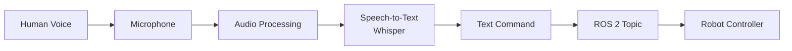
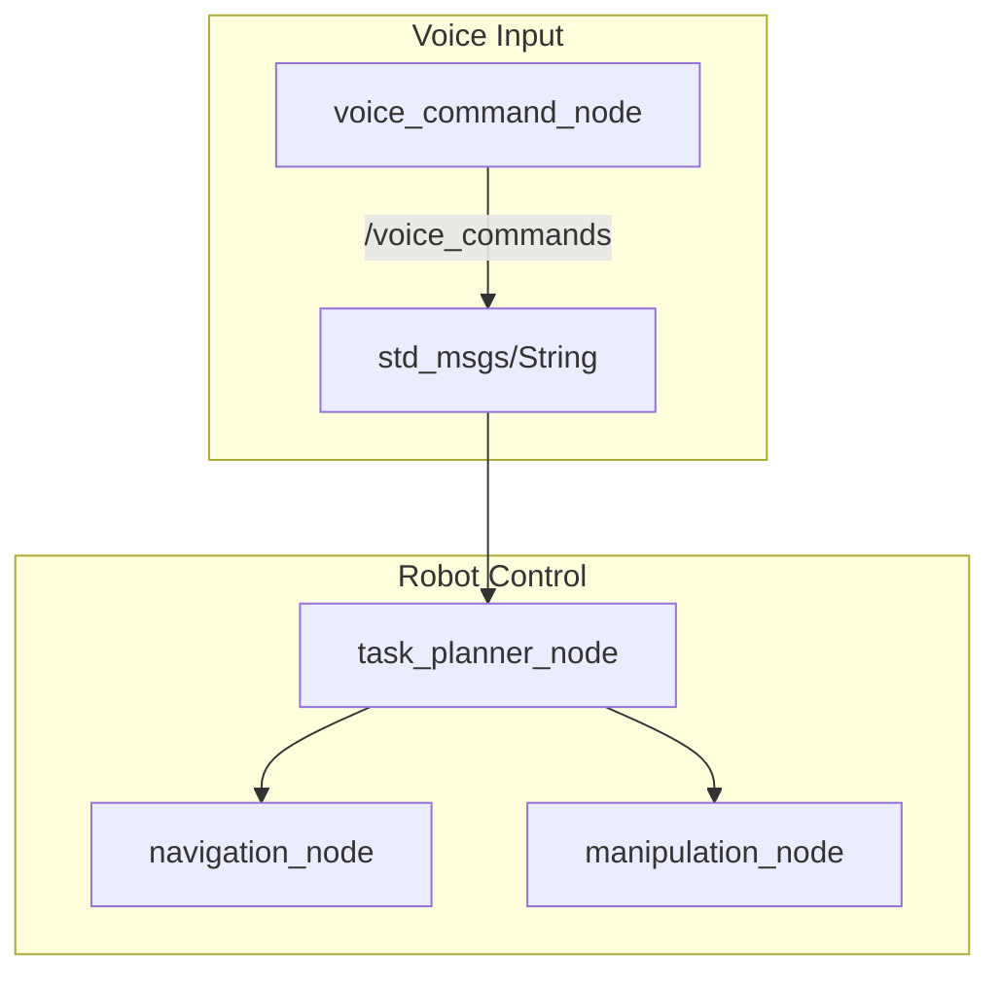

# Introduction to Speech Recognition in Robotics

## Learning Objectives

By the end of this section, you will be able to:

- Explain why voice interfaces are essential for humanoid robots
- Describe the key components of a speech-to-action pipeline
- Understand the challenges of real-time speech recognition in robotics
- Connect voice input concepts to the ROS 2 architecture from Module 1

---

## Why Voice Matters for Humanoid Robots

Imagine standing in front of a humanoid robot and having to type commands on a keyboard to make it move. It would feel unnatural, slow, and disconnected from the human experience. **Voice is the most natural interface for human-robot interaction.**

Consider how we interact with other humans:
- We speak to communicate intent
- We use natural language, not structured commands
- We expect immediate responses
- We can multitask while talking

A humanoid robot should interact the same way. When you say "Go to the kitchen and get me a glass of water," the robot should:

1. **Hear** your voice (audio capture)
2. **Understand** your words (speech-to-text)
3. **Interpret** your intent (natural language processing)
4. **Act** on your request (robot control)

This chapter focuses on steps 1 and 2—capturing audio and converting it to text using OpenAI Whisper. Chapter 9 will cover steps 3 and 4.

---

## The Speech-to-Action Pipeline



### Pipeline Components

| Component | Purpose | Technology |
|-----------|---------|------------|
| **Microphone** | Capture audio | USB/built-in mic |
| **Audio Processing** | Sample, buffer, filter | sounddevice, numpy |
| **Speech-to-Text** | Convert audio to text | OpenAI Whisper |
| **ROS 2 Integration** | Publish commands | rclpy, std_msgs |
| **Robot Controller** | Execute actions | Navigation, manipulation |

---

## Human-Robot Interaction (HRI) Fundamentals

Voice-based HRI introduces unique challenges compared to traditional robotics:

### 1. Real-Time Processing

Unlike batch processing, voice commands must be processed **as they happen**. A user won't wait 10 seconds after speaking "stop" for the robot to halt.

```python
# Bad: Batch processing
audio = record_5_seconds()  # User already frustrated
text = transcribe(audio)
execute(text)

# Good: Streaming processing
for chunk in audio_stream():
    if is_command(chunk):
        execute_immediately(chunk)
```

### 2. Noise Robustness

Real-world environments are noisy:
- Background conversations
- Motor and actuator sounds from the robot itself
- Environmental sounds (HVAC, traffic)

The speech recognition system must distinguish **your voice** from everything else.

### 3. Natural Language Variability

Humans don't speak in structured commands:

| User Says | Intended Action |
|-----------|-----------------|
| "Move forward" | Navigate forward |
| "Go ahead" | Navigate forward |
| "Walk straight" | Navigate forward |
| "Keep going" | Continue current action |

The system must handle synonyms, variations, and context.

### 4. Feedback and Confirmation

Robots should **acknowledge** voice commands:
- Visual feedback (LED, screen)
- Audio feedback (beep, speech)
- Action feedback (robot moves)

Without feedback, users don't know if the robot heard them.

---

## Connection to ROS 2

In Module 1, you learned that ROS 2 uses **topics** for asynchronous communication between nodes. Voice commands integrate naturally into this architecture:



### Why Topics for Voice?

1. **Decoupling**: Voice capture is independent of command processing
2. **Flexibility**: Multiple nodes can subscribe to voice commands
3. **Reliability**: QoS settings handle message delivery
4. **Debugging**: Easy to echo topics and inspect messages

### The Voice Command Message

We'll use a simple `std_msgs/String` message for voice commands:

```python
# Publishing a voice command
from std_msgs.msg import String

msg = String()
msg.data = "move forward"
self.publisher.publish(msg)
```

For production systems, you might create a custom message type with confidence scores, timestamps, and language information.

---

## Challenges in Robotics Speech Recognition

### Latency Budget

For responsive HRI, the total pipeline latency should be under 2 seconds:

| Stage | Target Latency |
|-------|---------------|
| Audio capture | 50-100ms |
| Network (if API) | 100-300ms |
| Transcription | 500-1000ms |
| Command parsing | 50-100ms |
| **Total** | **< 2 seconds** |

### Vocabulary and Domain

General-purpose speech recognition knows "weather" and "calendar" but might struggle with:
- Robot-specific terms ("joint", "gripper", "end effector")
- Technical jargon ("quaternion", "odometry", "costmap")
- Custom location names ("charging station alpha", "workbench 3")

We'll address this with prompt engineering and command vocabulary.

### Multilingual Support

OpenAI Whisper supports 99 languages, making it suitable for international robotics applications. However, command parsing and robot responses may need localization.

---

## What You'll Build in This Chapter

By the end of Chapter 8, you'll have:

1. **A working voice capture system** using Python and sounddevice
2. **Whisper integration** for high-accuracy speech-to-text
3. **A ROS 2 voice command node** that publishes to `/voice_commands`
4. **Noise handling strategies** for real-world environments

This foundation will enable Chapter 9's cognitive planning, where we use LLMs to interpret commands and generate robot actions.

---

## Prerequisites Check

Before proceeding, ensure you have:

- [ ] Completed Modules 1-3 (ROS 2 basics, simulation)
- [ ] Ubuntu 22.04 with ROS 2 Jazzy/Iron
- [ ] A working microphone (USB or built-in)
- [ ] Python 3.10+ with pip
- [ ] (Optional) OpenAI API key for cloud Whisper

:::tip Microphone Test
Run this command to verify your microphone works:
```bash
arecord -l  # List recording devices
arecord -d 3 test.wav && aplay test.wav  # Record and play back
```
:::

---

## Summary

- Voice interfaces enable natural human-robot interaction
- The speech-to-action pipeline: Audio → Whisper → Text → ROS 2 → Robot
- Real-time processing, noise robustness, and feedback are critical
- ROS 2 topics provide a clean architecture for voice command integration
- Whisper offers state-of-the-art accuracy for robotics applications

**Next**: We'll dive into OpenAI Whisper's architecture and understand why it's the ideal choice for robotics speech recognition.
