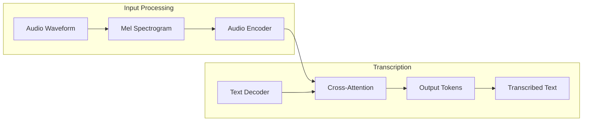
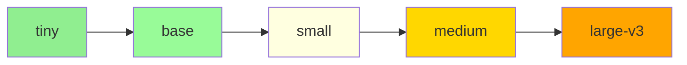

# OpenAI Whisper Architecture

## Learning Objectives

By the end of this section, you will be able to:

- Explain Whisper's encoder-decoder architecture
- Compare model sizes and their accuracy/speed tradeoffs
- Understand why Whisper is particularly suited for robotics applications
- Choose between API and local deployment options

---

## What is Whisper?

**Whisper** is OpenAI's open-source automatic speech recognition (ASR) system, released in September 2022. It was trained on 680,000 hours of multilingual audio data, making it one of the most robust and accurate speech recognition models available.

Key features:
- **Multilingual**: Supports 99 languages
- **Robust**: Handles accents, background noise, and technical terminology
- **Open-source**: Available for local deployment (MIT license)
- **API available**: OpenAI provides a cloud API for convenience

---

## Encoder-Decoder Architecture

Whisper uses a **transformer-based encoder-decoder** architecture, similar to models used in machine translation.



### 1. Audio Preprocessing

Raw audio is converted to a **log-Mel spectrogram**:

```python
# Simplified audio preprocessing
import numpy as np

def audio_to_mel_spectrogram(audio, sample_rate=16000, n_mels=80):
    """
    Convert raw audio to log-Mel spectrogram.

    Whisper expects:
    - 16 kHz sample rate
    - 80 Mel frequency bins
    - 30-second audio chunks
    """
    # Apply Short-Time Fourier Transform
    spectrogram = stft(audio)

    # Convert to Mel scale
    mel_spectrogram = mel_filter_bank(spectrogram, n_mels=n_mels)

    # Apply log compression
    log_mel = np.log10(mel_spectrogram + 1e-10)

    return log_mel
```

The spectrogram captures frequency content over time, which is more informative for speech than raw waveforms.

### 2. Audio Encoder

The encoder processes the spectrogram through **transformer layers**:

- Convolutional layers extract local patterns
- Self-attention layers capture long-range dependencies
- Output: A sequence of audio embeddings

### 3. Text Decoder

The decoder generates text **autoregressively** (one token at a time):

- Cross-attention connects to encoder outputs
- Self-attention attends to previously generated tokens
- Output: Probability distribution over vocabulary

### 4. Special Tokens

Whisper uses special tokens to control behavior:

| Token | Purpose |
|-------|---------|
| `<\|startoftranscript\|>` | Begin transcription |
| `<\|en\|>` | Language hint (English) |
| `<\|transcribe\|>` | Transcription task |
| `<\|notimestamps\|>` | Disable timestamps |
| `<\|endoftext\|>` | End of transcription |

---

## Model Sizes

Whisper comes in multiple sizes, trading accuracy for speed:

| Model | Parameters | Relative Speed | VRAM | Accuracy |
|-------|------------|----------------|------|----------|
| **tiny** | 39M | ~32x | ~1 GB | Basic |
| **base** | 74M | ~16x | ~1 GB | Good |
| **small** | 244M | ~6x | ~2 GB | Better |
| **medium** | 769M | ~2x | ~5 GB | Great |
| **large-v3** | 1.5B | 1x | ~10 GB | Best |

### Choosing the Right Size for Robotics

For **real-time robotics applications**, we recommend:

:::tip Recommended Configuration
- **Edge deployment (Jetson)**: `tiny` or `base` for low latency
- **Development/testing**: `small` or `medium` for better accuracy
- **Cloud API**: `large-v3` equivalent accuracy, no local resources needed
:::

### Speed vs. Accuracy Tradeoff



| Use Case | Recommended Model |
|----------|-------------------|
| Quick prototyping | tiny |
| Real-time commands | base or small |
| High accuracy needed | medium |
| Transcription quality critical | large-v3 |

---

## Why Whisper for Robotics?

### 1. Noise Robustness

Whisper was trained on diverse audio conditions:
- Background music
- Crowd noise
- Multiple speakers
- Varying microphone quality

This makes it ideal for:
- Factory floors with machinery noise
- Homes with background TV/music
- Outdoor environments with wind/traffic

### 2. Technical Vocabulary

Unlike consumer voice assistants, Whisper handles technical terms well:

```text
User: "Set the end effector position to 0.5, 0.3, 0.2"
Whisper: "Set the end effector position to 0.5, 0.3, 0.2"  ✓

Consumer ASR: "Set the end effect or position to 053 02"  ✗
```

### 3. Language Flexibility

For international robotics labs:
- English commands work in any environment
- Native language support for 99 languages
- Code-switching (mixing languages) supported

### 4. Consistent Output Format

Whisper produces clean, punctuated text:

```text
Input Audio: "move forward... um... about two meters"
Output: "Move forward about two meters."
```

Hesitations and filler words are cleaned up automatically.

---

## API vs. Local Deployment

### OpenAI Whisper API

**Pros**:
- No local GPU required
- Always uses latest model
- Simple integration (HTTP API)
- Pay-per-use pricing

**Cons**:
- Requires internet connection
- Latency: 100-500ms network overhead
- Cost: ~$0.006 per minute of audio
- Privacy: Audio sent to OpenAI servers

```python
# API usage example
from openai import OpenAI

client = OpenAI()

with open("command.wav", "rb") as audio_file:
    transcript = client.audio.transcriptions.create(
        model="whisper-1",
        file=audio_file
    )
    print(transcript.text)
```

### Local Whisper (whisper.cpp / Python)

**Pros**:
- No internet required
- No ongoing costs
- Full privacy (audio stays local)
- Customizable (fine-tuning possible)

**Cons**:
- Requires GPU/CPU resources
- Initial setup complexity
- Must manage model updates

```python
# Local usage example (Python whisper package)
import whisper

model = whisper.load_model("base")
result = model.transcribe("command.wav")
print(result["text"])
```

### Decision Matrix

| Factor | Choose API | Choose Local |
|--------|------------|--------------|
| Internet available | ✓ | ✗ |
| GPU available | ✗ | ✓ |
| Privacy critical | ✗ | ✓ |
| High volume (cost) | ✗ | ✓ |
| Quick prototyping | ✓ | ✗ |
| Edge deployment | ✗ | ✓ |

---

## Whisper for Real-Time Streaming

Whisper was designed for **batch processing** (complete audio files), but robotics needs **real-time streaming**. Strategies:

### 1. Chunked Processing

Process audio in fixed-size chunks (e.g., 3-5 seconds):

```python
CHUNK_DURATION = 3.0  # seconds

def process_stream(audio_stream):
    buffer = []
    for chunk in audio_stream:
        buffer.append(chunk)
        if len(buffer) >= CHUNK_DURATION * SAMPLE_RATE:
            text = transcribe(buffer)
            yield text
            buffer = []  # Clear buffer
```

### 2. Voice Activity Detection (VAD)

Only transcribe when speech is detected:

```python
import webrtcvad

vad = webrtcvad.Vad(3)  # Aggressiveness: 0-3

def is_speech(audio_chunk):
    return vad.is_speech(audio_chunk, sample_rate=16000)
```

### 3. Whisper Streaming Libraries

Community projects enable true streaming:
- **whisper-streaming**: Real-time transcription
- **faster-whisper**: Optimized inference with CTranslate2
- **whisper.cpp**: Efficient C++ implementation

---

## Accuracy Benchmarks

Whisper's Word Error Rate (WER) on standard benchmarks:

| Dataset | Whisper large-v3 | Previous SOTA |
|---------|------------------|---------------|
| LibriSpeech (clean) | 2.0% | 1.9% |
| LibriSpeech (noisy) | 4.2% | 4.4% |
| Common Voice | 12.8% | 15.2% |
| TED-LIUM | 4.0% | 4.4% |

For robotics command recognition (short, clear commands), expect **>95% accuracy** in typical conditions.

---

## Summary

- Whisper uses an encoder-decoder transformer architecture
- Five model sizes balance speed and accuracy
- Noise robustness makes Whisper ideal for robotics environments
- API is convenient; local deployment offers privacy and offline capability
- Streaming requires chunked processing or VAD

**Next**: We'll set up Whisper for your development environment—both API and local options.
