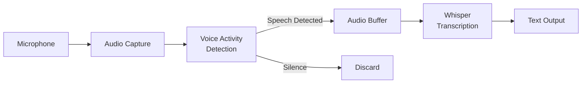

# Voice Command Pipeline

## Learning Objectives

By the end of this section, you will be able to:

- Capture audio from a microphone using Python
- Implement Voice Activity Detection (VAD) to detect speech
- Stream audio chunks to Whisper for transcription
- Build a complete voice-to-text pipeline

---

## Pipeline Architecture



The pipeline continuously:
1. **Captures** audio from the microphone
2. **Detects** when speech is present (VAD)
3. **Buffers** speech segments
4. **Transcribes** complete utterances
5. **Outputs** text for downstream processing

---

## Part 1: Audio Capture with sounddevice

The `sounddevice` library provides a simple interface for audio I/O.

### Basic Audio Capture

```python
#!/usr/bin/env python3
"""Basic audio capture example."""

import sounddevice as sd
import numpy as np

# Audio parameters
SAMPLE_RATE = 16000  # Whisper expects 16kHz
CHANNELS = 1          # Mono audio
DTYPE = np.int16      # 16-bit audio

def record_audio(duration_seconds: float) -> np.ndarray:
    """
    Record audio for a fixed duration.

    Args:
        duration_seconds: How long to record

    Returns:
        NumPy array of audio samples
    """
    print(f"Recording for {duration_seconds} seconds...")

    # Record audio
    audio = sd.rec(
        int(duration_seconds * SAMPLE_RATE),
        samplerate=SAMPLE_RATE,
        channels=CHANNELS,
        dtype=DTYPE
    )

    # Wait for recording to complete
    sd.wait()

    print("Recording complete!")
    return audio.flatten()

# Test recording
if __name__ == "__main__":
    audio = record_audio(3.0)
    print(f"Captured {len(audio)} samples ({len(audio)/SAMPLE_RATE:.1f} seconds)")
```

### Streaming Audio Capture

For real-time processing, use a callback-based approach:

```python
#!/usr/bin/env python3
"""Streaming audio capture with callback."""

import sounddevice as sd
import numpy as np
from queue import Queue
import threading

class AudioStream:
    """Continuous audio streaming from microphone."""

    def __init__(self, sample_rate: int = 16000, chunk_size: int = 1600):
        """
        Initialize audio stream.

        Args:
            sample_rate: Audio sample rate (Hz)
            chunk_size: Samples per chunk (100ms at 16kHz = 1600)
        """
        self.sample_rate = sample_rate
        self.chunk_size = chunk_size
        self.audio_queue = Queue()
        self.is_running = False
        self.stream = None

    def _audio_callback(self, indata, frames, time, status):
        """Callback function for audio stream."""
        if status:
            print(f"Audio status: {status}")
        # Put audio chunk in queue
        self.audio_queue.put(indata.copy().flatten())

    def start(self):
        """Start audio streaming."""
        self.is_running = True
        self.stream = sd.InputStream(
            samplerate=self.sample_rate,
            channels=1,
            dtype=np.int16,
            blocksize=self.chunk_size,
            callback=self._audio_callback
        )
        self.stream.start()
        print("Audio stream started")

    def stop(self):
        """Stop audio streaming."""
        self.is_running = False
        if self.stream:
            self.stream.stop()
            self.stream.close()
        print("Audio stream stopped")

    def get_chunk(self, timeout: float = 1.0) -> np.ndarray:
        """Get next audio chunk from queue."""
        return self.audio_queue.get(timeout=timeout)

# Usage example
if __name__ == "__main__":
    stream = AudioStream()
    stream.start()

    try:
        for i in range(50):  # Capture 50 chunks (~5 seconds)
            chunk = stream.get_chunk()
            rms = np.sqrt(np.mean(chunk.astype(float)**2))
            print(f"Chunk {i}: RMS = {rms:.0f}")
    finally:
        stream.stop()
```

---

## Part 2: Voice Activity Detection (VAD)

VAD determines when speech is present, avoiding transcription of silence.

### Using WebRTC VAD

```python
#!/usr/bin/env python3
"""Voice Activity Detection using WebRTC VAD."""

import webrtcvad
import numpy as np

class VoiceActivityDetector:
    """Detects speech in audio using WebRTC VAD."""

    def __init__(self, aggressiveness: int = 2, sample_rate: int = 16000):
        """
        Initialize VAD.

        Args:
            aggressiveness: 0 (least aggressive) to 3 (most aggressive)
                           Higher = fewer false positives, more missed speech
            sample_rate: Audio sample rate (must be 8000, 16000, or 32000)
        """
        self.vad = webrtcvad.Vad(aggressiveness)
        self.sample_rate = sample_rate

        # Frame duration must be 10, 20, or 30 ms
        self.frame_duration_ms = 30
        self.frame_size = int(sample_rate * self.frame_duration_ms / 1000)

    def is_speech(self, audio_chunk: np.ndarray) -> bool:
        """
        Check if audio chunk contains speech.

        Args:
            audio_chunk: Audio samples (int16)

        Returns:
            True if speech detected
        """
        # Ensure correct length for VAD
        if len(audio_chunk) != self.frame_size:
            # Pad or truncate
            if len(audio_chunk) < self.frame_size:
                audio_chunk = np.pad(audio_chunk, (0, self.frame_size - len(audio_chunk)))
            else:
                audio_chunk = audio_chunk[:self.frame_size]

        # Convert to bytes for VAD
        audio_bytes = audio_chunk.astype(np.int16).tobytes()

        return self.vad.is_speech(audio_bytes, self.sample_rate)

    def get_speech_ratio(self, audio: np.ndarray) -> float:
        """
        Calculate the ratio of speech frames in audio.

        Args:
            audio: Audio samples

        Returns:
            Ratio of frames containing speech (0.0 to 1.0)
        """
        speech_frames = 0
        total_frames = 0

        for i in range(0, len(audio) - self.frame_size, self.frame_size):
            frame = audio[i:i + self.frame_size]
            if self.is_speech(frame):
                speech_frames += 1
            total_frames += 1

        return speech_frames / total_frames if total_frames > 0 else 0.0

# Test VAD
if __name__ == "__main__":
    import sounddevice as sd

    vad = VoiceActivityDetector(aggressiveness=2)

    print("Recording 5 seconds - speak into your microphone!")
    audio = sd.rec(
        int(5 * 16000),
        samplerate=16000,
        channels=1,
        dtype=np.int16
    )
    sd.wait()

    speech_ratio = vad.get_speech_ratio(audio.flatten())
    print(f"Speech detected in {speech_ratio*100:.1f}% of frames")
```

---

## Part 3: Complete Voice Command Pipeline

Combining audio capture, VAD, and Whisper transcription:

```python
#!/usr/bin/env python3
"""
Complete Voice Command Pipeline.

Captures audio, detects speech, and transcribes using Whisper.
"""

import sounddevice as sd
import numpy as np
import webrtcvad
from openai import OpenAI
import tempfile
import wave
import time
from dataclasses import dataclass
from enum import Enum
from typing import Optional, Callable

# Constants
SAMPLE_RATE = 16000
CHUNK_DURATION_MS = 30
CHUNK_SIZE = int(SAMPLE_RATE * CHUNK_DURATION_MS / 1000)


class CommandStatus(Enum):
    """Voice command processing status."""
    LISTENING = "listening"
    SPEECH_DETECTED = "speech_detected"
    TRANSCRIBING = "transcribing"
    COMMAND_READY = "command_ready"
    ERROR = "error"


@dataclass
class VoiceCommand:
    """Represents a captured and transcribed voice command."""
    audio_data: np.ndarray
    transcription: str
    confidence: float
    duration_seconds: float
    timestamp: float


class VoiceCommandPipeline:
    """
    Real-time voice command capture and transcription.

    Features:
    - Continuous audio streaming
    - Voice Activity Detection
    - Automatic speech segmentation
    - Whisper transcription
    """

    def __init__(
        self,
        use_api: bool = True,
        whisper_model: str = "base",
        vad_aggressiveness: int = 2,
        min_speech_duration: float = 0.5,
        max_speech_duration: float = 10.0,
        silence_threshold: float = 0.5,
    ):
        """
        Initialize the voice command pipeline.

        Args:
            use_api: Use OpenAI API (True) or local Whisper (False)
            whisper_model: Model name for local Whisper
            vad_aggressiveness: VAD sensitivity (0-3)
            min_speech_duration: Minimum speech length to transcribe (seconds)
            max_speech_duration: Maximum speech length (seconds)
            silence_threshold: Silence duration to end utterance (seconds)
        """
        self.use_api = use_api
        self.vad = webrtcvad.Vad(vad_aggressiveness)
        self.min_speech_duration = min_speech_duration
        self.max_speech_duration = max_speech_duration
        self.silence_threshold = silence_threshold

        # Initialize Whisper
        if use_api:
            self.client = OpenAI()
            self.model = None
        else:
            import whisper
            self.model = whisper.load_model(whisper_model)
            self.client = None

        # State
        self.audio_buffer = []
        self.is_speaking = False
        self.silence_frames = 0
        self.status = CommandStatus.LISTENING

    def _is_speech(self, audio_chunk: np.ndarray) -> bool:
        """Check if audio chunk contains speech."""
        audio_bytes = audio_chunk.astype(np.int16).tobytes()
        try:
            return self.vad.is_speech(audio_bytes, SAMPLE_RATE)
        except Exception:
            return False

    def _transcribe(self, audio: np.ndarray) -> tuple[str, float]:
        """
        Transcribe audio using Whisper.

        Returns:
            (transcription, confidence)
        """
        # Save audio to temporary file
        with tempfile.NamedTemporaryFile(suffix=".wav", delete=False) as f:
            with wave.open(f.name, "w") as wav:
                wav.setnchannels(1)
                wav.setsampwidth(2)
                wav.setframerate(SAMPLE_RATE)
                wav.writeframes(audio.astype(np.int16).tobytes())
            temp_path = f.name

        try:
            if self.use_api:
                # Use OpenAI API
                with open(temp_path, "rb") as audio_file:
                    result = self.client.audio.transcriptions.create(
                        model="whisper-1",
                        file=audio_file,
                        response_format="verbose_json"
                    )
                # API doesn't return per-segment confidence, use 0.9 as default
                return result.text.strip(), 0.9
            else:
                # Use local Whisper
                result = self.model.transcribe(temp_path)
                # Calculate average confidence from segments
                if result.get("segments"):
                    avg_confidence = np.mean([
                        s.get("no_speech_prob", 0.0)
                        for s in result["segments"]
                    ])
                    confidence = 1.0 - avg_confidence
                else:
                    confidence = 0.9
                return result["text"].strip(), confidence
        finally:
            import os
            os.unlink(temp_path)

    def process_chunk(self, audio_chunk: np.ndarray) -> Optional[VoiceCommand]:
        """
        Process an audio chunk.

        Args:
            audio_chunk: Audio samples (CHUNK_SIZE int16 samples)

        Returns:
            VoiceCommand if utterance complete, None otherwise
        """
        is_speech = self._is_speech(audio_chunk)

        if is_speech:
            # Speech detected
            self.status = CommandStatus.SPEECH_DETECTED
            self.is_speaking = True
            self.silence_frames = 0
            self.audio_buffer.append(audio_chunk)

            # Check max duration
            buffer_duration = len(self.audio_buffer) * CHUNK_DURATION_MS / 1000
            if buffer_duration >= self.max_speech_duration:
                return self._finalize_utterance()

        elif self.is_speaking:
            # Silence after speech
            self.silence_frames += 1
            self.audio_buffer.append(audio_chunk)  # Include trailing silence

            silence_duration = self.silence_frames * CHUNK_DURATION_MS / 1000
            if silence_duration >= self.silence_threshold:
                return self._finalize_utterance()

        return None

    def _finalize_utterance(self) -> Optional[VoiceCommand]:
        """Finalize and transcribe the current utterance."""
        if not self.audio_buffer:
            return None

        # Combine audio chunks
        audio = np.concatenate(self.audio_buffer)
        duration = len(audio) / SAMPLE_RATE

        # Check minimum duration
        if duration < self.min_speech_duration:
            self._reset()
            return None

        # Transcribe
        self.status = CommandStatus.TRANSCRIBING
        try:
            transcription, confidence = self._transcribe(audio)

            if transcription:
                self.status = CommandStatus.COMMAND_READY
                command = VoiceCommand(
                    audio_data=audio,
                    transcription=transcription,
                    confidence=confidence,
                    duration_seconds=duration,
                    timestamp=time.time()
                )
            else:
                command = None
        except Exception as e:
            print(f"Transcription error: {e}")
            self.status = CommandStatus.ERROR
            command = None

        self._reset()
        return command

    def _reset(self):
        """Reset pipeline state."""
        self.audio_buffer = []
        self.is_speaking = False
        self.silence_frames = 0
        self.status = CommandStatus.LISTENING

    def run(self, callback: Callable[[VoiceCommand], None]):
        """
        Run the pipeline continuously.

        Args:
            callback: Function to call with each transcribed command
        """
        print("Voice Command Pipeline started. Speak into your microphone...")
        print("Press Ctrl+C to stop.\n")

        try:
            with sd.InputStream(
                samplerate=SAMPLE_RATE,
                channels=1,
                dtype=np.int16,
                blocksize=CHUNK_SIZE,
            ) as stream:
                while True:
                    # Read audio chunk
                    audio_chunk, overflowed = stream.read(CHUNK_SIZE)
                    if overflowed:
                        print("Warning: Audio buffer overflow")

                    # Process chunk
                    command = self.process_chunk(audio_chunk.flatten())

                    # Callback if command detected
                    if command:
                        callback(command)

        except KeyboardInterrupt:
            print("\nPipeline stopped.")


# Example usage
if __name__ == "__main__":
    def on_command(command: VoiceCommand):
        """Handle transcribed voice command."""
        print(f"\n{'='*50}")
        print(f"Command: {command.transcription}")
        print(f"Duration: {command.duration_seconds:.1f}s")
        print(f"Confidence: {command.confidence:.2f}")
        print(f"{'='*50}\n")

    # Create and run pipeline
    pipeline = VoiceCommandPipeline(
        use_api=True,  # Set to False for local Whisper
        vad_aggressiveness=2,
        min_speech_duration=0.5,
        max_speech_duration=10.0,
        silence_threshold=0.5,
    )

    pipeline.run(on_command)
```

---

## Pipeline in Action

### Running the Pipeline

```bash
# Make sure your environment is set up
source ~/vla_env/bin/activate
export OPENAI_API_KEY="your-key"

# Run the pipeline
python3 voice_command_pipeline.py
```

### Expected Output

```
Voice Command Pipeline started. Speak into your microphone...
Press Ctrl+C to stop.

==================================================
Command: Move forward two meters.
Duration: 1.8s
Confidence: 0.92
==================================================

==================================================
Command: Turn left 90 degrees.
Duration: 1.2s
Confidence: 0.89
==================================================
```

---

## Summary

- **Audio capture**: Use `sounddevice` for streaming microphone input
- **VAD**: WebRTC VAD filters out silence efficiently
- **Buffering**: Collect speech segments until silence detected
- **Transcription**: Send complete utterances to Whisper

**Next**: We'll integrate this pipeline with ROS 2 to publish voice commands as ROS topics.
