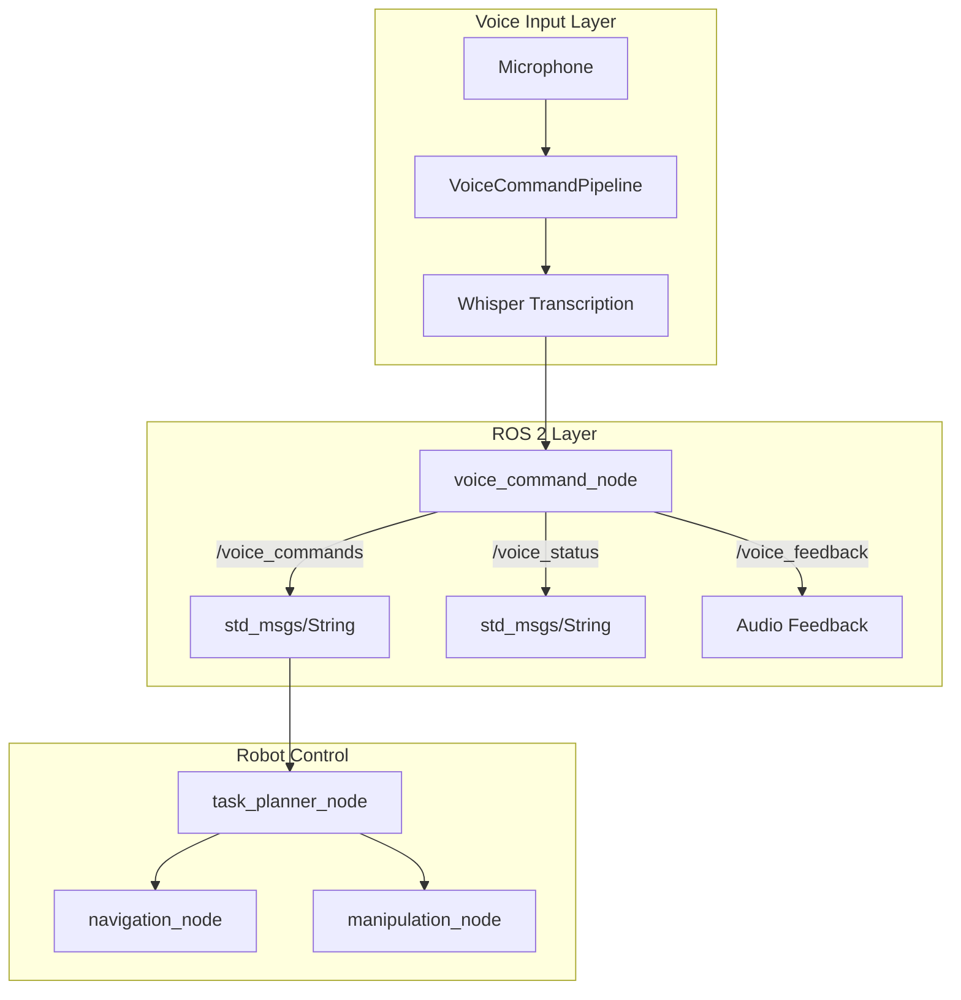
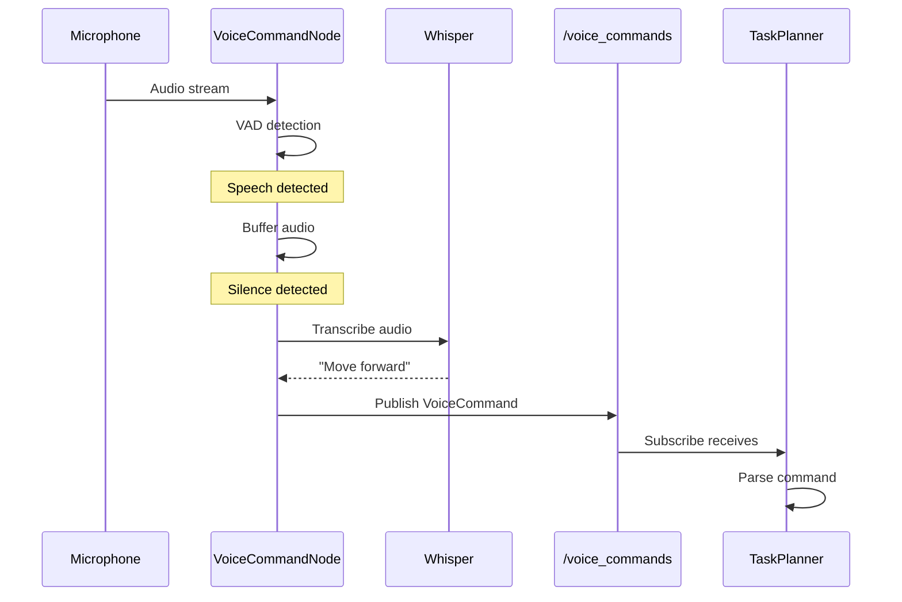

# ROS 2 Voice Command Node

## Learning Objectives

By the end of this section, you will be able to:

- Create a ROS 2 node that publishes voice commands
- Design custom message types for voice data
- Implement feedback mechanisms for voice recognition status
- Build a complete voice-to-ROS 2 pipeline

---

## System Architecture



---

## Part 1: Basic Voice Command Publisher

### Simple String Publisher

Start with a basic implementation using `std_msgs/String`:

```python
#!/usr/bin/env python3
"""
Basic ROS 2 voice command publisher.

Publishes transcribed voice commands to /voice_commands topic.
"""

import rclpy
from rclpy.node import Node
from std_msgs.msg import String

import sounddevice as sd
import numpy as np
import webrtcvad
from openai import OpenAI
import tempfile
import wave
import threading
from queue import Queue

# Audio parameters
SAMPLE_RATE = 16000
CHUNK_DURATION_MS = 30
CHUNK_SIZE = int(SAMPLE_RATE * CHUNK_DURATION_MS / 1000)


class VoiceCommandNode(Node):
    """ROS 2 node for voice command recognition."""

    def __init__(self):
        super().__init__('voice_command_node')

        # Declare parameters
        self.declare_parameter('use_api', True)
        self.declare_parameter('vad_aggressiveness', 2)
        self.declare_parameter('silence_threshold', 0.5)
        self.declare_parameter('min_speech_duration', 0.5)

        # Get parameters
        self.use_api = self.get_parameter('use_api').value
        vad_aggressiveness = self.get_parameter('vad_aggressiveness').value
        self.silence_threshold = self.get_parameter('silence_threshold').value
        self.min_speech_duration = self.get_parameter('min_speech_duration').value

        # Initialize VAD
        self.vad = webrtcvad.Vad(vad_aggressiveness)

        # Initialize Whisper
        if self.use_api:
            self.client = OpenAI()
            self.get_logger().info('Using OpenAI Whisper API')
        else:
            import whisper
            self.model = whisper.load_model('base')
            self.get_logger().info('Using local Whisper model')

        # Publishers
        self.command_pub = self.create_publisher(
            String,
            '/voice_commands',
            10
        )

        self.status_pub = self.create_publisher(
            String,
            '/voice_status',
            10
        )

        # State
        self.audio_buffer = []
        self.is_speaking = False
        self.silence_frames = 0
        self.audio_queue = Queue()

        # Start audio capture thread
        self.running = True
        self.audio_thread = threading.Thread(target=self._audio_capture_loop)
        self.audio_thread.start()

        # Create timer for processing
        self.create_timer(0.01, self._process_audio)

        self._publish_status('ready')
        self.get_logger().info('Voice command node initialized')

    def _audio_capture_loop(self):
        """Continuous audio capture in separate thread."""
        def callback(indata, frames, time, status):
            if status:
                self.get_logger().warning(f'Audio status: {status}')
            self.audio_queue.put(indata.copy().flatten())

        with sd.InputStream(
            samplerate=SAMPLE_RATE,
            channels=1,
            dtype=np.int16,
            blocksize=CHUNK_SIZE,
            callback=callback
        ):
            while self.running:
                sd.sleep(100)

    def _process_audio(self):
        """Process audio chunks from queue."""
        while not self.audio_queue.empty():
            chunk = self.audio_queue.get()
            self._handle_chunk(chunk)

    def _handle_chunk(self, audio_chunk: np.ndarray):
        """Handle a single audio chunk."""
        is_speech = self._is_speech(audio_chunk)

        if is_speech:
            if not self.is_speaking:
                self._publish_status('listening')
            self.is_speaking = True
            self.silence_frames = 0
            self.audio_buffer.append(audio_chunk)

        elif self.is_speaking:
            self.silence_frames += 1
            self.audio_buffer.append(audio_chunk)

            silence_duration = self.silence_frames * CHUNK_DURATION_MS / 1000
            if silence_duration >= self.silence_threshold:
                self._finalize_utterance()

    def _is_speech(self, audio_chunk: np.ndarray) -> bool:
        """Check if audio chunk contains speech."""
        try:
            audio_bytes = audio_chunk.astype(np.int16).tobytes()
            return self.vad.is_speech(audio_bytes, SAMPLE_RATE)
        except Exception:
            return False

    def _finalize_utterance(self):
        """Finalize and transcribe the current utterance."""
        if not self.audio_buffer:
            return

        audio = np.concatenate(self.audio_buffer)
        duration = len(audio) / SAMPLE_RATE

        # Reset state
        self.audio_buffer = []
        self.is_speaking = False
        self.silence_frames = 0

        # Check minimum duration
        if duration < self.min_speech_duration:
            self._publish_status('ready')
            return

        # Transcribe
        self._publish_status('transcribing')
        try:
            text = self._transcribe(audio)
            if text:
                self._publish_command(text)
                self.get_logger().info(f'Command: {text}')
        except Exception as e:
            self.get_logger().error(f'Transcription error: {e}')

        self._publish_status('ready')

    def _transcribe(self, audio: np.ndarray) -> str:
        """Transcribe audio using Whisper."""
        # Save to temporary file
        with tempfile.NamedTemporaryFile(suffix='.wav', delete=False) as f:
            with wave.open(f.name, 'w') as wav:
                wav.setnchannels(1)
                wav.setsampwidth(2)
                wav.setframerate(SAMPLE_RATE)
                wav.writeframes(audio.astype(np.int16).tobytes())
            temp_path = f.name

        try:
            if self.use_api:
                with open(temp_path, 'rb') as audio_file:
                    result = self.client.audio.transcriptions.create(
                        model='whisper-1',
                        file=audio_file
                    )
                return result.text.strip()
            else:
                result = self.model.transcribe(temp_path)
                return result['text'].strip()
        finally:
            import os
            os.unlink(temp_path)

    def _publish_command(self, text: str):
        """Publish voice command to topic."""
        msg = String()
        msg.data = text
        self.command_pub.publish(msg)

    def _publish_status(self, status: str):
        """Publish recognition status."""
        msg = String()
        msg.data = status
        self.status_pub.publish(msg)

    def destroy_node(self):
        """Clean shutdown."""
        self.running = False
        self.audio_thread.join()
        super().destroy_node()


def main(args=None):
    rclpy.init(args=args)
    node = VoiceCommandNode()

    try:
        rclpy.spin(node)
    except KeyboardInterrupt:
        pass
    finally:
        node.destroy_node()
        rclpy.shutdown()


if __name__ == '__main__':
    main()
```

---

## Part 2: Custom Voice Command Message

For production systems, create a custom message with metadata.

### Message Definition

Create `voice_interfaces/msg/VoiceCommand.msg`:

```
# Voice command message with metadata

# Header with timestamp
std_msgs/Header header

# Transcribed text
string text

# Recognition confidence (0.0 - 1.0)
float32 confidence

# Audio duration in seconds
float32 duration

# Language detected (e.g., "en", "es")
string language

# Whether this is a final or partial result
bool is_final
```

### Package Setup

Create the message package structure:

```bash
cd ~/ros2_ws/src
ros2 pkg create --build-type ament_cmake voice_interfaces

# Create msg directory
mkdir -p voice_interfaces/msg

# Add the message file
# (create VoiceCommand.msg as shown above)
```

Update `voice_interfaces/CMakeLists.txt`:

```cmake
cmake_minimum_required(VERSION 3.8)
project(voice_interfaces)

find_package(ament_cmake REQUIRED)
find_package(rosidl_default_generators REQUIRED)
find_package(std_msgs REQUIRED)

rosidl_generate_interfaces(${PROJECT_NAME}
  "msg/VoiceCommand.msg"
  DEPENDENCIES std_msgs
)

ament_package()
```

Update `voice_interfaces/package.xml`:

```xml
<?xml version="1.0"?>
<package format="3">
  <name>voice_interfaces</name>
  <version>0.1.0</version>
  <description>Voice command interfaces for VLA</description>
  <maintainer email="you@example.com">Your Name</maintainer>
  <license>Apache-2.0</license>

  <buildtool_depend>ament_cmake</buildtool_depend>
  <buildtool_depend>rosidl_default_generators</buildtool_depend>

  <depend>std_msgs</depend>

  <exec_depend>rosidl_default_runtime</exec_depend>

  <member_of_group>rosidl_interface_packages</member_of_group>
</package>
```

Build the package:

```bash
cd ~/ros2_ws
colcon build --packages-select voice_interfaces
source install/setup.bash
```

---

## Part 3: Enhanced Voice Command Node

Using the custom message type:

```python
#!/usr/bin/env python3
"""
Enhanced ROS 2 voice command node with custom message type.
"""

import rclpy
from rclpy.node import Node
from rclpy.qos import QoSProfile, ReliabilityPolicy, HistoryPolicy
from std_msgs.msg import String
from voice_interfaces.msg import VoiceCommand

import sounddevice as sd
import numpy as np
import webrtcvad
from openai import OpenAI
import tempfile
import wave
import threading
from queue import Queue
from dataclasses import dataclass
from typing import Optional
import time

SAMPLE_RATE = 16000
CHUNK_DURATION_MS = 30
CHUNK_SIZE = int(SAMPLE_RATE * CHUNK_DURATION_MS / 1000)


@dataclass
class TranscriptionResult:
    """Result from Whisper transcription."""
    text: str
    confidence: float
    language: str
    duration: float


class EnhancedVoiceCommandNode(Node):
    """Enhanced voice command node with custom messages."""

    def __init__(self):
        super().__init__('voice_command_node')

        # Parameters
        self.declare_parameter('use_api', True)
        self.declare_parameter('vad_aggressiveness', 2)
        self.declare_parameter('silence_threshold', 0.5)
        self.declare_parameter('min_speech_duration', 0.5)
        self.declare_parameter('max_speech_duration', 10.0)
        self.declare_parameter('feedback_enabled', True)

        self.use_api = self.get_parameter('use_api').value
        vad_aggressiveness = self.get_parameter('vad_aggressiveness').value
        self.silence_threshold = self.get_parameter('silence_threshold').value
        self.min_speech_duration = self.get_parameter('min_speech_duration').value
        self.max_speech_duration = self.get_parameter('max_speech_duration').value
        self.feedback_enabled = self.get_parameter('feedback_enabled').value

        # QoS for reliable delivery
        qos_reliable = QoSProfile(
            reliability=ReliabilityPolicy.RELIABLE,
            history=HistoryPolicy.KEEP_LAST,
            depth=10
        )

        # Publishers
        self.command_pub = self.create_publisher(
            VoiceCommand,
            '/voice_commands',
            qos_reliable
        )

        self.status_pub = self.create_publisher(
            String,
            '/voice_status',
            10
        )

        # Subscriber for feedback acknowledgment
        self.ack_sub = self.create_subscription(
            String,
            '/voice_command_ack',
            self._ack_callback,
            10
        )

        # Initialize components
        self.vad = webrtcvad.Vad(vad_aggressiveness)

        if self.use_api:
            self.client = OpenAI()
        else:
            import whisper
            self.model = whisper.load_model('base')

        # State
        self.audio_buffer = []
        self.is_speaking = False
        self.silence_frames = 0
        self.audio_queue = Queue()
        self.command_sequence = 0

        # Start audio thread
        self.running = True
        self.audio_thread = threading.Thread(target=self._audio_loop)
        self.audio_thread.start()

        self.create_timer(0.01, self._process_audio)

        self._publish_status('ready')
        self.get_logger().info('Enhanced voice command node ready')

    def _audio_loop(self):
        """Audio capture loop."""
        def callback(indata, frames, time_info, status):
            if status:
                self.get_logger().warning(f'Audio: {status}')
            self.audio_queue.put(indata.copy().flatten())

        with sd.InputStream(
            samplerate=SAMPLE_RATE,
            channels=1,
            dtype=np.int16,
            blocksize=CHUNK_SIZE,
            callback=callback
        ):
            while self.running:
                sd.sleep(100)

    def _process_audio(self):
        """Process queued audio chunks."""
        while not self.audio_queue.empty():
            chunk = self.audio_queue.get()
            self._handle_chunk(chunk)

    def _handle_chunk(self, chunk: np.ndarray):
        """Process single audio chunk."""
        is_speech = self._detect_speech(chunk)

        if is_speech:
            if not self.is_speaking:
                self._publish_status('listening')
                self.get_logger().debug('Speech started')

            self.is_speaking = True
            self.silence_frames = 0
            self.audio_buffer.append(chunk)

            # Check max duration
            buffer_duration = len(self.audio_buffer) * CHUNK_DURATION_MS / 1000
            if buffer_duration >= self.max_speech_duration:
                self._finalize()

        elif self.is_speaking:
            self.silence_frames += 1
            self.audio_buffer.append(chunk)

            silence_duration = self.silence_frames * CHUNK_DURATION_MS / 1000
            if silence_duration >= self.silence_threshold:
                self._finalize()

    def _detect_speech(self, chunk: np.ndarray) -> bool:
        """Detect speech using VAD."""
        try:
            return self.vad.is_speech(
                chunk.astype(np.int16).tobytes(),
                SAMPLE_RATE
            )
        except Exception:
            return False

    def _finalize(self):
        """Finalize utterance and transcribe."""
        if not self.audio_buffer:
            return

        audio = np.concatenate(self.audio_buffer)
        duration = len(audio) / SAMPLE_RATE

        # Reset
        self.audio_buffer = []
        self.is_speaking = False
        self.silence_frames = 0

        if duration < self.min_speech_duration:
            self._publish_status('ready')
            return

        self._publish_status('transcribing')

        try:
            result = self._transcribe(audio, duration)
            if result and result.text:
                self._publish_voice_command(result)
        except Exception as e:
            self.get_logger().error(f'Transcription failed: {e}')

        self._publish_status('ready')

    def _transcribe(self, audio: np.ndarray, duration: float) -> Optional[TranscriptionResult]:
        """Transcribe audio with Whisper."""
        with tempfile.NamedTemporaryFile(suffix='.wav', delete=False) as f:
            with wave.open(f.name, 'w') as wav:
                wav.setnchannels(1)
                wav.setsampwidth(2)
                wav.setframerate(SAMPLE_RATE)
                wav.writeframes(audio.astype(np.int16).tobytes())
            temp_path = f.name

        try:
            if self.use_api:
                with open(temp_path, 'rb') as audio_file:
                    result = self.client.audio.transcriptions.create(
                        model='whisper-1',
                        file=audio_file,
                        response_format='verbose_json'
                    )
                return TranscriptionResult(
                    text=result.text.strip(),
                    confidence=0.9,  # API doesn't return confidence
                    language=result.language or 'en',
                    duration=duration
                )
            else:
                result = self.model.transcribe(temp_path)
                # Calculate confidence from no_speech_prob
                segments = result.get('segments', [])
                if segments:
                    avg_no_speech = np.mean([
                        s.get('no_speech_prob', 0.0) for s in segments
                    ])
                    confidence = 1.0 - avg_no_speech
                else:
                    confidence = 0.9

                return TranscriptionResult(
                    text=result['text'].strip(),
                    confidence=confidence,
                    language=result.get('language', 'en'),
                    duration=duration
                )
        finally:
            import os
            os.unlink(temp_path)

    def _publish_voice_command(self, result: TranscriptionResult):
        """Publish voice command message."""
        msg = VoiceCommand()
        msg.header.stamp = self.get_clock().now().to_msg()
        msg.header.frame_id = 'voice_input'
        msg.text = result.text
        msg.confidence = result.confidence
        msg.duration = result.duration
        msg.language = result.language
        msg.is_final = True

        self.command_pub.publish(msg)
        self.command_sequence += 1

        self.get_logger().info(
            f'Published: "{result.text}" '
            f'(conf={result.confidence:.2f}, dur={result.duration:.1f}s)'
        )

    def _publish_status(self, status: str):
        """Publish status update."""
        msg = String()
        msg.data = status
        self.status_pub.publish(msg)

    def _ack_callback(self, msg: String):
        """Handle command acknowledgment."""
        self.get_logger().debug(f'Command acknowledged: {msg.data}')

    def destroy_node(self):
        """Clean shutdown."""
        self.running = False
        if self.audio_thread.is_alive():
            self.audio_thread.join(timeout=2.0)
        super().destroy_node()


def main(args=None):
    rclpy.init(args=args)
    node = EnhancedVoiceCommandNode()

    try:
        rclpy.spin(node)
    except KeyboardInterrupt:
        pass
    finally:
        node.destroy_node()
        rclpy.shutdown()


if __name__ == '__main__':
    main()
```

---

## Part 4: Package Structure

### Complete Package Layout

```
voice_commands/
├── package.xml
├── setup.py
├── setup.cfg
├── resource/
│   └── voice_commands
├── voice_commands/
│   ├── __init__.py
│   ├── voice_command_node.py
│   └── enhanced_voice_node.py
├── launch/
│   └── voice_commands.launch.py
└── config/
    └── voice_params.yaml
```

### setup.py

```python
from setuptools import setup, find_packages

package_name = 'voice_commands'

setup(
    name=package_name,
    version='0.1.0',
    packages=find_packages(),
    data_files=[
        ('share/ament_index/resource_index/packages',
            ['resource/' + package_name]),
        ('share/' + package_name, ['package.xml']),
        ('share/' + package_name + '/launch',
            ['launch/voice_commands.launch.py']),
        ('share/' + package_name + '/config',
            ['config/voice_params.yaml']),
    ],
    install_requires=['setuptools'],
    zip_safe=True,
    maintainer='Your Name',
    maintainer_email='you@example.com',
    description='Voice command nodes for VLA',
    license='Apache-2.0',
    entry_points={
        'console_scripts': [
            'voice_command_node = voice_commands.voice_command_node:main',
            'enhanced_voice_node = voice_commands.enhanced_voice_node:main',
        ],
    },
)
```

### package.xml

```xml
<?xml version="1.0"?>
<package format="3">
  <name>voice_commands</name>
  <version>0.1.0</version>
  <description>Voice command recognition for robotics</description>
  <maintainer email="you@example.com">Your Name</maintainer>
  <license>Apache-2.0</license>

  <depend>rclpy</depend>
  <depend>std_msgs</depend>
  <depend>voice_interfaces</depend>

  <exec_depend>python3-numpy</exec_depend>
  <exec_depend>python3-openai</exec_depend>

  <export>
    <build_type>ament_python</build_type>
  </export>
</package>
```

### Launch File

`launch/voice_commands.launch.py`:

```python
from launch import LaunchDescription
from launch_ros.actions import Node
from launch.actions import DeclareLaunchArgument
from launch.substitutions import LaunchConfiguration
from ament_index_python.packages import get_package_share_directory
import os


def generate_launch_description():
    # Get package directory
    pkg_dir = get_package_share_directory('voice_commands')

    # Declare arguments
    use_api_arg = DeclareLaunchArgument(
        'use_api',
        default_value='true',
        description='Use OpenAI API (true) or local Whisper (false)'
    )

    # Load parameters
    config_file = os.path.join(pkg_dir, 'config', 'voice_params.yaml')

    # Voice command node
    voice_node = Node(
        package='voice_commands',
        executable='enhanced_voice_node',
        name='voice_command_node',
        parameters=[
            config_file,
            {'use_api': LaunchConfiguration('use_api')}
        ],
        output='screen'
    )

    return LaunchDescription([
        use_api_arg,
        voice_node,
    ])
```

### Configuration File

`config/voice_params.yaml`:

```yaml
voice_command_node:
  ros__parameters:
    use_api: true
    vad_aggressiveness: 2
    silence_threshold: 0.5
    min_speech_duration: 0.5
    max_speech_duration: 10.0
    feedback_enabled: true
```

---

## Part 5: Testing the Integration

### Build and Run

```bash
# Build packages
cd ~/ros2_ws
colcon build --packages-select voice_interfaces voice_commands
source install/setup.bash

# Set API key
export OPENAI_API_KEY="your-key"

# Run the node
ros2 launch voice_commands voice_commands.launch.py
```

### Monitor Topics

In separate terminals:

```bash
# Watch voice commands
ros2 topic echo /voice_commands

# Watch status
ros2 topic echo /voice_status

# Check topic info
ros2 topic info /voice_commands -v
```

### Expected Output

When you speak "Move forward two meters":

```
---
header:
  stamp:
    sec: 1234567890
    nanosec: 123456789
  frame_id: voice_input
text: Move forward two meters.
confidence: 0.92
duration: 1.8
language: en
is_final: true
---
```

---

## Integration Diagram



---

## Error Handling Best Practices

### Graceful Degradation

```python
def _transcribe_with_fallback(self, audio: np.ndarray) -> Optional[str]:
    """Transcribe with fallback to local model."""
    try:
        # Try API first
        if self.use_api:
            return self._transcribe_api(audio)
    except Exception as e:
        self.get_logger().warning(f'API failed: {e}, trying local')

    # Fallback to local
    try:
        return self._transcribe_local(audio)
    except Exception as e:
        self.get_logger().error(f'Local transcription failed: {e}')
        return None
```

### Status Monitoring

```python
# Publish detailed status for monitoring
def _publish_detailed_status(self, status: str, details: dict):
    """Publish detailed status with diagnostics."""
    msg = DiagnosticStatus()
    msg.name = 'voice_command_node'
    msg.level = DiagnosticStatus.OK
    msg.message = status

    for key, value in details.items():
        kv = KeyValue()
        kv.key = key
        kv.value = str(value)
        msg.values.append(kv)

    self.diag_pub.publish(msg)
```

---

## Summary

- **Basic node**: Uses `std_msgs/String` for quick prototyping
- **Custom message**: `VoiceCommand.msg` includes confidence, duration, language
- **QoS settings**: Reliable delivery for critical commands
- **Package structure**: Complete ROS 2 Python package layout
- **Error handling**: Graceful fallback and status monitoring

**Next**: Practice exercises to reinforce your understanding and extend the voice command system.
