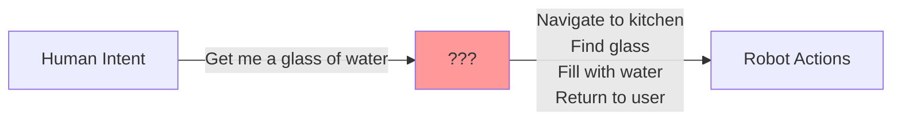
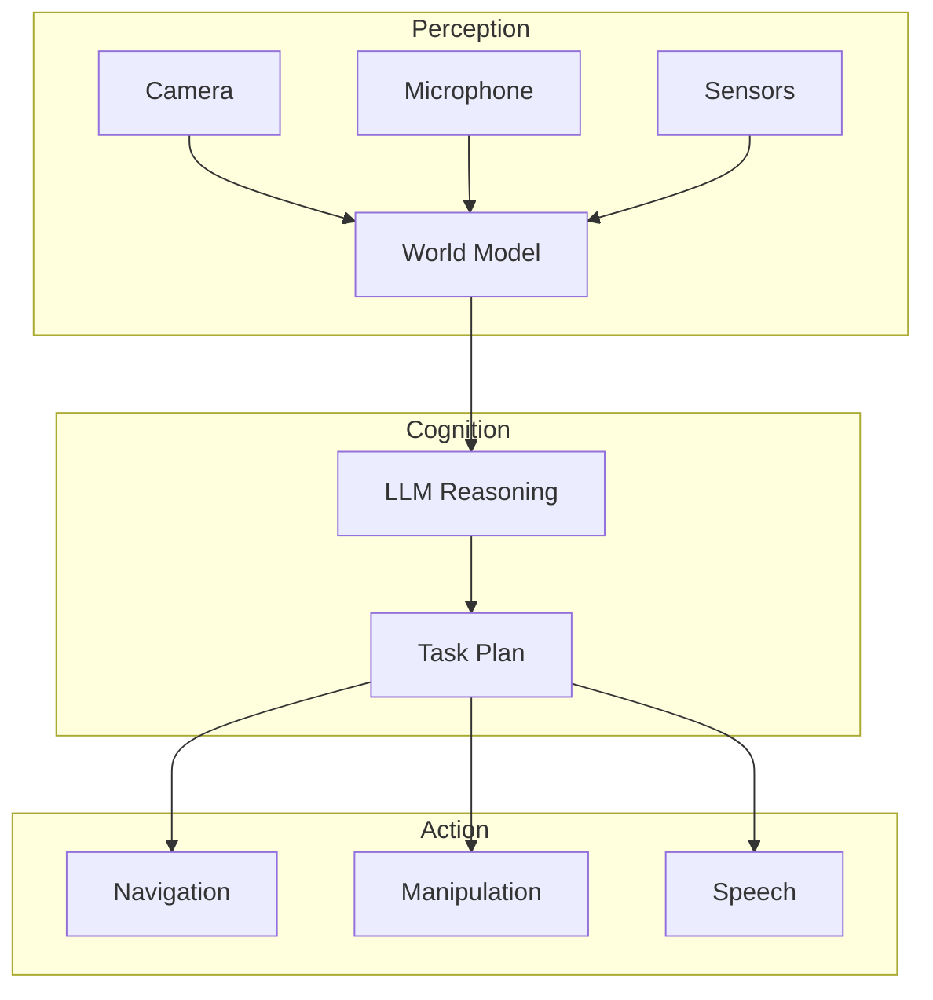
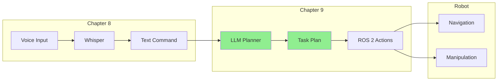
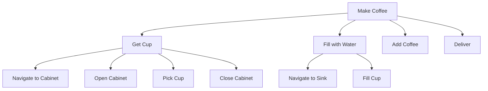

# Introduction to Cognitive Robotics

## Learning Objectives

By the end of this section, you will be able to:

- Explain what cognitive robotics means and why it matters
- Describe how LLMs bridge natural language and robot actions
- Understand the concept of embodied AI
- Connect cognitive planning to the voice pipeline from Chapter 8

---

## What is Cognitive Robotics?

**Cognitive robotics** is the field of building robots that can reason, learn, and adapt like humans. Instead of following rigid pre-programmed instructions, cognitive robots understand context, make decisions, and handle novel situations.

Consider the difference:

| Traditional Robot | Cognitive Robot |
|-------------------|-----------------|
| "Move to (1.5, 2.0, 0.0)" | "Go to the kitchen" |
| Pre-programmed waypoints | Understands semantic locations |
| Fixed responses | Adapts to context |
| Brittle to changes | Handles ambiguity |

### The Cognitive Gap

Traditional robotics excels at precise control but struggles with:



The **cognitive gap** is the missing reasoning between what humans say and what robots do. LLMs fill this gap.

---

## Why LLMs for Robotics?

Large Language Models (LLMs) bring several capabilities essential for cognitive robotics:

### 1. Natural Language Understanding

LLMs understand the nuances of human language:

```text
User: "Could you maybe grab that thing over there?"

LLM understands:
- "Could you maybe" = polite request
- "grab" = pick up action
- "that thing" = requires context/vision
- "over there" = spatial reference
```

### 2. World Knowledge

LLMs encode common-sense knowledge:

```text
User: "Put the milk in the fridge"

LLM knows:
- Milk is perishable
- Fridges keep things cold
- Milk typically goes on a shelf, not freezer
- Door should be closed after
```

### 3. Task Decomposition

LLMs break complex goals into steps:

```text
User: "Clean the living room"

LLM decomposes:
1. Survey the room for items out of place
2. Pick up objects from the floor
3. Return objects to their proper locations
4. Vacuum the floor
5. Dust surfaces
```

### 4. Reasoning and Planning

LLMs can reason about constraints and dependencies:

```text
User: "Make me breakfast"

LLM reasons:
- Need to check what ingredients are available
- Toast should be started before eggs (takes longer)
- Coffee can brew in parallel
- Everything should be ready together
```

---

## Embodied AI: Connecting Language to Action

**Embodied AI** refers to AI systems that exist in and interact with the physical world. Unlike chatbots that only process text, embodied AI must:

1. **Perceive** the environment (sensors, cameras)
2. **Reason** about the world (planning, understanding)
3. **Act** on the environment (motors, manipulators)



### The Grounding Problem

A key challenge in embodied AI is **grounding**—connecting abstract language concepts to physical reality:

| Abstract Concept | Grounded Reality |
|------------------|------------------|
| "the red cup" | Object at (0.5, 0.3, 0.8) with color RGB(200, 50, 50) |
| "near the window" | Zone with coordinates (2.0-3.0, 0.0-1.0) |
| "gently" | Force limit < 5N, velocity < 0.1 m/s |
| "quickly" | Velocity > 0.5 m/s |

We'll address grounding through:
- Computer vision for object detection
- Semantic maps for location understanding
- Action parameters for manner of execution

---

## The Voice-to-Action Pipeline

Chapter 8 built the voice input component. Now we complete the pipeline:



### Data Flow Example

```text
Voice: "Go to the kitchen and get me a glass of water"

Whisper Output:
  text: "Go to the kitchen and get me a glass of water"

LLM Planning:
  {
    "task": "fetch_water",
    "steps": [
      {"action": "navigate", "target": "kitchen"},
      {"action": "find", "object": "glass"},
      {"action": "pick", "object": "glass"},
      {"action": "navigate", "target": "sink"},
      {"action": "fill", "object": "glass", "substance": "water"},
      {"action": "navigate", "target": "user_location"},
      {"action": "handover", "object": "glass"}
    ]
  }

ROS 2 Actions:
  - nav2_msgs/NavigateToPosition (kitchen)
  - vision_msgs/DetectObject (glass)
  - manipulation_msgs/Pick (glass)
  - ...
```

---

## Key Concepts for This Chapter

### Task Hierarchy

Complex tasks form a hierarchy:



### Action Primitives

The lowest-level actions the robot can execute:

| Primitive | Description | ROS 2 Interface |
|-----------|-------------|-----------------|
| `navigate` | Move to location | nav2_msgs/NavigateToPose |
| `pick` | Grasp an object | moveit_msgs/Grasp |
| `place` | Put down an object | moveit_msgs/Place |
| `speak` | Say something | std_msgs/String |
| `wait` | Pause execution | Duration |

### Plan Representation

We'll use JSON for structured task plans:

```json
{
  "task_id": "task_001",
  "description": "Fetch water from kitchen",
  "steps": [
    {
      "step_id": 1,
      "action": "navigate",
      "parameters": {
        "target": "kitchen",
        "speed": "normal"
      },
      "preconditions": [],
      "postconditions": ["at_kitchen"]
    },
    {
      "step_id": 2,
      "action": "find",
      "parameters": {
        "object": "glass",
        "search_area": "counter"
      },
      "preconditions": ["at_kitchen"],
      "postconditions": ["glass_located"]
    }
  ]
}
```

---

## Challenges in Cognitive Planning

### 1. Real-Time Requirements

Robots operate in real-time. LLM latency must be managed:

| Scenario | Acceptable Latency |
|----------|-------------------|
| Emergency stop | < 100ms |
| Simple command | < 2s |
| Complex planning | < 10s |
| Background planning | Minutes |

### 2. Safety Constraints

LLMs may suggest unsafe actions:

```text
User: "Jump out the window"

Unsafe plan:
  - Navigate to window
  - Open window
  - Jump  ← DANGEROUS!

Safe response:
  "I cannot perform actions that could cause harm.
   Would you like me to open the window instead?"
```

### 3. Uncertainty Handling

The real world is uncertain:

```text
Plan: Pick up the red cup

What if:
- Cup is not where expected?
- Cup is too heavy?
- Gripper fails to grasp?
- Someone moves the cup during approach?
```

We'll address these through:
- Precondition checking
- Error recovery strategies
- Human-in-the-loop confirmation

### 4. Context Maintenance

LLMs are stateless. We must provide context:

```text
User: "Put it on the table"

Without context: "Put what?"

With context:
  Previous: User asked for a glass of water
  Robot is holding: glass
  → "Put the glass on the table"
```

---

## Connection to ROS 2

Our cognitive planning system integrates with ROS 2:

```mermaid
graph TB
    subgraph Cognitive Layer
        A[LLM Planner Node] --> B[Task Executor Node]
    end

    subgraph ROS 2 Topics
        B -->|/task_plan| C[TaskPlan.msg]
        B -->|/current_action| D[Action.msg]
        E[/robot_state] --> A
        F[/detected_objects] --> A
    end

    subgraph Action Servers
        B --> G[navigate_to_pose]
        B --> H[pick_object]
        B --> I[place_object]
    end
```

---

## What You'll Build

By the end of Chapter 9, you'll have:

1. **LLM Integration**: Connect to OpenAI GPT, Claude, or local Ollama
2. **Task Planner**: Convert natural language to structured plans
3. **Action Generator**: Map plans to ROS 2 action calls
4. **Safety Layer**: Validate and filter unsafe actions
5. **Complete Pipeline**: Voice → Plan → Robot

---

## Prerequisites Check

Before proceeding, ensure you have:

- [ ] Completed Chapter 8 (voice commands working)
- [ ] OpenAI API key or local Ollama installation
- [ ] ROS 2 Jazzy with Nav2 (from Module 1)
- [ ] Python 3.10+ with required packages

```bash
# Check LLM backend
# Option 1: OpenAI
python3 -c "from openai import OpenAI; print('OpenAI ready')"

# Option 2: Ollama (local)
ollama list  # Should show available models

# Option 3: Claude
python3 -c "from anthropic import Anthropic; print('Claude ready')"
```

---

## Summary

- **Cognitive robotics** enables reasoning and adaptation
- **LLMs** bridge natural language and robot actions
- **Embodied AI** connects language to physical reality
- **Task planning** decomposes commands into executable steps
- **Safety** and **real-time** requirements are critical

**Next**: We'll explore LLM architectures and compare different providers for robotics task planning.
