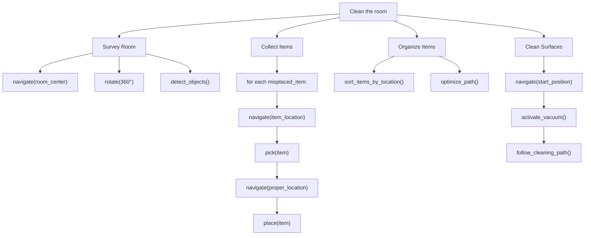

# Natural Language to Actions

## Learning Objectives

By the end of this section, you will be able to:

- Implement task decomposition for complex commands
- Extract action parameters from natural language
- Build structured action sequences
- Handle conditional and parallel actions

---

## Task Decomposition Methodology

### The Decomposition Process

Converting "Clean the room" into robot actions:



### Decomposition Levels

| Level | Description | Example |
|-------|-------------|---------|
| **Goal** | High-level intent | "Clean the room" |
| **Task** | Major subtask | "Collect misplaced items" |
| **Action** | Atomic operation | "Pick up the book" |
| **Primitive** | Robot command | `pick(object="book", hand="right")` |

---

## Action Representation

### The RobotAction Class

```python
#!/usr/bin/env python3
"""Action representation for robot task planning."""

from dataclasses import dataclass, field
from typing import Dict, Any, List, Optional
from enum import Enum
import json


class ActionType(Enum):
    """Types of robot actions."""
    NAVIGATE = "navigate"
    PICK = "pick"
    PLACE = "place"
    FIND = "find"
    SPEAK = "speak"
    WAIT = "wait"
    HANDOVER = "handover"
    INTERACT = "interact"


class ActionStatus(Enum):
    """Action execution status."""
    PENDING = "pending"
    EXECUTING = "executing"
    COMPLETED = "completed"
    FAILED = "failed"
    SKIPPED = "skipped"


@dataclass
class RobotAction:
    """
    Represents a single robot action.

    Attributes:
        action_id: Unique identifier
        action_type: Type of action
        parameters: Action-specific parameters
        description: Human-readable description
        preconditions: Conditions that must be true before execution
        postconditions: Conditions that will be true after execution
        timeout_seconds: Maximum execution time
        retry_count: Number of retries on failure
    """
    action_id: str
    action_type: ActionType
    parameters: Dict[str, Any]
    description: str = ""
    preconditions: List[str] = field(default_factory=list)
    postconditions: List[str] = field(default_factory=list)
    timeout_seconds: float = 30.0
    retry_count: int = 2
    status: ActionStatus = ActionStatus.PENDING

    def to_dict(self) -> Dict[str, Any]:
        """Convert to dictionary for serialization."""
        return {
            "action_id": self.action_id,
            "action_type": self.action_type.value,
            "parameters": self.parameters,
            "description": self.description,
            "preconditions": self.preconditions,
            "postconditions": self.postconditions,
            "timeout_seconds": self.timeout_seconds,
            "retry_count": self.retry_count,
            "status": self.status.value
        }

    @classmethod
    def from_dict(cls, data: Dict[str, Any]) -> "RobotAction":
        """Create from dictionary."""
        return cls(
            action_id=data["action_id"],
            action_type=ActionType(data["action_type"]),
            parameters=data.get("parameters", {}),
            description=data.get("description", ""),
            preconditions=data.get("preconditions", []),
            postconditions=data.get("postconditions", []),
            timeout_seconds=data.get("timeout_seconds", 30.0),
            retry_count=data.get("retry_count", 2),
            status=ActionStatus(data.get("status", "pending"))
        )


@dataclass
class TaskPlan:
    """
    Complete task plan with ordered actions.

    Attributes:
        plan_id: Unique identifier
        description: High-level task description
        actions: Ordered list of actions
        context: Environmental context
        estimated_duration: Total estimated time
    """
    plan_id: str
    description: str
    actions: List[RobotAction]
    context: Dict[str, Any] = field(default_factory=dict)
    estimated_duration_seconds: float = 0.0

    def to_json(self) -> str:
        """Serialize to JSON."""
        return json.dumps({
            "plan_id": self.plan_id,
            "description": self.description,
            "actions": [a.to_dict() for a in self.actions],
            "context": self.context,
            "estimated_duration_seconds": self.estimated_duration_seconds
        }, indent=2)

    @classmethod
    def from_json(cls, json_str: str) -> "TaskPlan":
        """Deserialize from JSON."""
        data = json.loads(json_str)
        return cls(
            plan_id=data["plan_id"],
            description=data["description"],
            actions=[RobotAction.from_dict(a) for a in data["actions"]],
            context=data.get("context", {}),
            estimated_duration_seconds=data.get("estimated_duration_seconds", 0.0)
        )
```

---

## Parameter Extraction

### Extracting Values from Natural Language

```python
#!/usr/bin/env python3
"""Parameter extraction from natural language."""

import re
from typing import Dict, Any, Optional, List, Tuple
from dataclasses import dataclass


@dataclass
class ExtractedParameters:
    """Parameters extracted from natural language."""
    object_name: Optional[str] = None
    location: Optional[str] = None
    quantity: Optional[int] = None
    color: Optional[str] = None
    size: Optional[str] = None
    speed: Optional[str] = None
    direction: Optional[str] = None
    distance: Optional[Tuple[float, str]] = None  # (value, unit)
    duration: Optional[float] = None


class ParameterExtractor:
    """Extract action parameters from natural language."""

    # Common patterns
    DISTANCE_PATTERN = r'(\d+(?:\.\d+)?)\s*(meters?|m|feet|ft|centimeters?|cm)'
    DURATION_PATTERN = r'(\d+(?:\.\d+)?)\s*(seconds?|s|minutes?|min|hours?|h)'
    QUANTITY_PATTERN = r'(\d+)\s+(?:of\s+)?(\w+)'
    COLOR_PATTERN = r'\b(red|blue|green|yellow|orange|purple|black|white|brown|pink)\b'
    SIZE_PATTERN = r'\b(small|medium|large|big|tiny|huge)\b'
    SPEED_PATTERN = r'\b(slowly|quickly|fast|slow|carefully|gently)\b'
    DIRECTION_PATTERN = r'\b(left|right|forward|backward|up|down|north|south|east|west)\b'

    # Known locations
    LOCATIONS = [
        "kitchen", "bedroom", "living room", "bathroom", "garage",
        "table", "counter", "shelf", "cabinet", "drawer", "sink",
        "fridge", "refrigerator", "couch", "sofa", "bed", "desk"
    ]

    # Common objects
    OBJECTS = [
        "cup", "glass", "mug", "bottle", "plate", "bowl",
        "book", "remote", "phone", "keys", "wallet",
        "apple", "banana", "orange", "water"
    ]

    def extract(self, text: str) -> ExtractedParameters:
        """
        Extract all parameters from text.

        Args:
            text: Natural language input

        Returns:
            ExtractedParameters with all found values
        """
        text_lower = text.lower()
        params = ExtractedParameters()

        # Extract distance
        distance_match = re.search(self.DISTANCE_PATTERN, text_lower)
        if distance_match:
            value = float(distance_match.group(1))
            unit = distance_match.group(2)
            params.distance = (value, unit)

        # Extract duration
        duration_match = re.search(self.DURATION_PATTERN, text_lower)
        if duration_match:
            value = float(duration_match.group(1))
            unit = duration_match.group(2)
            # Convert to seconds
            if 'min' in unit:
                value *= 60
            elif 'h' in unit:
                value *= 3600
            params.duration = value

        # Extract color
        color_match = re.search(self.COLOR_PATTERN, text_lower)
        if color_match:
            params.color = color_match.group(1)

        # Extract size
        size_match = re.search(self.SIZE_PATTERN, text_lower)
        if size_match:
            params.size = size_match.group(1)

        # Extract speed
        speed_match = re.search(self.SPEED_PATTERN, text_lower)
        if speed_match:
            params.speed = self._normalize_speed(speed_match.group(1))

        # Extract direction
        direction_match = re.search(self.DIRECTION_PATTERN, text_lower)
        if direction_match:
            params.direction = direction_match.group(1)

        # Extract location
        for loc in self.LOCATIONS:
            if loc in text_lower:
                params.location = loc
                break

        # Extract object
        for obj in self.OBJECTS:
            if obj in text_lower:
                params.object_name = obj
                break

        return params

    def _normalize_speed(self, speed: str) -> str:
        """Normalize speed descriptors."""
        slow_words = ["slowly", "slow", "carefully", "gently"]
        fast_words = ["quickly", "fast"]

        if speed in slow_words:
            return "slow"
        elif speed in fast_words:
            return "fast"
        return "normal"


# Test extraction
if __name__ == "__main__":
    extractor = ParameterExtractor()

    test_phrases = [
        "Move forward 2 meters",
        "Pick up the red cup from the table",
        "Go to the kitchen slowly",
        "Wait for 30 seconds",
        "Get me a large glass of water",
        "Turn left and move 5 feet forward"
    ]

    for phrase in test_phrases:
        params = extractor.extract(phrase)
        print(f"\n'{phrase}'")
        print(f"  Object: {params.object_name}")
        print(f"  Location: {params.location}")
        print(f"  Color: {params.color}")
        print(f"  Speed: {params.speed}")
        print(f"  Distance: {params.distance}")
        print(f"  Duration: {params.duration}")
```

---

## Building Action Sequences

### The ActionBuilder Class

```python
#!/usr/bin/env python3
"""Build action sequences from parsed commands."""

from typing import List, Optional
import uuid


class ActionBuilder:
    """
    Builds executable action sequences from parsed parameters.
    """

    def __init__(self):
        self.action_templates = {
            "fetch": self._build_fetch_sequence,
            "navigate": self._build_navigate_sequence,
            "clean": self._build_clean_sequence,
            "deliver": self._build_deliver_sequence,
        }

    def build(
        self,
        intent: str,
        params: ExtractedParameters,
        context: Dict[str, Any] = None
    ) -> TaskPlan:
        """
        Build a task plan from intent and parameters.

        Args:
            intent: Detected intent (fetch, navigate, clean, etc.)
            params: Extracted parameters
            context: Environmental context

        Returns:
            Complete TaskPlan
        """
        context = context or {}

        builder = self.action_templates.get(intent)
        if not builder:
            raise ValueError(f"Unknown intent: {intent}")

        actions = builder(params, context)

        return TaskPlan(
            plan_id=str(uuid.uuid4())[:8],
            description=f"{intent} task",
            actions=actions,
            context=context,
            estimated_duration_seconds=sum(a.timeout_seconds for a in actions)
        )

    def _build_fetch_sequence(
        self,
        params: ExtractedParameters,
        context: Dict[str, Any]
    ) -> List[RobotAction]:
        """Build fetch object sequence."""
        actions = []
        obj = params.object_name or "object"
        location = params.location or "nearby"
        speed = params.speed or "normal"

        # Navigate to object location
        actions.append(RobotAction(
            action_id=f"nav_{uuid.uuid4().hex[:4]}",
            action_type=ActionType.NAVIGATE,
            parameters={"target": location, "speed": speed},
            description=f"Navigate to {location}",
            postconditions=[f"at_{location}"]
        ))

        # Find the object
        actions.append(RobotAction(
            action_id=f"find_{uuid.uuid4().hex[:4]}",
            action_type=ActionType.FIND,
            parameters={
                "object": obj,
                "color": params.color,
                "size": params.size
            },
            description=f"Locate {obj}",
            preconditions=[f"at_{location}"],
            postconditions=[f"{obj}_located"]
        ))

        # Pick up object
        actions.append(RobotAction(
            action_id=f"pick_{uuid.uuid4().hex[:4]}",
            action_type=ActionType.PICK,
            parameters={"object": obj, "hand": "right"},
            description=f"Pick up {obj}",
            preconditions=[f"{obj}_located"],
            postconditions=[f"holding_{obj}"]
        ))

        # Return to user
        actions.append(RobotAction(
            action_id=f"nav_{uuid.uuid4().hex[:4]}",
            action_type=ActionType.NAVIGATE,
            parameters={"target": "user_location", "speed": "slow"},
            description="Return to user",
            preconditions=[f"holding_{obj}"],
            postconditions=["at_user"]
        ))

        # Hand over
        actions.append(RobotAction(
            action_id=f"hand_{uuid.uuid4().hex[:4]}",
            action_type=ActionType.HANDOVER,
            parameters={"object": obj},
            description=f"Hand {obj} to user",
            preconditions=["at_user", f"holding_{obj}"],
            postconditions=[f"{obj}_delivered"]
        ))

        return actions

    def _build_navigate_sequence(
        self,
        params: ExtractedParameters,
        context: Dict[str, Any]
    ) -> List[RobotAction]:
        """Build navigation sequence."""
        actions = []
        target = params.location or params.direction
        speed = params.speed or "normal"

        if params.distance:
            value, unit = params.distance
            # Convert to meters
            if 'ft' in unit or 'feet' in unit:
                value *= 0.3048
            elif 'cm' in unit:
                value /= 100

            actions.append(RobotAction(
                action_id=f"move_{uuid.uuid4().hex[:4]}",
                action_type=ActionType.NAVIGATE,
                parameters={
                    "direction": params.direction or "forward",
                    "distance": value,
                    "speed": speed
                },
                description=f"Move {params.direction or 'forward'} {value:.1f}m"
            ))
        else:
            actions.append(RobotAction(
                action_id=f"nav_{uuid.uuid4().hex[:4]}",
                action_type=ActionType.NAVIGATE,
                parameters={"target": target, "speed": speed},
                description=f"Navigate to {target}"
            ))

        return actions

    def _build_clean_sequence(
        self,
        params: ExtractedParameters,
        context: Dict[str, Any]
    ) -> List[RobotAction]:
        """Build cleaning sequence."""
        location = params.location or "room"
        actions = []

        # Announce start
        actions.append(RobotAction(
            action_id=f"speak_{uuid.uuid4().hex[:4]}",
            action_type=ActionType.SPEAK,
            parameters={"message": f"Starting to clean the {location}"},
            description="Announce cleaning start"
        ))

        # Survey area
        actions.append(RobotAction(
            action_id=f"nav_{uuid.uuid4().hex[:4]}",
            action_type=ActionType.NAVIGATE,
            parameters={"target": f"{location}_center", "speed": "slow"},
            description=f"Move to center of {location}"
        ))

        # Scan for objects
        actions.append(RobotAction(
            action_id=f"find_{uuid.uuid4().hex[:4]}",
            action_type=ActionType.FIND,
            parameters={"object": "misplaced_items", "search_area": location},
            description="Scan for misplaced items"
        ))

        # Complete
        actions.append(RobotAction(
            action_id=f"speak_{uuid.uuid4().hex[:4]}",
            action_type=ActionType.SPEAK,
            parameters={"message": f"Finished cleaning the {location}"},
            description="Announce completion"
        ))

        return actions

    def _build_deliver_sequence(
        self,
        params: ExtractedParameters,
        context: Dict[str, Any]
    ) -> List[RobotAction]:
        """Build delivery sequence."""
        obj = params.object_name or "item"
        destination = params.location or "user"

        return [
            RobotAction(
                action_id=f"nav_{uuid.uuid4().hex[:4]}",
                action_type=ActionType.NAVIGATE,
                parameters={"target": destination, "speed": "normal"},
                description=f"Navigate to {destination}",
                preconditions=[f"holding_{obj}"]
            ),
            RobotAction(
                action_id=f"place_{uuid.uuid4().hex[:4]}",
                action_type=ActionType.PLACE,
                parameters={"object": obj, "location": destination},
                description=f"Place {obj} at {destination}"
            )
        ]
```

---

## Conditional and Parallel Actions

### Conditional Actions

```python
@dataclass
class ConditionalAction:
    """Action that executes based on a condition."""
    condition: str
    if_true: RobotAction
    if_false: Optional[RobotAction] = None


def build_conditional_plan(
    command: str,
    condition: str
) -> List[RobotAction]:
    """
    Build plan with conditional logic.

    Example: "If the cup is on the table, pick it up"
    """
    actions = []

    # Check condition
    actions.append(RobotAction(
        action_id="check_condition",
        action_type=ActionType.FIND,
        parameters={"condition": condition},
        description=f"Check: {condition}"
    ))

    # Conditional execution handled by executor
    return actions
```

### Parallel Actions

```python
@dataclass
class ParallelActionGroup:
    """Group of actions that can execute simultaneously."""
    group_id: str
    actions: List[RobotAction]
    wait_for_all: bool = True


def build_parallel_plan() -> List[ParallelActionGroup]:
    """
    Build plan with parallel actions.

    Example: While navigating, announce the destination
    """
    return [
        ParallelActionGroup(
            group_id="nav_and_speak",
            actions=[
                RobotAction(
                    action_id="nav",
                    action_type=ActionType.NAVIGATE,
                    parameters={"target": "kitchen", "speed": "normal"},
                    description="Navigate to kitchen"
                ),
                RobotAction(
                    action_id="speak",
                    action_type=ActionType.SPEAK,
                    parameters={"message": "Heading to the kitchen"},
                    description="Announce destination"
                )
            ],
            wait_for_all=False  # Continue when navigation completes
        )
    ]
```

---

## Complete Command Pipeline

### End-to-End Example

```python
#!/usr/bin/env python3
"""Complete command-to-action pipeline."""

from dataclasses import dataclass
from typing import Optional


@dataclass
class CommandPipeline:
    """
    Complete pipeline from natural language to actions.
    """

    def __init__(self):
        self.extractor = ParameterExtractor()
        self.builder = ActionBuilder()
        self.intent_classifier = IntentClassifier()

    def process(self, command: str, context: dict = None) -> TaskPlan:
        """
        Process natural language command into action plan.

        Args:
            command: Natural language command
            context: Environmental context

        Returns:
            TaskPlan ready for execution
        """
        # Step 1: Classify intent
        intent = self.intent_classifier.classify(command)
        print(f"Intent: {intent}")

        # Step 2: Extract parameters
        params = self.extractor.extract(command)
        print(f"Parameters: {params}")

        # Step 3: Build action sequence
        plan = self.builder.build(intent, params, context)
        print(f"Plan: {len(plan.actions)} actions")

        return plan


class IntentClassifier:
    """Simple intent classification."""

    INTENT_KEYWORDS = {
        "fetch": ["get", "bring", "fetch", "grab", "take"],
        "navigate": ["go", "move", "walk", "come", "travel"],
        "clean": ["clean", "tidy", "organize", "vacuum"],
        "deliver": ["put", "place", "deliver", "take to"],
    }

    def classify(self, text: str) -> str:
        """Classify command intent."""
        text_lower = text.lower()

        for intent, keywords in self.INTENT_KEYWORDS.items():
            for keyword in keywords:
                if keyword in text_lower:
                    return intent

        return "unknown"


# Demo
if __name__ == "__main__":
    pipeline = CommandPipeline()

    commands = [
        "Get me the red cup from the kitchen",
        "Go to the bedroom slowly",
        "Clean the living room",
        "Put this on the table"
    ]

    for cmd in commands:
        print(f"\n{'='*50}")
        print(f"Command: {cmd}")
        print(f"{'='*50}")

        plan = pipeline.process(cmd)

        print(f"\nGenerated Plan:")
        for action in plan.actions:
            print(f"  - [{action.action_type.value}] {action.description}")
            print(f"    Params: {action.parameters}")
```

---

## Summary

- **Task decomposition**: Break high-level goals into atomic actions
- **Parameter extraction**: Use regex and NLP to extract values
- **Action representation**: Structured `RobotAction` with pre/postconditions
- **ActionBuilder**: Template-based sequence generation
- **Conditional/Parallel**: Handle complex action relationships

**Next**: We'll integrate these action plans with ROS 2 action servers for actual robot execution.
