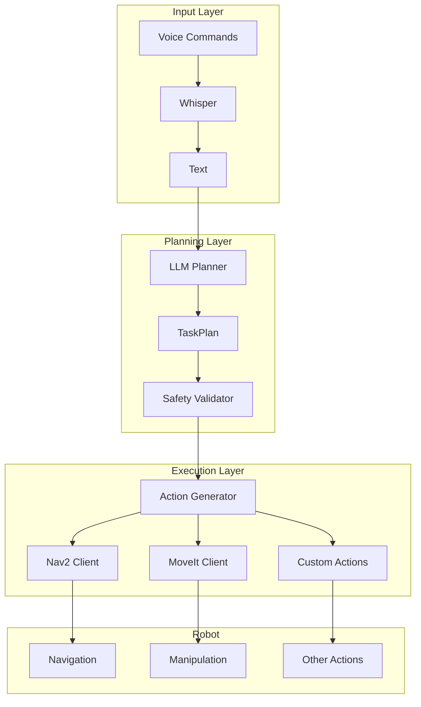
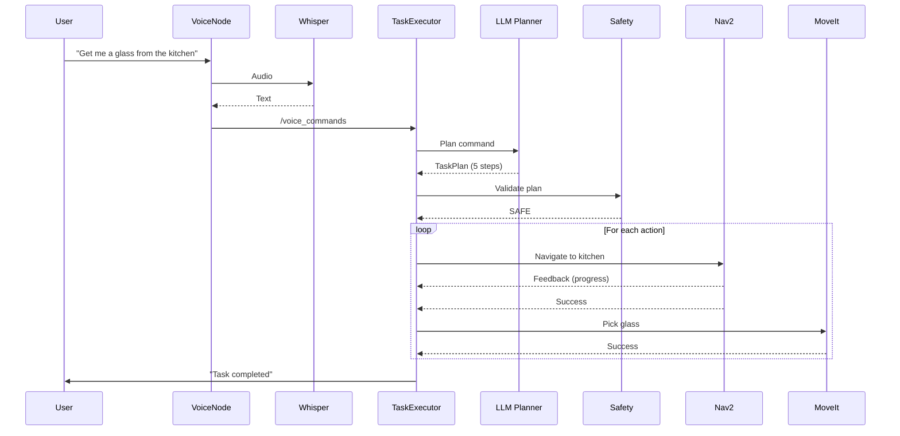

# ROS 2 Action Generation

## Learning Objectives

By the end of this section, you will be able to:

- Convert task plans to ROS 2 action goals
- Integrate with Nav2 for navigation actions
- Interface with MoveIt for manipulation
- Implement safety validation and constraints
- Build a complete Voice → LLM → ROS 2 pipeline

---

## System Architecture



---

## Part 1: ROS 2 Action Client Basics

### Understanding ROS 2 Actions

Actions are ideal for long-running tasks with feedback:

```python
# Action structure
# - Goal: What to achieve
# - Result: Outcome when complete
# - Feedback: Progress updates during execution
```

### Generic Action Client

```python
#!/usr/bin/env python3
"""Generic ROS 2 action client wrapper."""

import rclpy
from rclpy.node import Node
from rclpy.action import ActionClient
from rclpy.action.client import ClientGoalHandle
from action_msgs.msg import GoalStatus
from typing import Any, Callable, Optional
import asyncio


class ActionClientWrapper:
    """
    Wrapper for ROS 2 action clients with async support.
    """

    def __init__(
        self,
        node: Node,
        action_type: Any,
        action_name: str
    ):
        """
        Initialize action client.

        Args:
            node: ROS 2 node
            action_type: Action type class
            action_name: Action server name
        """
        self.node = node
        self.action_name = action_name
        self._client = ActionClient(node, action_type, action_name)
        self._goal_handle: Optional[ClientGoalHandle] = None
        self._feedback_callback: Optional[Callable] = None

    def wait_for_server(self, timeout_sec: float = 10.0) -> bool:
        """Wait for action server to be available."""
        self.node.get_logger().info(
            f"Waiting for action server: {self.action_name}"
        )
        return self._client.wait_for_server(timeout_sec)

    async def send_goal_async(
        self,
        goal: Any,
        feedback_callback: Optional[Callable] = None
    ) -> Any:
        """
        Send goal and wait for result asynchronously.

        Args:
            goal: Goal message
            feedback_callback: Optional callback for feedback

        Returns:
            Result message
        """
        self._feedback_callback = feedback_callback

        # Send goal
        goal_future = self._client.send_goal_async(
            goal,
            feedback_callback=self._handle_feedback
        )

        # Wait for goal acceptance
        self._goal_handle = await goal_future

        if not self._goal_handle.accepted:
            self.node.get_logger().warning("Goal rejected")
            return None

        self.node.get_logger().info("Goal accepted")

        # Wait for result
        result_future = self._goal_handle.get_result_async()
        result = await result_future

        return result.result

    def _handle_feedback(self, feedback_msg):
        """Handle feedback from action server."""
        if self._feedback_callback:
            self._feedback_callback(feedback_msg.feedback)

    def cancel_goal(self):
        """Cancel the current goal."""
        if self._goal_handle:
            self.node.get_logger().info("Canceling goal")
            self._goal_handle.cancel_goal_async()
```

---

## Part 2: Nav2 Integration

### NavigateToPose Action Client

```python
#!/usr/bin/env python3
"""Nav2 navigation action client."""

import rclpy
from rclpy.node import Node
from nav2_msgs.action import NavigateToPose
from geometry_msgs.msg import PoseStamped, Quaternion
from tf_transformations import quaternion_from_euler
import math
from typing import Tuple, Optional, Callable


class Nav2Client:
    """
    Client for Nav2 NavigateToPose action.
    """

    # Predefined semantic locations
    LOCATIONS = {
        "kitchen": (3.0, 2.0, 0.0),
        "bedroom": (5.0, 4.0, 1.57),
        "living_room": (1.0, 1.0, 0.0),
        "bathroom": (4.0, 1.0, 3.14),
        "entrance": (0.0, 0.0, 0.0),
    }

    def __init__(self, node: Node):
        """Initialize Nav2 client."""
        self.node = node
        self._client = ActionClientWrapper(
            node,
            NavigateToPose,
            'navigate_to_pose'
        )

    def wait_for_server(self, timeout: float = 10.0) -> bool:
        """Wait for Nav2 action server."""
        return self._client.wait_for_server(timeout)

    async def navigate_to_pose(
        self,
        x: float,
        y: float,
        theta: float = 0.0,
        frame_id: str = "map",
        feedback_callback: Optional[Callable] = None
    ) -> bool:
        """
        Navigate to a specific pose.

        Args:
            x: X coordinate in meters
            y: Y coordinate in meters
            theta: Orientation in radians
            frame_id: Reference frame
            feedback_callback: Progress callback

        Returns:
            True if navigation succeeded
        """
        # Create goal pose
        goal = NavigateToPose.Goal()
        goal.pose = self._create_pose_stamped(x, y, theta, frame_id)

        self.node.get_logger().info(
            f"Navigating to ({x:.2f}, {y:.2f}, {math.degrees(theta):.0f}°)"
        )

        # Send goal
        result = await self._client.send_goal_async(
            goal,
            feedback_callback=feedback_callback
        )

        return result is not None

    async def navigate_to_location(
        self,
        location_name: str,
        feedback_callback: Optional[Callable] = None
    ) -> bool:
        """
        Navigate to a named semantic location.

        Args:
            location_name: Name of predefined location
            feedback_callback: Progress callback

        Returns:
            True if navigation succeeded
        """
        if location_name not in self.LOCATIONS:
            self.node.get_logger().error(
                f"Unknown location: {location_name}"
            )
            return False

        x, y, theta = self.LOCATIONS[location_name]
        return await self.navigate_to_pose(
            x, y, theta,
            feedback_callback=feedback_callback
        )

    def _create_pose_stamped(
        self,
        x: float,
        y: float,
        theta: float,
        frame_id: str
    ) -> PoseStamped:
        """Create PoseStamped message."""
        pose = PoseStamped()
        pose.header.frame_id = frame_id
        pose.header.stamp = self.node.get_clock().now().to_msg()

        pose.pose.position.x = x
        pose.pose.position.y = y
        pose.pose.position.z = 0.0

        # Convert yaw to quaternion
        q = quaternion_from_euler(0, 0, theta)
        pose.pose.orientation = Quaternion(
            x=q[0], y=q[1], z=q[2], w=q[3]
        )

        return pose

    def cancel_navigation(self):
        """Cancel current navigation."""
        self._client.cancel_goal()
```

### Navigation Feedback Handler

```python
def navigation_feedback_handler(feedback):
    """Handle navigation feedback."""
    # Extract current pose
    current = feedback.current_pose.pose
    x = current.position.x
    y = current.position.y

    # Calculate remaining distance
    remaining = feedback.distance_remaining

    print(f"Position: ({x:.2f}, {y:.2f}) | Remaining: {remaining:.2f}m")
```

---

## Part 3: MoveIt Integration

### Manipulation Action Client

```python
#!/usr/bin/env python3
"""MoveIt manipulation action client."""

import rclpy
from rclpy.node import Node
from moveit_msgs.action import MoveGroup
from moveit_msgs.msg import (
    MotionPlanRequest,
    Constraints,
    PositionConstraint,
    OrientationConstraint,
    BoundingVolume
)
from geometry_msgs.msg import Pose, Point
from shape_msgs.msg import SolidPrimitive
from typing import List, Optional, Tuple


class MoveItClient:
    """
    Client for MoveIt motion planning.
    """

    def __init__(self, node: Node, group_name: str = "arm"):
        """
        Initialize MoveIt client.

        Args:
            node: ROS 2 node
            group_name: MoveIt planning group name
        """
        self.node = node
        self.group_name = group_name
        self._client = ActionClientWrapper(
            node,
            MoveGroup,
            'move_action'
        )

    async def move_to_pose(
        self,
        position: Tuple[float, float, float],
        orientation: Tuple[float, float, float, float],
        end_effector_link: str = "gripper_link"
    ) -> bool:
        """
        Move end effector to target pose.

        Args:
            position: (x, y, z) target position
            orientation: (x, y, z, w) quaternion orientation
            end_effector_link: End effector frame

        Returns:
            True if motion succeeded
        """
        goal = MoveGroup.Goal()

        # Create motion plan request
        goal.request = MotionPlanRequest()
        goal.request.group_name = self.group_name
        goal.request.num_planning_attempts = 5
        goal.request.allowed_planning_time = 5.0

        # Create pose constraint
        constraint = Constraints()
        constraint.name = "target_pose"

        # Position constraint
        pos_constraint = PositionConstraint()
        pos_constraint.header.frame_id = "base_link"
        pos_constraint.link_name = end_effector_link
        pos_constraint.target_point_offset = Point(x=0.0, y=0.0, z=0.0)

        # Target region (small sphere around target)
        region = BoundingVolume()
        sphere = SolidPrimitive()
        sphere.type = SolidPrimitive.SPHERE
        sphere.dimensions = [0.01]  # 1cm tolerance
        region.primitives.append(sphere)

        target_pose = Pose()
        target_pose.position.x = position[0]
        target_pose.position.y = position[1]
        target_pose.position.z = position[2]
        region.primitive_poses.append(target_pose)

        pos_constraint.constraint_region = region
        pos_constraint.weight = 1.0
        constraint.position_constraints.append(pos_constraint)

        # Orientation constraint
        orient_constraint = OrientationConstraint()
        orient_constraint.header.frame_id = "base_link"
        orient_constraint.link_name = end_effector_link
        orient_constraint.orientation.x = orientation[0]
        orient_constraint.orientation.y = orientation[1]
        orient_constraint.orientation.z = orientation[2]
        orient_constraint.orientation.w = orientation[3]
        orient_constraint.absolute_x_axis_tolerance = 0.1
        orient_constraint.absolute_y_axis_tolerance = 0.1
        orient_constraint.absolute_z_axis_tolerance = 0.1
        orient_constraint.weight = 1.0
        constraint.orientation_constraints.append(orient_constraint)

        goal.request.goal_constraints.append(constraint)

        # Execute
        result = await self._client.send_goal_async(goal)
        return result is not None and result.error_code.val == 1

    async def move_to_named_pose(self, pose_name: str) -> bool:
        """
        Move to a named pose (e.g., 'home', 'ready').

        Args:
            pose_name: Name of predefined pose

        Returns:
            True if motion succeeded
        """
        goal = MoveGroup.Goal()
        goal.request = MotionPlanRequest()
        goal.request.group_name = self.group_name

        # Use named target
        goal.request.start_state.is_diff = True
        # Named targets handled by MoveIt configuration

        self.node.get_logger().info(f"Moving to named pose: {pose_name}")
        result = await self._client.send_goal_async(goal)

        return result is not None
```

### Gripper Control

```python
#!/usr/bin/env python3
"""Gripper control for manipulation."""

from rclpy.node import Node
from control_msgs.action import GripperCommand
from typing import Optional


class GripperClient:
    """Client for gripper control."""

    def __init__(self, node: Node, gripper_name: str = "gripper"):
        self.node = node
        self._client = ActionClientWrapper(
            node,
            GripperCommand,
            f'{gripper_name}_controller/gripper_cmd'
        )

    async def open_gripper(self, width: float = 0.08) -> bool:
        """Open the gripper."""
        goal = GripperCommand.Goal()
        goal.command.position = width
        goal.command.max_effort = 10.0

        result = await self._client.send_goal_async(goal)
        return result is not None

    async def close_gripper(self, force: float = 50.0) -> bool:
        """Close the gripper with specified force."""
        goal = GripperCommand.Goal()
        goal.command.position = 0.0
        goal.command.max_effort = force

        result = await self._client.send_goal_async(goal)
        return result is not None
```

---

## Part 4: Safety Validation

### Safety Validator

```python
#!/usr/bin/env python3
"""Safety validation for robot actions."""

from dataclasses import dataclass
from typing import List, Optional, Set
from enum import Enum


class SafetyLevel(Enum):
    """Safety classification levels."""
    SAFE = "safe"
    CAUTION = "caution"
    DANGEROUS = "dangerous"
    FORBIDDEN = "forbidden"


@dataclass
class SafetyCheckResult:
    """Result of safety validation."""
    level: SafetyLevel
    passed: bool
    issues: List[str]
    suggestions: List[str]


class SafetyValidator:
    """
    Validates task plans for safety constraints.
    """

    # Forbidden actions
    FORBIDDEN_ACTIONS = {
        "jump", "throw", "run", "climb_stairs",
        "open_window", "use_knife", "use_stove"
    }

    # Dangerous locations
    DANGEROUS_LOCATIONS = {
        "stairs", "balcony", "roof", "window_ledge",
        "garage", "street", "elevator_shaft"
    }

    # Speed limits by context
    SPEED_LIMITS = {
        "near_human": 0.3,      # m/s
        "carrying_liquid": 0.2,
        "carrying_fragile": 0.2,
        "normal": 0.5,
        "open_space": 0.8
    }

    # Force limits
    MAX_GRIP_FORCE = 50.0  # Newtons
    MAX_PUSH_FORCE = 20.0

    def validate_plan(self, plan: 'TaskPlan') -> SafetyCheckResult:
        """
        Validate entire task plan.

        Args:
            plan: TaskPlan to validate

        Returns:
            SafetyCheckResult with issues and suggestions
        """
        issues = []
        suggestions = []
        level = SafetyLevel.SAFE

        for action in plan.actions:
            result = self.validate_action(action)

            if not result.passed:
                issues.extend(result.issues)
                suggestions.extend(result.suggestions)

                if result.level == SafetyLevel.FORBIDDEN:
                    level = SafetyLevel.FORBIDDEN
                elif result.level == SafetyLevel.DANGEROUS and level != SafetyLevel.FORBIDDEN:
                    level = SafetyLevel.DANGEROUS
                elif result.level == SafetyLevel.CAUTION and level == SafetyLevel.SAFE:
                    level = SafetyLevel.CAUTION

        return SafetyCheckResult(
            level=level,
            passed=(level not in [SafetyLevel.DANGEROUS, SafetyLevel.FORBIDDEN]),
            issues=issues,
            suggestions=suggestions
        )

    def validate_action(self, action: 'RobotAction') -> SafetyCheckResult:
        """Validate a single action."""
        issues = []
        suggestions = []
        level = SafetyLevel.SAFE

        action_name = action.action_type.value
        params = action.parameters

        # Check forbidden actions
        if action_name in self.FORBIDDEN_ACTIONS:
            return SafetyCheckResult(
                level=SafetyLevel.FORBIDDEN,
                passed=False,
                issues=[f"Action '{action_name}' is forbidden"],
                suggestions=["Request an alternative approach"]
            )

        # Check dangerous locations
        target = params.get("target", "")
        if target in self.DANGEROUS_LOCATIONS:
            return SafetyCheckResult(
                level=SafetyLevel.DANGEROUS,
                passed=False,
                issues=[f"Location '{target}' is dangerous"],
                suggestions=[f"Consider a safer alternative to {target}"]
            )

        # Check speed limits
        speed = params.get("speed", "normal")
        if speed == "fast" and params.get("near_human", False):
            issues.append("Fast speed near humans is unsafe")
            suggestions.append("Reduce speed when humans are nearby")
            level = SafetyLevel.CAUTION

        # Check manipulation safety
        if action_name == "pick":
            obj = params.get("object", "")
            if self._is_heavy_object(obj):
                issues.append(f"Object '{obj}' may be too heavy")
                suggestions.append("Verify object weight before lifting")
                level = SafetyLevel.CAUTION

        return SafetyCheckResult(
            level=level,
            passed=True,
            issues=issues,
            suggestions=suggestions
        )

    def _is_heavy_object(self, obj_name: str) -> bool:
        """Check if object is potentially heavy."""
        heavy_keywords = ["heavy", "large", "box", "furniture", "appliance"]
        return any(kw in obj_name.lower() for kw in heavy_keywords)


# Usage example
def validate_before_execution(plan: 'TaskPlan') -> bool:
    """Validate plan and report issues."""
    validator = SafetyValidator()
    result = validator.validate_plan(plan)

    if not result.passed:
        print(f"Safety check FAILED: {result.level.value}")
        for issue in result.issues:
            print(f"  - {issue}")
        for suggestion in result.suggestions:
            print(f"  Suggestion: {suggestion}")
        return False

    if result.issues:
        print("Safety check PASSED with warnings:")
        for issue in result.issues:
            print(f"  - {issue}")

    return True
```

---

## Part 5: Complete Pipeline Integration

### Task Executor Node

```python
#!/usr/bin/env python3
"""
Complete Voice → LLM → ROS 2 task executor.
"""

import rclpy
from rclpy.node import Node
from rclpy.executors import MultiThreadedExecutor
from std_msgs.msg import String
import asyncio
from typing import Optional


class TaskExecutorNode(Node):
    """
    Executes task plans from voice commands.

    Integrates:
    - Voice command subscription
    - LLM task planning
    - Safety validation
    - Nav2/MoveIt action execution
    """

    def __init__(self):
        super().__init__('task_executor_node')

        # Parameters
        self.declare_parameter('llm_backend', 'openai')
        self.declare_parameter('enable_safety', True)

        backend = self.get_parameter('llm_backend').value
        self.enable_safety = self.get_parameter('enable_safety').value

        # Initialize components
        from .llm_planner import TaskPlanner, LLMBackend
        self.planner = TaskPlanner(backend=LLMBackend(backend))
        self.safety = SafetyValidator()
        self.nav_client = Nav2Client(self)
        # self.moveit_client = MoveItClient(self)  # If manipulation needed

        # Subscribers
        self.command_sub = self.create_subscription(
            String,
            '/voice_commands',
            self._command_callback,
            10
        )

        # Publishers
        self.status_pub = self.create_publisher(
            String,
            '/task_executor/status',
            10
        )

        self.feedback_pub = self.create_publisher(
            String,
            '/task_executor/feedback',
            10
        )

        # State
        self.current_plan: Optional['TaskPlan'] = None
        self.is_executing = False

        self.get_logger().info('Task executor initialized')

    def _command_callback(self, msg: String):
        """Handle incoming voice command."""
        command = msg.data
        self.get_logger().info(f"Received command: {command}")

        if self.is_executing:
            self.get_logger().warning("Already executing a task")
            self._publish_status("busy")
            return

        # Process command asynchronously
        asyncio.create_task(self._process_command(command))

    async def _process_command(self, command: str):
        """Process command through full pipeline."""
        self.is_executing = True
        self._publish_status("planning")

        try:
            # Step 1: Generate plan
            self.get_logger().info("Generating task plan...")
            plan = self.planner.plan(command)
            self.current_plan = plan

            self.get_logger().info(
                f"Plan generated: {len(plan.steps)} steps"
            )

            # Step 2: Validate safety
            if self.enable_safety:
                self._publish_status("validating")
                safety_result = self.safety.validate_plan(plan)

                if not safety_result.passed:
                    self.get_logger().error(
                        f"Safety validation failed: {safety_result.issues}"
                    )
                    self._publish_status("safety_failed")
                    self._speak(
                        "I cannot execute this command due to safety concerns."
                    )
                    return

            # Step 3: Execute plan
            self._publish_status("executing")
            success = await self._execute_plan(plan)

            if success:
                self._publish_status("completed")
                self._speak("Task completed successfully.")
            else:
                self._publish_status("failed")
                self._speak("Task execution failed.")

        except Exception as e:
            self.get_logger().error(f"Error processing command: {e}")
            self._publish_status("error")

        finally:
            self.is_executing = False
            self.current_plan = None

    async def _execute_plan(self, plan: 'TaskPlan') -> bool:
        """Execute task plan step by step."""

        for i, action in enumerate(plan.steps):
            self.get_logger().info(
                f"Executing step {i+1}/{len(plan.steps)}: {action.description}"
            )
            self._publish_feedback(
                f"Step {i+1}: {action.description}"
            )

            success = await self._execute_action(action)

            if not success:
                self.get_logger().error(
                    f"Action failed: {action.description}"
                )
                return False

        return True

    async def _execute_action(self, action: 'RobotAction') -> bool:
        """Execute a single action."""
        action_type = action.action_type.value
        params = action.parameters

        if action_type == "navigate":
            target = params.get("target")
            if target in Nav2Client.LOCATIONS:
                return await self.nav_client.navigate_to_location(
                    target,
                    feedback_callback=self._nav_feedback
                )
            else:
                self.get_logger().warning(f"Unknown location: {target}")
                return False

        elif action_type == "speak":
            message = params.get("message", "")
            self._speak(message)
            return True

        elif action_type == "wait":
            duration = params.get("duration_seconds", 1.0)
            await asyncio.sleep(duration)
            return True

        elif action_type == "find":
            # Placeholder - would integrate with vision
            self.get_logger().info(
                f"Finding: {params.get('object')}"
            )
            return True

        elif action_type == "pick":
            # Placeholder - would integrate with MoveIt
            self.get_logger().info(
                f"Picking: {params.get('object')}"
            )
            return True

        elif action_type == "place":
            # Placeholder
            self.get_logger().info(
                f"Placing at: {params.get('location')}"
            )
            return True

        elif action_type == "handover":
            # Placeholder
            self.get_logger().info(
                f"Handing over: {params.get('object')}"
            )
            return True

        else:
            self.get_logger().warning(
                f"Unknown action type: {action_type}"
            )
            return False

    def _nav_feedback(self, feedback):
        """Handle navigation feedback."""
        remaining = feedback.distance_remaining
        self._publish_feedback(f"Distance remaining: {remaining:.2f}m")

    def _publish_status(self, status: str):
        """Publish executor status."""
        msg = String()
        msg.data = status
        self.status_pub.publish(msg)

    def _publish_feedback(self, feedback: str):
        """Publish execution feedback."""
        msg = String()
        msg.data = feedback
        self.feedback_pub.publish(msg)

    def _speak(self, message: str):
        """Text-to-speech output."""
        self.get_logger().info(f"[SPEAK] {message}")
        # Would integrate with TTS system


def main(args=None):
    rclpy.init(args=args)

    executor = TaskExecutorNode()

    # Use multi-threaded executor for async operations
    ros_executor = MultiThreadedExecutor()
    ros_executor.add_node(executor)

    try:
        ros_executor.spin()
    except KeyboardInterrupt:
        pass
    finally:
        executor.destroy_node()
        rclpy.shutdown()


if __name__ == '__main__':
    main()
```

---

## Integration Diagram



---

## Launch Configuration

### Launch File

```python
# launch/cognitive_planning.launch.py

from launch import LaunchDescription
from launch_ros.actions import Node
from launch.actions import DeclareLaunchArgument
from launch.substitutions import LaunchConfiguration


def generate_launch_description():
    return LaunchDescription([
        # Arguments
        DeclareLaunchArgument(
            'llm_backend',
            default_value='openai',
            description='LLM backend (openai/anthropic/ollama)'
        ),

        DeclareLaunchArgument(
            'enable_safety',
            default_value='true',
            description='Enable safety validation'
        ),

        # Voice command node (from Chapter 8)
        Node(
            package='voice_commands',
            executable='voice_command_node',
            name='voice_command_node',
            output='screen'
        ),

        # Task executor node
        Node(
            package='cognitive_planning',
            executable='task_executor_node',
            name='task_executor_node',
            parameters=[{
                'llm_backend': LaunchConfiguration('llm_backend'),
                'enable_safety': LaunchConfiguration('enable_safety')
            }],
            output='screen'
        ),
    ])
```

---

## Summary

- **Action clients**: Wrap ROS 2 actions for async execution
- **Nav2 integration**: Navigate to poses and semantic locations
- **MoveIt integration**: Motion planning for manipulation
- **Safety validation**: Check plans before execution
- **Complete pipeline**: Voice → Whisper → LLM → ROS 2 Actions

**Next**: Practice exercises to reinforce your understanding and build custom cognitive planning features.
