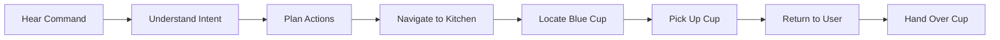

# Project Overview

## Welcome to the Capstone

Congratulations on reaching the final chapter of Module 4! You've learned:

- **Chapter 8**: Voice recognition with OpenAI Whisper
- **Chapter 9**: Cognitive planning with LLMs

Now it's time to bring everything together into a complete autonomous humanoid demonstration.

---

## Learning Objectives

By the end of this project, you will be able to:

- Integrate all VLA (Vision-Language-Action) components
- Build an end-to-end autonomous command pipeline
- Demonstrate voice-controlled object fetching
- Troubleshoot multi-system robotics integration
- Present your work effectively

---

## The Demo Scenario

### Primary Scenario: "Fetch the Cup"

You will build a robot that responds to:

> **"Go to the kitchen table and pick up the blue cup"**

The robot will:



### Why This Scenario?

This scenario exercises all components:

| Component | What It Tests |
|-----------|---------------|
| Voice Recognition | Real-time speech-to-text |
| Language Understanding | Intent extraction, parameter parsing |
| Task Planning | Multi-step decomposition |
| Navigation | Autonomous pathfinding |
| Computer Vision | Object detection, localization |
| Manipulation | Grasp planning, execution |
| Human-Robot Interaction | Handover, feedback |

---

## System Requirements

### Hardware Requirements

| Component | Minimum | Recommended |
|-----------|---------|-------------|
| CPU | Intel i5 / AMD Ryzen 5 | Intel i7 / AMD Ryzen 7 |
| RAM | 8 GB | 16 GB |
| GPU | Integrated | NVIDIA GTX 1060+ |
| Microphone | USB microphone | Directional USB mic |
| Webcam | 720p | 1080p with depth (RealSense) |

:::note Simulation Option
If you don't have a physical robot, you can complete this capstone entirely in simulation using Gazebo.
:::

### Software Requirements

```bash
# Ubuntu 22.04 LTS
lsb_release -a

# ROS 2 Jazzy
ros2 --version

# Python 3.10+
python3 --version

# Gazebo
gz sim --version
```

### API Keys

```bash
# OpenAI API (Whisper + GPT)
echo $OPENAI_API_KEY

# Or local alternatives
ollama list
```

---

## Project Structure

```
capstone_ws/
├── src/
│   ├── voice_commands/          # Chapter 8 code
│   │   ├── voice_command_node.py
│   │   └── ...
│   ├── cognitive_planning/      # Chapter 9 code
│   │   ├── task_planner_node.py
│   │   ├── task_executor_node.py
│   │   └── ...
│   ├── robot_vision/            # Object detection
│   │   ├── object_detector_node.py
│   │   └── ...
│   ├── robot_manipulation/      # Arm control
│   │   ├── gripper_controller.py
│   │   └── ...
│   └── capstone_bringup/        # Launch files
│       ├── launch/
│       │   └── capstone.launch.py
│       └── config/
│           └── params.yaml
├── worlds/                       # Gazebo worlds
│   └── kitchen.world
└── README.md
```

---

## Milestone Breakdown

### Milestone 1: Environment Setup (Day 1-2)

**Goal**: Working simulation environment with robot model

Tasks:
- [ ] Set up ROS 2 workspace
- [ ] Install all dependencies
- [ ] Load robot model in Gazebo
- [ ] Verify teleop control works
- [ ] Create kitchen world with objects

**Verification**:
```bash
ros2 launch capstone_bringup simulation.launch.py
# Robot should appear in kitchen environment
```

### Milestone 2: Voice Pipeline (Day 3-4)

**Goal**: Voice commands transcribed and published to ROS 2

Tasks:
- [ ] Integrate voice_commands package
- [ ] Configure microphone input
- [ ] Test Whisper transcription
- [ ] Verify `/voice_commands` topic

**Verification**:
```bash
ros2 topic echo /voice_commands
# Say "hello" → should see transcription
```

### Milestone 3: Cognitive Planning (Day 5-7)

**Goal**: Voice commands converted to task plans

Tasks:
- [ ] Integrate cognitive_planning package
- [ ] Configure LLM backend
- [ ] Test task decomposition
- [ ] Verify action generation

**Verification**:
```bash
ros2 topic echo /task_plan
# Say "go to kitchen" → should see navigation plan
```

### Milestone 4: Navigation (Day 8-10)

**Goal**: Robot navigates to commanded locations

Tasks:
- [ ] Configure Nav2
- [ ] Create semantic map with locations
- [ ] Test autonomous navigation
- [ ] Integrate with task executor

**Verification**:
```bash
# Say "go to the kitchen"
# Robot should navigate to kitchen area
```

### Milestone 5: Object Detection (Day 11-12)

**Goal**: Robot detects and localizes objects

Tasks:
- [ ] Set up camera pipeline
- [ ] Configure object detector
- [ ] Test cup detection
- [ ] Publish detected objects

**Verification**:
```bash
ros2 topic echo /detected_objects
# Should see cup with pose
```

### Milestone 6: Manipulation (Day 13-14)

**Goal**: Robot picks up detected objects

Tasks:
- [ ] Configure MoveIt (or simplified arm)
- [ ] Implement grasp planning
- [ ] Test pick action
- [ ] Integrate with task executor

**Verification**:
```bash
# Robot approaches cup and picks it up
```

### Milestone 7: Integration & Demo (Day 15-17)

**Goal**: Complete end-to-end demonstration

Tasks:
- [ ] Wire all components together
- [ ] End-to-end testing
- [ ] Error handling and recovery
- [ ] Practice demo presentation

**Verification**:
```bash
# Complete demo: Voice command → Robot fetches cup
```

---

## Success Criteria

### Functional Requirements

| ID | Requirement | Priority |
|----|-------------|----------|
| FR1 | Robot transcribes voice commands with >90% accuracy | Must Have |
| FR2 | Robot correctly interprets "fetch X from Y" commands | Must Have |
| FR3 | Robot navigates to named locations autonomously | Must Have |
| FR4 | Robot detects specified objects in the environment | Must Have |
| FR5 | Robot picks up small objects (cup, book) | Should Have |
| FR6 | Robot returns to user and hands over object | Should Have |
| FR7 | Robot provides verbal feedback during task | Nice to Have |

### Non-Functional Requirements

| ID | Requirement | Target |
|----|-------------|--------|
| NFR1 | Voice recognition latency | < 3 seconds |
| NFR2 | Task planning latency | < 5 seconds |
| NFR3 | Total task completion time | < 2 minutes |
| NFR4 | Success rate (10 attempts) | > 70% |

---

## Demo Day Checklist

### Before the Demo

- [ ] Test the full scenario 3 times successfully
- [ ] Charge all batteries / verify power
- [ ] Check microphone levels and positioning
- [ ] Verify network connectivity (if using cloud APIs)
- [ ] Prepare backup plan for common failures
- [ ] Have manual controls ready as failsafe

### During the Demo

- [ ] Explain what the robot will do before commanding
- [ ] Speak clearly and at moderate pace
- [ ] Point out key behaviors as they happen
- [ ] Be prepared to explain failures constructively

### Presentation Guidelines

1. **Introduction** (2 min): What is VLA? Why does it matter?
2. **Architecture** (3 min): Show system diagram, explain data flow
3. **Live Demo** (5 min): Run the fetch scenario
4. **Technical Deep Dive** (5 min): Highlight interesting challenges
5. **Q&A** (5 min): Answer questions

---

## Getting Help

### Common Resources

- **ROS 2 Documentation**: [docs.ros.org](https://docs.ros.org)
- **Nav2 Documentation**: [docs.nav2.org](https://docs.nav2.org)
- **OpenAI API**: [platform.openai.com](https://platform.openai.com)
- **Module 1-3 Content**: Review earlier chapters

### Troubleshooting Strategy

1. **Isolate the Problem**: Which subsystem is failing?
2. **Check Topics**: Are messages being published?
3. **Check Logs**: What errors appear?
4. **Simplify**: Can you reproduce in a minimal case?
5. **Document**: What did you try? What happened?

---

## Summary

You're building a complete autonomous humanoid demo:

- **Input**: "Go to the kitchen and get me the blue cup"
- **Output**: Robot fetches the cup and hands it to you

This capstone validates your mastery of:
- Real-time voice recognition
- LLM-based task planning
- ROS 2 navigation and manipulation
- System integration

**Next**: Let's explore the system architecture in detail.
