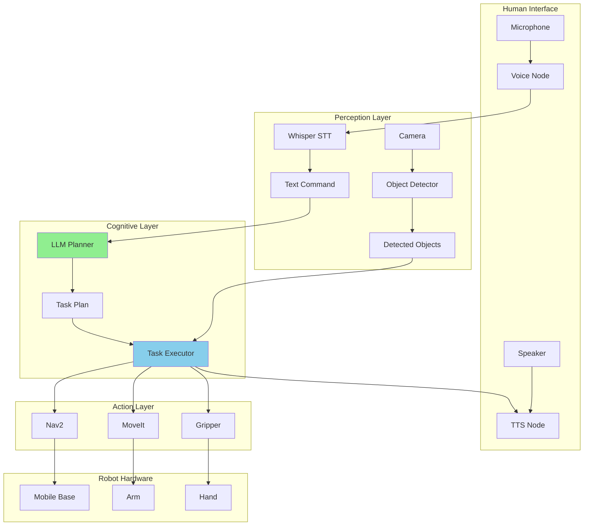
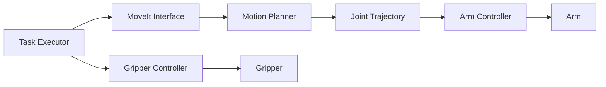
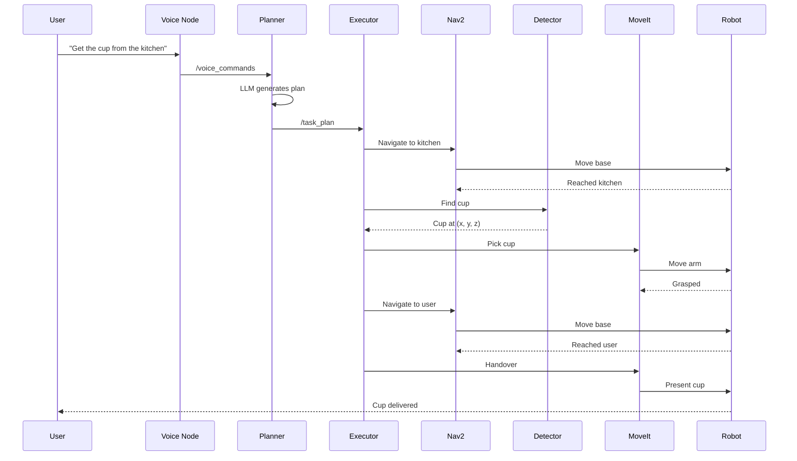
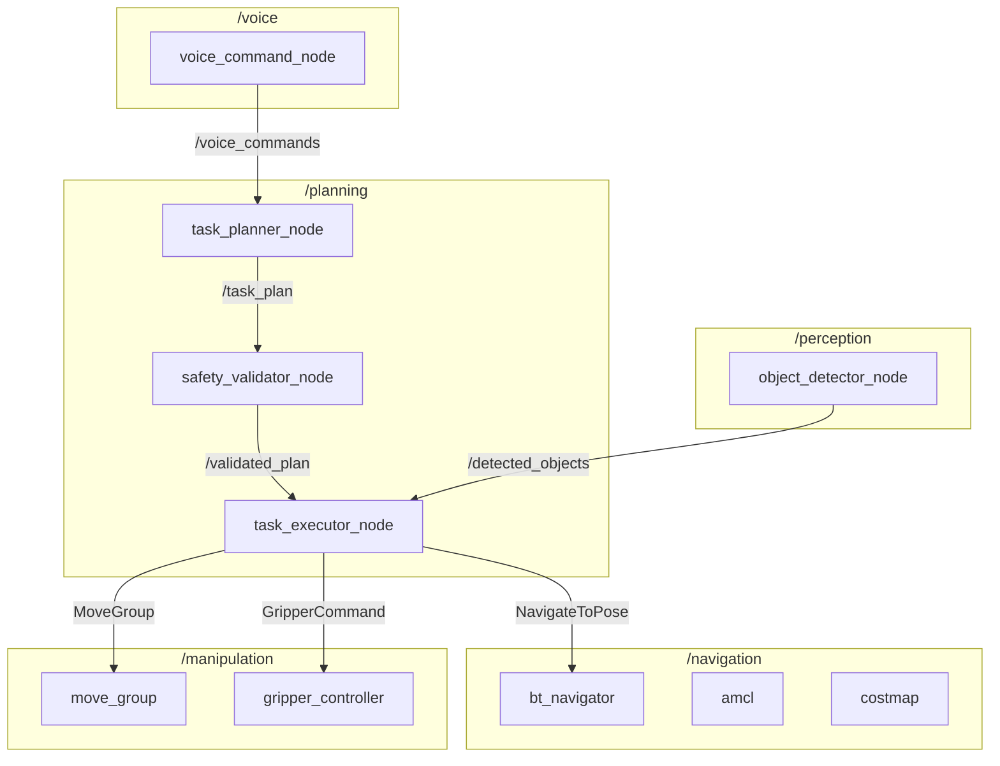
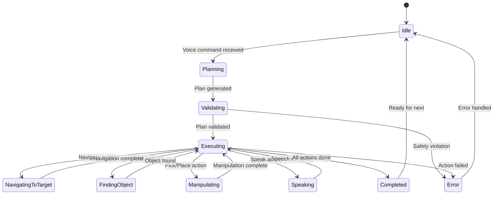

# System Architecture

## Learning Objectives

By the end of this section, you will be able to:

- Understand the complete VLA system architecture
- Identify each component's role and interfaces
- Trace data flow through the system
- Design the task execution state machine

---

## High-Level Architecture



---

## Component Breakdown

### 1. Voice Recognition Subsystem

**Purpose**: Convert spoken commands to text

```mermaid
graph LR
    A[Microphone] --> B[Audio Stream]
    B --> C[VAD Filter]
    C --> D[Whisper]
    D --> E[/voice_commands]
```

| Node | Package | Input | Output |
|------|---------|-------|--------|
| `voice_command_node` | voice_commands | Audio stream | `/voice_commands` (String) |

**Key Parameters**:
```yaml
voice_command_node:
  ros__parameters:
    use_api: true
    vad_aggressiveness: 2
    silence_threshold: 0.5
    min_speech_duration: 0.5
```

### 2. Cognitive Planning Subsystem

**Purpose**: Convert text commands to action plans

```mermaid
graph LR
    A[/voice_commands] --> B[LLM Planner]
    B --> C[TaskPlan]
    C --> D[Safety Validator]
    D --> E[/task_plan]
```

| Node | Package | Input | Output |
|------|---------|-------|--------|
| `task_planner_node` | cognitive_planning | `/voice_commands` | `/task_plan` |
| `safety_validator_node` | cognitive_planning | `/task_plan` | `/validated_plan` |

**Key Parameters**:
```yaml
task_planner_node:
  ros__parameters:
    llm_backend: "openai"  # or "ollama", "anthropic"
    model: "gpt-4o"
    temperature: 0.3
    max_tokens: 1024
```

### 3. Task Execution Subsystem

**Purpose**: Execute action plans step by step

```mermaid
graph LR
    A[/validated_plan] --> B[Task Executor]
    B --> C{Action Type}
    C -->|navigate| D[Nav2 Client]
    C -->|pick| E[MoveIt Client]
    C -->|speak| F[TTS Client]
    C -->|find| G[Vision Client]
```

| Node | Package | Input | Output |
|------|---------|-------|--------|
| `task_executor_node` | cognitive_planning | `/validated_plan` | Action goals |

### 4. Navigation Subsystem

**Purpose**: Autonomous navigation to locations

```mermaid
graph LR
    A[Task Executor] --> B[NavigateToPose Goal]
    B --> C[Nav2 Stack]
    C --> D[/cmd_vel]
    D --> E[Mobile Base]
    F[/tf] --> C
    G[/scan] --> C
```

| Node | Package | Input | Output |
|------|---------|-------|--------|
| Nav2 BT Navigator | nav2_bt_navigator | NavigateToPose goal | `/cmd_vel` |
| AMCL | nav2_amcl | `/scan`, `/tf` | Localization |
| Costmap | nav2_costmap_2d | `/scan` | Cost layers |

**Semantic Locations**:
```yaml
semantic_locations:
  kitchen:
    position: [3.0, 2.0, 0.0]
    orientation: [0.0, 0.0, 0.0, 1.0]
  bedroom:
    position: [5.0, 4.0, 0.0]
    orientation: [0.0, 0.0, 0.707, 0.707]
  living_room:
    position: [1.0, 1.0, 0.0]
    orientation: [0.0, 0.0, 0.0, 1.0]
```

### 5. Vision Subsystem

**Purpose**: Detect and localize objects

```mermaid
graph LR
    A[Camera] --> B[Image]
    B --> C[Object Detector]
    C --> D[Bounding Boxes]
    D --> E[Depth Estimation]
    E --> F[/detected_objects]
```

| Node | Package | Input | Output |
|------|---------|-------|--------|
| `object_detector_node` | robot_vision | `/camera/image_raw` | `/detected_objects` |

**Detected Object Message**:
```python
# DetectedObject.msg
string label              # Object class name
float32 confidence        # Detection confidence
geometry_msgs/Pose pose   # 3D pose in world frame
float32[4] bbox           # 2D bounding box [x, y, w, h]
```

### 6. Manipulation Subsystem

**Purpose**: Grasp and manipulate objects



| Node | Package | Input | Output |
|------|---------|-------|--------|
| MoveIt | moveit2 | Planning requests | Joint trajectories |
| Gripper | control_msgs | GripperCommand | Gripper action |

---

## Data Flow Diagram

### Complete Pipeline



---

## ROS 2 Node Graph

### Node Diagram



### Topic List

```bash
# Core topics
/voice_commands          # std_msgs/String
/task_plan               # cognitive_msgs/TaskPlan
/validated_plan          # cognitive_msgs/TaskPlan
/executor_status         # std_msgs/String
/executor_feedback       # std_msgs/String

# Navigation
/cmd_vel                 # geometry_msgs/Twist
/odom                    # nav_msgs/Odometry
/scan                    # sensor_msgs/LaserScan
/tf                      # tf2_msgs/TFMessage
/map                     # nav_msgs/OccupancyGrid

# Perception
/camera/image_raw        # sensor_msgs/Image
/camera/depth            # sensor_msgs/Image
/detected_objects        # vision_msgs/Detection3DArray

# Manipulation
/joint_states            # sensor_msgs/JointState
/arm_controller/command  # trajectory_msgs/JointTrajectory
/gripper/status          # control_msgs/GripperCommandResult
```

---

## State Machine

### Task Execution States



### State Details

| State | Description | Entry Condition | Exit Condition |
|-------|-------------|-----------------|----------------|
| **Idle** | Waiting for commands | System startup / task complete | Voice command received |
| **Planning** | LLM generating plan | Voice command | Plan ready |
| **Validating** | Safety checking | Plan received | Validation pass/fail |
| **Executing** | Running actions | Plan validated | All actions complete |
| **NavigatingToTarget** | Moving to location | Navigate action | Goal reached |
| **FindingObject** | Detecting object | Find action | Object located |
| **Manipulating** | Arm movements | Pick/Place action | Grasp complete |
| **Speaking** | Audio output | Speak action | Speech done |
| **Completed** | Task finished | Last action done | Reset to Idle |
| **Error** | Handling failure | Any failure | Error resolved |

---

## Interface Specifications

### Voice Command Interface

```python
# Input: Audio from microphone
# Output: /voice_commands (std_msgs/String)

# Message content examples:
"go to the kitchen"
"pick up the blue cup"
"bring me water"
```

### Task Plan Interface

```python
# cognitive_msgs/msg/TaskPlan.msg

Header header
string task_id
string description
Action[] actions
float32 estimated_duration

# cognitive_msgs/msg/Action.msg
uint32 action_id
string action_type      # navigate, pick, place, speak, find
string[] parameters     # key=value pairs
string description
string[] preconditions
string[] postconditions
```

### Detected Object Interface

```python
# vision_msgs/msg/Detection3D.msg

Header header
ObjectHypothesisWithPose[] results
BoundingBox3D bbox

# ObjectHypothesisWithPose.msg
ObjectHypothesis hypothesis  # id, score
geometry_msgs/PoseWithCovariance pose
```

---

## Configuration Files

### Main Configuration

```yaml
# config/capstone_params.yaml

# Voice Recognition
voice_command_node:
  ros__parameters:
    use_api: true
    vad_aggressiveness: 2
    silence_threshold: 0.5

# Cognitive Planning
task_planner_node:
  ros__parameters:
    llm_backend: "openai"
    model: "gpt-4o"
    enable_safety: true

task_executor_node:
  ros__parameters:
    action_timeout: 30.0
    retry_count: 2

# Navigation
nav2:
  amcl:
    ros__parameters:
      robot_model_type: "differential"
  bt_navigator:
    ros__parameters:
      default_nav_to_pose_bt_xml: "navigate_w_replanning.xml"

# Vision
object_detector_node:
  ros__parameters:
    model: "yolov8n"
    confidence_threshold: 0.5
    device: "cuda"  # or "cpu"

# Manipulation
move_group:
  ros__parameters:
    planning_time: 5.0
    num_planning_attempts: 5
```

---

## Summary

The capstone system integrates:

| Subsystem | Components | Key Interfaces |
|-----------|------------|----------------|
| Voice | Whisper, VAD | `/voice_commands` |
| Planning | LLM, Safety | `/task_plan` |
| Execution | State machine | Action clients |
| Navigation | Nav2 stack | `NavigateToPose` |
| Vision | YOLO, depth | `/detected_objects` |
| Manipulation | MoveIt | `MoveGroup` |

**Next**: Step-by-step implementation guide to build each component.
