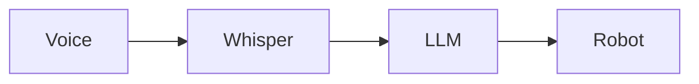

# Demo and Presentation

## Congratulations!

You've built a complete Vision-Language-Action system for autonomous humanoid robotics. This final section helps you present your work effectively.

---

## Demo Setup

### Environment Preparation

```
Demo Space Layout:
┌─────────────────────────────────────────────┐
│                                             │
│    ┌─────┐                                  │
│    │Table│ ← Objects (cup, book, etc.)      │
│    │     │                                  │
│    └─────┘                                  │
│                                             │
│              ┌─────┐                        │
│              │Robot│ ← Starting position    │
│              └─────┘                        │
│                                             │
│    ┌────────┐                               │
│    │Operator│ ← You (with mic)              │
│    └────────┘                               │
│                                             │
│              ┌────────┐                     │
│              │Audience│                     │
│              └────────┘                     │
│                                             │
└─────────────────────────────────────────────┘
```

### Pre-Demo Checklist

```markdown
## 30 Minutes Before

- [ ] Robot is powered on and charged
- [ ] All nodes are running (`ros2 node list`)
- [ ] Microphone is connected and tested
- [ ] Camera feed is working
- [ ] Objects are placed in known positions
- [ ] Demo space is clear of obstacles
- [ ] Backup plan materials ready

## 10 Minutes Before

- [ ] Run a complete test of the demo scenario
- [ ] Verify all topics are publishing
- [ ] Check network connectivity (if using cloud APIs)
- [ ] Brief any assistants on their roles
- [ ] Queue up monitoring windows

## Immediately Before

- [ ] Clear terminal screens
- [ ] Start recording (if desired)
- [ ] Take a deep breath!
```

---

## Presentation Structure

### Suggested Outline (20 minutes)

#### Part 1: Introduction (3 min)

**What to cover:**
- What is VLA (Vision-Language-Action)?
- Why is voice control important for humanoid robots?
- What will the demo show?

**Script example:**
> "Today I'll demonstrate how a humanoid robot can understand natural language commands and autonomously complete tasks. This combines voice recognition, AI-powered planning, and robot control into what we call a Vision-Language-Action system."

#### Part 2: Architecture Overview (4 min)

**What to cover:**
- Show the system architecture diagram
- Explain each component briefly
- Highlight the data flow

**Visual aid:**


**Script example:**
> "The system has four main components: First, OpenAI Whisper converts speech to text. Then, GPT-4 plans the task into steps. The executor sends these steps to Nav2 for navigation and MoveIt for manipulation."

#### Part 3: Live Demo (8 min)

**Demo script:**

1. **Simple Navigation** (2 min)
   > "Robot, go to the kitchen."
   - Wait for robot to navigate
   - Explain what's happening during movement

2. **Object Interaction** (3 min)
   > "Find the cup on the table."
   - Show detection feedback
   - Explain vision system

3. **Complex Task** (3 min)
   > "Get me the cup from the kitchen table."
   - Full pipeline demonstration
   - Narrate each step as it happens

#### Part 4: Technical Deep Dive (3 min)

**Choose one interesting aspect:**
- LLM prompt engineering
- Safety validation
- State machine design
- Integration challenges

**Example:**
> "One interesting challenge was prompt engineering. We had to carefully design the system prompt to ensure the LLM only generates actions the robot can actually perform."

#### Part 5: Q&A (2 min)

**Anticipated questions:**
- "What happens if the robot can't find the object?"
- "How accurate is the voice recognition?"
- "Could this work with other robots?"
- "What are the limitations?"

---

## Demo Commands to Practice

### Tier 1: Basic (Should always work)

```
"Go to the kitchen"
"Go to the living room"
"Stop"
```

### Tier 2: Intermediate (Usually works)

```
"Find the cup"
"Look for my phone"
"What do you see?"
```

### Tier 3: Advanced (Demo highlight)

```
"Get me the cup from the kitchen"
"Bring me the book from the shelf"
"Go to the bedroom and find my phone"
```

### Fallback Commands

If something fails:
```
"Never mind, stop"
"Go back to start"
"Reset"
```

---

## Handling Failures

### Common Failure Scenarios

#### 1. Voice Not Recognized

**Symptom**: No transcription appears

**Recovery**:
> "Let me speak a bit louder and clearer..."
> *Repeat command slowly*

**If still fails**:
> "The ambient noise is a bit high. Let me type the command instead."
```bash
ros2 topic pub /voice_commands std_msgs/String "data: 'go to kitchen'" --once
```

#### 2. Planning Takes Too Long

**Symptom**: Long pause after voice command

**Recovery**:
> "The LLM is thinking about the best way to accomplish this task..."
> *Show planning topic output*

**If timeout**:
> "Sometimes complex commands need a moment. Let's try a simpler version."

#### 3. Navigation Fails

**Symptom**: Robot doesn't move or gets stuck

**Recovery**:
> "The robot is recalculating its path around this obstacle..."
> *Clear obstacle if safe*

**If still fails**:
> "Let me demonstrate the navigation component separately."
```bash
ros2 action send_goal /navigate_to_pose nav2_msgs/action/NavigateToPose ...
```

#### 4. Object Not Detected

**Symptom**: "Object not found" message

**Recovery**:
> "The lighting might be affecting detection. Let me adjust..."
> *Move object or improve lighting*

**Explain**:
> "This shows the importance of good perception systems. In production, we'd have multiple sensors and better models."

---

## Backup Plans

### Plan B: Simulated Components

If hardware fails, show simulation:
```bash
ros2 launch capstone_bringup simulation.launch.py
```

### Plan C: Recorded Demo

Have a video recording of a successful run:
> "Due to [reason], let me show you a recorded demo that I captured earlier..."

### Plan D: Component Demo

Demo individual components:
1. Voice transcription only
2. LLM planning only
3. Navigation only

---

## After the Demo

### What to Share

```markdown
## Resources for Attendees

- GitHub repository: [your-repo-link]
- This book: Physical AI Humanoid Robotics
- Key papers:
  - "SayCan: Grounding Language in Robotic Affordances"
  - "RT-2: Vision-Language-Action Models"
```

### Metrics to Report

| Metric | Your Result |
|--------|-------------|
| Voice accuracy | __% |
| Planning success rate | __% |
| Navigation success rate | __% |
| Full task completion | __% |
| Average task time | __s |

---

## Next Steps

### Congratulations!

You've completed Module 4: Vision-Language-Action. You now have:

- **Voice Recognition**: Real-time speech-to-text with Whisper
- **Cognitive Planning**: LLM-based task decomposition
- **ROS 2 Integration**: Action clients for navigation and manipulation
- **System Integration**: Complete pipeline from voice to robot action

### Where to Go From Here

#### 1. Improve the System

- Add more semantic locations
- Improve object detection with custom training
- Implement actual manipulation (MoveIt integration)
- Add multi-turn dialogue for clarification

#### 2. Advanced Topics

- **Vision-Language Models**: Explore models like LLaVA or GPT-4V
- **Imitation Learning**: Train from demonstrations
- **Reinforcement Learning**: Optimize task execution
- **Multi-Robot Coordination**: Extend to robot teams

#### 3. Real Hardware

If you completed this in simulation:
- Port to a real TurtleBot or similar
- Integrate actual manipulator arm
- Deploy on NVIDIA Jetson for edge inference

#### 4. Research Directions

- Read the RT-2 paper (Vision-Language-Action Models)
- Explore PaLM-E (Embodied Multimodal Language Models)
- Investigate language-conditioned reinforcement learning

---

## Final Thoughts

You've built something remarkable: a robot that understands human language and acts on it. This is the foundation of human-robot collaboration.

The technologies you've learned—speech recognition, large language models, autonomous navigation, and computer vision—are at the forefront of robotics research and industry.

Keep building. Keep learning. The future of robotics is in your hands.

---

## Thank You!

Thank you for completing this module. We hope you've gained valuable skills that will serve you in your robotics journey.

If you have feedback on this book, please share it. Your input helps improve the learning experience for future readers.

**Good luck with your demo!**

---

## Appendix: Quick Reference

### Key Commands

```bash
# Launch full system
ros2 launch capstone_bringup capstone.launch.py

# Monitor topics
ros2 topic echo /voice_commands
ros2 topic echo /task_plan
ros2 topic echo /executor_status

# Manual navigation
ros2 action send_goal /navigate_to_pose nav2_msgs/action/NavigateToPose \
  "{pose: {header: {frame_id: 'map'}, pose: {position: {x: 3.0, y: 2.0}}}}"

# Test voice command
ros2 topic pub /voice_commands std_msgs/String "data: 'go to kitchen'" --once
```

### Node List

| Node | Package | Purpose |
|------|---------|---------|
| voice_command_node | voice_commands | Speech recognition |
| task_planner_node | cognitive_planning | LLM planning |
| task_executor_node | cognitive_planning | Plan execution |
| object_detector_node | robot_vision | Object detection |

### Topic List

| Topic | Type | Publisher |
|-------|------|-----------|
| /voice_commands | String | voice_node |
| /task_plan | String | planner_node |
| /executor_status | String | executor_node |
| /detected_objects | String | detector_node |
