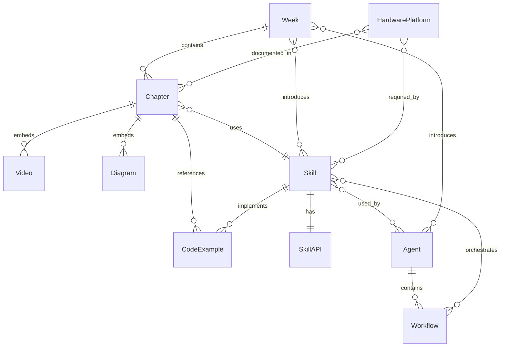

# Data Model: Physical AI & Humanoid Robotics

**Feature**: 001-physical-ai-humanoid
**Date**: 2025-12-06
**Status**: Complete

---

## Overview

This document defines the core entities, relationships, and data structures for the Physical AI & Humanoid Robotics educational resource. The data model supports both the Docusaurus content layer and the reusable intelligence layer (skills/agents).

---

## 1. Entity Definitions

### 1.1 Chapter

**Description**: A single educational unit within a week (MDX file in `docs/`)

**Attributes**:
```typescript
interface Chapter {
  id: string;                    // e.g., "week-01-foundations/01-ubuntu-setup"
  title: string;                 // e.g., "Ubuntu 22.04 Setup & Validation"
  description: string;           // SEO meta description
  weekNumber: number;            // 1-13
  chapterNumber: number;         // 1-6 (within week)
  sidebarPosition: number;       // Order in sidebar
  learningObjectives: string[];  // Bulleted list
  prerequisites: string[];       // Links to prerequisite chapters
  estimatedTime: number;         // Minutes to complete
  difficulty: "beginner" | "intermediate" | "advanced";
  tags: string[];                // e.g., ["ros2", "simulation", "setup"]

  // Content
  content: string;               // MDX content
  codeExamples: CodeExample[];   // Associated code files
  videos: Video[];               // Embedded videos
  diagrams: Diagram[];           // Embedded diagrams

  // Validation
  validationChecklist: ChecklistItem[];
  troubleshootingGuide: TroubleshootingEntry[];

  // Metadata
  createdAt: Date;
  updatedAt: Date;
  authors: string[];
  reviewers: string[];
}
```

**Relationships**:
- Belongs to one `Week`
- Has many `CodeExample`
- Has many `Video`
- Has many `Diagram`
- References one or more `Skill`

---

### 1.2 Week

**Description**: A collection of chapters forming a weekly module (directory in `docs/`)

**Attributes**:
```typescript
interface Week {
  id: string;                    // e.g., "week-01-foundations"
  number: number;                // 1-13
  title: string;                 // e.g., "Foundations & ROS2 Setup"
  description: string;           // Week overview
  chapters: Chapter[];           // 4-6 chapters per week

  // Learning Goals
  weeklyGoals: string[];
  hardwareMilestones: string[];  // Optional hardware validation points
  videoMilestones: string[];     // Optional demo video milestones

  // Skills Introduced
  skillsIntroduced: Skill[];     // New skills taught this week
  agentsIntroduced: Agent[];     // New agents introduced this week

  // Metadata
  dateRange: {
    start: Date;                 // Project timeline dates
    end: Date;
  };
}
```

**Relationships**:
- Has many `Chapter` (4-6 per week)
- Introduces one or more `Skill`
- May introduce one or more `Agent`

---

### 1.3 Skill

**Description**: A modular, reusable capability (directory in `skills/`)

**Attributes**:
```typescript
interface Skill {
  id: string;                    // e.g., "ros2_core"
  name: string;                  // e.g., "ROS2 Core"
  description: string;           // Brief overview

  // Documentation
  skillMdPath: string;           // Path to SKILL.md
  usageMdPath: string;           // Path to usage.md
  apiJsonPath: string;           // Path to api.json

  // API Contract
  apiContract: SkillAPI;         // Parsed from api.json

  // Implementation
  srcPath: string;               // Path to src/ directory
  mainEntryPoint: string;        // e.g., "src/ros2_setup.py"

  // Testing
  testsPath: string;             // Path to tests/ directory
  testCoverage: number;          // Percentage (target: > 85%)

  // Dependencies
  dependencies: {
    python: string[];            // pip packages
    ros2: string[];              // ROS2 packages
    system: string[];            // apt packages
  };

  // Metadata
  introduced: string;            // Week ID where introduced
  category: "simulation" | "ai" | "edge" | "hardware" | "visualization";
  complexity: "low" | "medium" | "high";

  // Usage Tracking
  invokedBy: Agent[];            // Agents that use this skill
  usedInChapters: Chapter[];     // Chapters that reference this skill
}
```

**Skill List** (8 total):
1. **ros2_core**: ROS2 installation, workspace setup, basic nodes
2. **urdf_designer**: URDF generation and kinematics
3. **gazebo_sim**: Gazebo simulation launch and control
4. **unity_vis**: Unity ROS2 bridge and visualization
5. **isaac_sim_pipeline**: Isaac Sim parallel environments and RL training
6. **vla_controller**: OpenVLA fine-tuning and inference
7. **edge_deploy**: TensorRT optimization and Jetson deployment
8. **hardware_proxy**: CAN bus, motor control, sensor integration

**Relationships**:
- Belongs to one `SkillCategory`
- Has one `SkillAPI` contract
- Has many `CodeExample` implementations
- Used by one or more `Agent`
- Referenced by many `Chapter`

---

### 1.4 Agent

**Description**: An orchestration workflow that coordinates multiple skills (directory in `agents/`)

**Attributes**:
```typescript
interface Agent {
  id: string;                    // e.g., "humanoid_capstone_agent"
  name: string;                  // e.g., "Humanoid Capstone Agent"
  description: string;           // Brief overview

  // Documentation
  agentMdPath: string;           // Path to AGENT.md
  routesJsonPath: string;        // Path to routes.json

  // Workflow Definitions
  workflows: Workflow[];         // Multi-skill orchestration

  // Skills Used
  skillsUsed: Skill[];           // Skills this agent coordinates

  // Implementation
  workflowsPath: string;         // Path to workflows/ directory
  testsPath: string;             // Path to tests/ directory

  // Metadata
  introduced: string;            // Week ID where introduced
  complexity: "basic" | "advanced" | "expert";

  // Usage Tracking
  usedInChapters: Chapter[];     // Chapters that invoke this agent
}
```

**Agent List** (3 total):
1. **sim_agent**: Coordinates simulation workflows (Gazebo/Isaac Sim)
2. **ai_agent**: Coordinates AI training and VLA workflows
3. **humanoid_capstone_agent**: Full Week 1-13 capstone orchestration

**Relationships**:
- Uses many `Skill`
- Has many `Workflow`
- Referenced by many `Chapter`

---

### 1.5 CodeExample

**Description**: An executable code file or package (in `static/code-examples/`)

**Attributes**:
```typescript
interface CodeExample {
  id: string;                    // Unique identifier
  name: string;                  // e.g., "install_ros2.sh"
  filePath: string;              // Path from repo root
  weekNumber: number;            // 1-13

  // Code Metadata
  language: "python" | "cpp" | "bash" | "yaml" | "launch";
  purpose: string;               // Brief description

  // Execution
  executable: boolean;           // Can be run directly
  executionCommand: string;      // e.g., "bash install_ros2.sh"
  expectedOutput: string;        // What success looks like

  // Testing
  hasTests: boolean;             // Unit/integration tests exist
  testCommand: string;           // e.g., "pytest tests/test_ros2_core.py"

  // Dependencies
  dependencies: {
    python: string[];
    ros2: string[];
    system: string[];
  };

  // Documentation
  docstring: string;             // Inline documentation
  usageExample: string;          // CLI usage example

  // Relationships
  referencedInChapters: Chapter[];
  implementsSkill?: Skill;       // Optional skill implementation
}
```

**Relationships**:
- Belongs to one `Week` (via weekNumber)
- Referenced by one or more `Chapter`
- May implement one `Skill`

---

### 1.6 SkillAPI

**Description**: API contract for a skill (JSON schema in `specs/001-physical-ai-humanoid/contracts/skills/`)

**Attributes**:
```typescript
interface SkillAPI {
  skillId: string;               // e.g., "ros2_core"
  version: string;               // Semantic versioning

  // Invocation
  invocation: {
    method: "function_call" | "cli" | "ros_service";
    endpoint: string;            // Function name, CLI command, or ROS service
    parameters: Parameter[];
    returns: ReturnType;
  };

  // Parameters
  parameters: Parameter[];

  // Returns
  returns: {
    type: "success" | "error" | "data";
    schema: any;                 // JSON schema for return value
  };

  // Error Handling
  errors: {
    code: string;
    message: string;
    recovery: string;            // How to recover from this error
  }[];

  // Examples
  examples: {
    description: string;
    input: any;
    output: any;
  }[];
}

interface Parameter {
  name: string;
  type: "string" | "number" | "boolean" | "array" | "object";
  required: boolean;
  default?: any;
  description: string;
  validation?: {
    min?: number;
    max?: number;
    pattern?: string;
    enum?: any[];
  };
}
```

**Relationships**:
- Belongs to one `Skill`

---

### 1.7 Workflow

**Description**: Multi-skill orchestration sequence (Python script in `agents/*/workflows/`)

**Attributes**:
```typescript
interface Workflow {
  id: string;                    // e.g., "week01_to_week13"
  name: string;                  // Human-readable name
  description: string;

  // Orchestration Steps
  steps: WorkflowStep[];

  // Execution
  entryPoint: string;            // Python file path
  estimatedDuration: number;     // Minutes

  // Dependencies
  skillsRequired: Skill[];
  prerequisiteWorkflows: Workflow[];

  // Metadata
  agentId: string;               // Parent agent
  complexity: "simple" | "complex" | "expert";
}

interface WorkflowStep {
  stepNumber: number;
  skillId: string;               // Skill being invoked
  action: string;                // Specific skill function
  parameters: Record<string, any>;
  successCriteria: string;       // How to validate success
  errorHandling: string;         // What to do on failure
  dependencies: number[];        // Step numbers that must complete first
}
```

**Relationships**:
- Belongs to one `Agent`
- Uses many `Skill`

---

### 1.8 HardwarePlatform

**Description**: Physical robot or compute platform (documented in appendix chapters)

**Attributes**:
```typescript
interface HardwarePlatform {
  id: string;                    // e.g., "unitree-go2-edu"
  category: "robot" | "compute" | "sensor";

  // Robot Platforms
  manufacturer?: string;         // e.g., "Unitree Robotics"
  model?: string;                // e.g., "Go2 Edu"
  degreesOfFreedom?: number;     // e.g., 12 (quadruped)

  // Compute Platforms
  processorType?: string;        // e.g., "NVIDIA Jetson Orin Nano"
  ram?: string;                  // e.g., "8GB LPDDR5"
  storage?: string;              // e.g., "64GB eMMC"

  // Specifications
  specifications: {
    weight?: number;             // kg
    batteryLife?: number;        // minutes
    maxSpeed?: number;           // m/s
    payload?: number;            // kg
  };

  // Pricing
  price: {
    amount: number;
    currency: string;
    date: Date;                  // Pricing as of date
    source: string;              // URL
  };

  // Compatibility
  supportedWeeks: number[];      // Weeks where this hardware is used
  requiredSkills: Skill[];       // Skills needed for this hardware

  // Documentation
  setupGuide: string;            // Chapter path
  troubleshooting: string;       // Chapter path
}
```

**Hardware Platforms**:
- **Robots**: Unitree Go2, G1, H1, Custom DIY Humanoid
- **Compute**: Jetson Orin Nano/NX/AGX, RTX 4070 Ti, RTX 4090
- **Sensors**: Intel RealSense D455, BNO085 IMU

**Relationships**:
- Referenced by many `Chapter`
- Required by certain `Skill` (e.g., hardware_proxy)

---

### 1.9 Video

**Description**: Educational video file (in `static/videos/`, tracked by Git LFS)

**Attributes**:
```typescript
interface Video {
  id: string;
  title: string;
  filePath: string;              // Path from static/

  // Video Metadata
  duration: number;              // Seconds
  resolution: "1080p" | "4K";
  format: "mp4" | "webm";
  fileSize: number;              // MB

  // Video Type
  type: "chapter-opener" | "demo" | "tutorial" | "capstone";

  // Content
  description: string;
  transcript?: string;           // Optional subtitles/transcript

  // Hosting
  hosting: "self-hosted" | "youtube" | "ipfs";
  externalUrl?: string;          // If hosted externally

  // Relationships
  weekNumber?: number;           // For chapter openers
  chapterId?: string;            // For embedded videos
}
```

**Relationships**:
- May belong to one `Week` (chapter openers)
- Embedded in one or more `Chapter`

---

### 1.10 Diagram

**Description**: Architecture diagram or visualization (in `static/diagrams/`)

**Attributes**:
```typescript
interface Diagram {
  id: string;
  title: string;
  filePath: string;              // Path from static/

  // Diagram Type
  type: "mermaid" | "static-image";
  format?: "svg" | "png" | "jpg";  // For static images
  mermaidCode?: string;          // For Mermaid.js diagrams

  // Content
  description: string;
  resolution?: string;           // e.g., "4K" for static images

  // Relationships
  chapterId: string[];           // Chapters where used
}
```

**Relationships**:
- Embedded in one or more `Chapter`

---

## 2. Entity Relationships (ERD)



---

## 3. Data Storage Strategy

### 3.1 Content Layer (Docusaurus)

**Chapters**: MDX files in `docs/`
- Frontmatter (YAML): metadata
- Content (Markdown/MDX): educational content
- Embedded React components for interactivity

**Code Examples**: Python/C++/Bash files in `static/code-examples/`
- Organized by week
- Executable and tested
- Linked from chapters via relative paths

**Videos**: MP4/WebM files tracked by Git LFS
- Self-hosted or YouTube embeds
- Chapter openers (30s each)
- Long-form demos (3-10 min)

**Diagrams**: SVG/PNG files or Mermaid.js code
- 4K resolution for static images
- Mermaid embedded in MDX

### 3.2 Intelligence Layer (Skills/Agents)

**Skills**: Directory per skill in `skills/`
- `SKILL.md`: Documentation
- `usage.md`: Invocation examples
- `api.json`: API contract
- `src/`: Implementation
- `tests/`: Unit tests

**Agents**: Directory per agent in `agents/`
- `AGENT.md`: Documentation
- `routes.json`: Workflow routes
- `workflows/`: Python orchestration scripts
- `tests/`: Integration tests

**API Contracts**: JSON files in `specs/001-physical-ai-humanoid/contracts/`
- `skills/*.json`: Skill API schemas
- `agents/*.json`: Agent route definitions

---

## 4. Validation Rules

### 4.1 Chapter Validation

- ✅ Title must be unique within week
- ✅ Sidebar position must be sequential (1, 2, 3...)
- ✅ Prerequisites must reference existing chapters
- ✅ Code examples must exist at specified paths
- ✅ Videos must exist (self-hosted) or have valid external URL
- ✅ Learning objectives: 2-5 bullet points
- ✅ Estimated time: 15-120 minutes

### 4.2 Skill Validation

- ✅ Skill ID must match directory name
- ✅ SKILL.md, usage.md, api.json must exist
- ✅ `src/` and `tests/` directories must exist
- ✅ Test coverage must be > 85%
- ✅ API contract must be valid JSON schema

### 4.3 Code Example Validation

- ✅ File must be executable (chmod +x for scripts)
- ✅ Shebang must be present for scripts
- ✅ Must have docstring (Python) or header comment (C++/Bash)
- ✅ Must pass linting (black/ruff for Python, clang-format for C++)
- ✅ Must have associated test if hasTests=true

---

## 5. Data Access Patterns

### 5.1 Docusaurus Queries

**Get all chapters for a week**:
```javascript
const week1Chapters = chapters.filter(ch => ch.weekNumber === 1)
  .sort((a, b) => a.sidebarPosition - b.sidebarPosition);
```

**Get chapters using a specific skill**:
```javascript
const ros2Chapters = chapters.filter(ch =>
  ch.tags.includes('ros2')
);
```

### 5.2 Skill/Agent Queries

**Get skills used by an agent**:
```javascript
const capstoneSkills = agents
  .find(a => a.id === 'humanoid_capstone_agent')
  .skillsUsed;
```

**Get all code examples for Week 5**:
```javascript
const week5Examples = codeExamples.filter(ex => ex.weekNumber === 5);
```

---

## 6. Future Extensions

### 6.1 User Progress Tracking (Optional)

```typescript
interface UserProgress {
  userId: string;
  completedChapters: string[];   // Chapter IDs
  currentWeek: number;
  lastActivity: Date;
  skillsMastered: string[];      // Skill IDs
}
```

### 6.2 Community Contributions

```typescript
interface CommunityExample {
  id: string;
  authorGitHub: string;
  exampleType: "code" | "video" | "diagram";
  filePath: string;
  upvotes: number;
  verified: boolean;
  relatedChapter: string;
}
```

---

**Last Updated**: 2025-12-06
**Version**: 1.0.0
