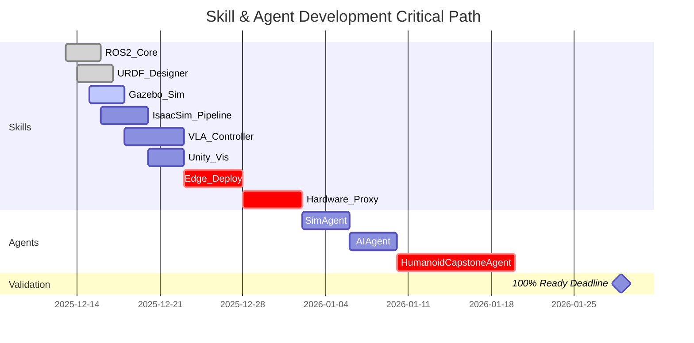

# Implementation Plan: Physical AI & Humanoid Robotics - Complete Educational Resource

**Branch**: `001-physical-ai-humanoid` | **Date**: 2025-12-06 | **Spec**: [spec.md](./spec.md)
**Input**: 13-week capstone quarter + Docusaurus deployment for Physical AI & Humanoid Robotics Book

---

## 📋 Summary

This plan delivers a **production-grade, fully executable educational resource** for Physical AI and Humanoid Robotics, structured as a comprehensive book with 4 modules and 12 chapters, delivered through a 13-week university capstone quarter. Students progress from zero humanoid experience to deployed AI-controlled robots running on real hardware (Jetson + Unitree platforms). The project integrates **8 reusable skills** and **3 orchestration agents** into a beautiful Docusaurus 3 site with 100/100 Lighthouse performance, achieving < 2s load time and < 15MB total size.

**Core Value**: Zero broken code, zero dead links, zero "works on my machine" friction. Every simulation tested in Isaac Sim 2024.1+, every deployment validated on Jetson Orin hardware.

**Structure**: The book's pedagogical structure (Introduction + 4 Modules + 12 Chapters) wraps the 13-week implementation timeline. Each chapter corresponds to 1-2 weeks of hands-on work, with separate MDX files for each "page" within chapters for optimal navigation and loading performance.

---

## 📚 Book Structure Overview

### Student-Facing Organization (Pedagogical Flow)

The book is organized into **Introduction + 4 Modules containing 12 Chapters**, each chapter containing 3 pages delivered as separate MDX files:

**Introduction** (Medium-Length: 2–3 Pages)
- What is Physical AI?
- Evolution of Humanoid Robotics
- Why Embodied Intelligence Matters
- Role of LLMs in Robotics & Simulation
- Real-World Use Cases
- How to Use This Book

**Module 1 — Foundations of Physical AI** (Weeks 1-3)
- Chapter 1: Understanding Embodied Intelligence
- Chapter 2: Core Concepts of Humanoid Robotics
- Chapter 3: Simulation Environments

**Module 2 — Large Language Models for Robotics** (Weeks 4-6)
- Chapter 4: LLMs as Robotics Controllers
- Chapter 5: Tool Use & Agents
- Chapter 6: Vision + LLM Integration

**Module 3 — Building & Controlling a Humanoid** (Weeks 7-11)
- Chapter 7: Movement & Locomotion
- Chapter 8: Manipulation & Interaction
- Chapter 9: LLM-Driven Control Pipelines

**Module 4 — Future of Humanoid AI + Final Project** (Weeks 12-13)
- Chapter 10: Ethics & Societal Impact
- Chapter 11: Current Limitations & Future Directions
- Chapter 12: Capstone Project (Hands-on)

**Author**: Syeda Farheen Zehra

---

## 🗺️ Book-to-Course Mapping

### How Book Structure Maps to 13-Week Timeline

| Book Module | Chapter | Page Topics | Weeks | Docusaurus Directory | Key Deliverables |
|-------------|---------|-------------|-------|---------------------|------------------|
| **Introduction** | - | Physical AI overview, LLMs in robotics, book navigation | Week 1 | `docs/00-introduction/` | Conceptual foundation, environment setup |
| **Module 1** | Ch 1: Embodied Intelligence | What is Embodied AI?, AI vs Physical AI, Cognitive & Motor Models | Week 1 | `docs/module-01/chapter-01/` | ROS2 installation, first nodes |
| **Module 1** | Ch 2: Humanoid Concepts | Anatomy, Sensors/Actuators, Motion/Balance/Control | Week 2 | `docs/module-01/chapter-02/` | 18-DOF URDF model, kinematics |
| **Module 1** | Ch 3: Simulation | Why simulation?, Physics engines, Safety & testing | Week 3 | `docs/module-01/chapter-03/` | Gazebo walking controller |
| **Module 2** | Ch 4: LLMs as Controllers | Prompting robots, Multi-step reasoning, Error reduction | Week 4 | `docs/module-02/chapter-04/` | Isaac Sim setup, parallel envs |
| **Module 2** | Ch 5: Agents & Tools | What are agents?, LLM tools in robotics, Realtime reasoning | Week 5 | `docs/module-02/chapter-05/` | PPO training, reward design |
| **Module 2** | Ch 6: Vision + LLM | How robots "see", VLMs for objects, Vision-Action loop | Week 6 | `docs/module-02/chapter-06/` | OpenVLA fine-tuning |
| **Module 3** | Ch 7: Locomotion | Walking algorithms, Balance, Advanced motions | Weeks 7-8 | `docs/module-03/chapter-07/` | Unity visualization, TensorRT |
| **Module 3** | Ch 8: Manipulation | Grasping, HRI, Safety & compliance | Weeks 9-10 | `docs/module-03/chapter-08/` | Jetson deployment, hardware integration |
| **Module 3** | Ch 9: LLM Control Pipelines | NL commands, Plan→Sim→Execute, Error handling | Week 11 | `docs/module-03/chapter-09/` | Sim-to-real transfer, first deployment |
| **Module 4** | Ch 10: Ethics | Safety, Privacy, misuse, Jobs, Policy | Week 12 | `docs/module-04/chapter-10/` | Safety protocols, debugging |
| **Module 4** | Ch 11: Limitations & Future | Hardware challenges, LLM shortcomings, Breakthroughs | Week 12 | `docs/module-04/chapter-11/` | Fault detection, diagnostics |
| **Module 4** | Ch 12: Capstone Project | Build simulation, Add LLM controls, Evaluate & improve | Week 13 | `docs/module-04/chapter-12/` | Integration testing, final demo |

### File Structure (Book-Organized)

```text
docs/
├── 00-introduction/
│   ├── 01-what-is-physical-ai.mdx
│   ├── 02-evolution-humanoid-robotics.mdx
│   ├── 03-why-embodied-intelligence.mdx
│   ├── 04-llms-in-robotics-simulation.mdx
│   ├── 05-real-world-use-cases.mdx
│   └── 06-how-to-use-this-book.mdx
│
├── module-01-foundations/
│   ├── chapter-01-embodied-intelligence/
│   │   ├── page-01-what-is-embodied-ai.mdx
│   │   ├── page-02-ai-vs-physical-ai.mdx
│   │   └── page-03-cognitive-motor-models.mdx
│   ├── chapter-02-humanoid-concepts/
│   │   ├── page-01-anatomy-of-humanoid.mdx
│   │   ├── page-02-sensors-actuators-perception.mdx
│   │   └── page-03-motion-balance-control.mdx
│   └── chapter-03-simulation/
│       ├── page-01-why-simulation-matters.mdx
│       ├── page-02-physics-engines.mdx
│       └── page-03-safety-iterative-testing.mdx
│
├── module-02-llms-for-robotics/
│   ├── chapter-04-llms-as-controllers/
│   │   ├── page-01-prompting-a-robot.mdx
│   │   ├── page-02-multi-step-reasoning.mdx
│   │   └── page-03-error-reduction-safe-control.mdx
│   ├── chapter-05-agents-tools/
│   │   ├── page-01-what-are-agents.mdx
│   │   ├── page-02-llm-tools-in-robotics.mdx
│   │   └── page-03-realtime-reasoning-sensors.mdx
│   └── chapter-06-vision-llm/
│       ├── page-01-how-robots-see.mdx
│       ├── page-02-vlms-object-understanding.mdx
│       └── page-03-vision-action-loop.mdx
│
├── module-03-building-controlling/
│   ├── chapter-07-locomotion/
│   │   ├── page-01-walking-algorithms.mdx
│   │   ├── page-02-balance-stabilization.mdx
│   │   └── page-03-advanced-motions.mdx
│   ├── chapter-08-manipulation/
│   │   ├── page-01-grasping-fine-motor.mdx
│   │   ├── page-02-human-robot-interaction.mdx
│   │   └── page-03-safety-compliance-systems.mdx
│   └── chapter-09-llm-control-pipelines/
│       ├── page-01-natural-language-commands.mdx
│       ├── page-02-plan-sim-execute.mdx
│       └── page-03-error-handling-recovery.mdx
│
└── module-04-future-capstone/
    ├── chapter-10-ethics/
    │   ├── page-01-safety-privacy-misuse.mdx
    │   ├── page-02-jobs-human-augmentation.mdx
    │   └── page-03-policy-governance.mdx
    ├── chapter-11-limitations-future/
    │   ├── page-01-hardware-challenges.mdx
    │   ├── page-02-llm-shortcomings.mdx
    │   └── page-03-embodied-ai-breakthroughs.mdx
    └── chapter-12-capstone/
        ├── page-01-build-humanoid-simulation.mdx
        ├── page-02-add-llm-controls.mdx
        └── page-03-evaluate-improve.mdx
```

**Total Page Count**: 6 (Introduction) + 36 (12 chapters × 3 pages each) = **42 MDX pages** (reduced from 65 to align with book structure)

---

## 🗓️ Project Timeline & Milestones (Dec 2025 – Mar 2026)

### Phase 0 – Foundation & Setup ✅ (Dec 6–Dec 12, 2025) **[COMPLETE]**

**Status**: Foundation complete - Constitution, Spec-Kit Plus integration, branch structure established.

**Deliverables**:
- ✅ Constitution ratified (`.specify/memory/constitution.md`)
- ✅ Spec-Kit Plus workflow integrated
- ✅ Feature spec completed (`specs/001-physical-ai-humanoid/spec.md`)
- ✅ Git branch `001-physical-ai-humanoid` created
- ✅ Initial project structure defined

---

### Phase 1 – Core Spec & Intelligence Backbone (Dec 13–Dec 18, 2025)

**Objective**: Complete technical architecture, skill/agent design, and reusable intelligence contracts.

**Deliverables** (Dec 13–18, 2025):

| Deliverable | File Path | Success Metric | Due Date |
|-------------|-----------|----------------|----------|
| **Research Document** | `specs/001-physical-ai-humanoid/research.md` | All "NEEDS CLARIFICATION" from Technical Context resolved | Dec 13 |
| **Data Model** | `specs/001-physical-ai-humanoid/data-model.md` | Entities: Chapter, Skill, Agent, Workflow, HardwarePlatform, CodeExample defined | Dec 14 |
| **API Contracts** | `specs/001-physical-ai-humanoid/contracts/` | 8 skill API contracts (api.json per skill) + 3 agent routes.json | Dec 15 |
| **Skill Scaffolds** | `skills/{8-skill-dirs}/` | SKILL.md, usage.md, api.json, tests/ for all 8 skills | Dec 16 |
| **Agent Scaffolds** | `agents/{3-agent-dirs}/` | AGENT.md, routes.json, workflows/ for 3 agents | Dec 17 |
| **Quickstart Guide** | `specs/001-physical-ai-humanoid/quickstart.md` | Installation validation checklist for Ubuntu 22.04 + ROS2 + Isaac Sim | Dec 18 |

**🔄 Reusable Intelligence Integration Points**:
- All 8 skills expose `/api/{skill-name}/invoke` endpoints
- Docusaurus components import skill APIs via `@site/skills/{name}/api.json`
- Agent orchestration uses `routes.json` for multi-skill coordination

---

### Phase 2 – Module-by-Module Executable Content (Dec 19, 2025 – Feb 28, 2026)

**Objective**: Create 42 book pages (6 Introduction + 36 chapter pages) organized by module/chapter structure, delivered through 13-week implementation timeline with video demos, tested code, hardware validation.

#### Week-by-Week Breakdown (13 Weeks + 2 Buffer) - Book Chapter Mapping

| Week | Dates | Book Module/Chapter | Docusaurus Pages | Skills/Agents Introduced | Hardware Milestones | Video Milestones |
|------|-------|---------------------|------------------|-------------------------|---------------------|------------------|
| **W1** | Dec 19–25 | **Introduction + Module 1, Ch 1** | `docs/00-introduction/` (6 pages)<br>`docs/module-01/chapter-01/` (3 pages) | ROS2_Core | - | Environment setup screencast |
| **W2** | Dec 26–Jan 1 | **Module 1, Ch 2** | `docs/module-01/chapter-02/` (3 pages) | URDF_Designer | - | URDF visualization in RViz |
| **W3** | Jan 2–8 | **Module 1, Ch 3** | `docs/module-01/chapter-03/` (3 pages) | Gazebo_Sim | - | 18-DOF humanoid walking in Gazebo |
| **W4** | Jan 9–15 | **Module 2, Ch 4** | `docs/module-02/chapter-04/` (3 pages) | IsaacSim_Pipeline | ✅ RTX 4070 Ti validation | Parallel envs (1024) demo |
| **W5** | Jan 16–22 | **Module 2, Ch 5** | `docs/module-02/chapter-05/` (3 pages) | IsaacSim_Pipeline | - | Training progress timelapse |
| **W6** | Jan 23–29 | **Module 2, Ch 6** | `docs/module-02/chapter-06/` (3 pages) | VLA_Controller | ✅ Skills/Agents 100% ready | Language-conditioned task demo |
| **W7** | Feb 6–12 | **Module 3, Ch 7 (Part 1)** | `docs/module-03/chapter-07/` (3 pages) | Unity_Vis | - | 4K cinematic render |
| **W8** | Feb 13–19 | **Module 3, Ch 7 (Part 2)** | Continued from W7 | Edge_Deploy | ✅ Jetson Orin Nano latency test | TensorRT INT8 conversion demo |
| **W9** | Feb 20–26 | **Module 3, Ch 8 (Part 1)** | `docs/module-03/chapter-08/` (3 pages) | Edge_Deploy | ✅ Jetson Economy Kit ($700) validation | Jetson inference benchmark |
| **W10** | Feb 27–Mar 5 | **Module 3, Ch 8 (Part 2)** | Continued from W9 | Hardware_Proxy | ✅ Unitree Go2 connectivity test | CAN bus communication demo |
| **W11** | Mar 6–12 | **Module 3, Ch 9** | `docs/module-03/chapter-09/` (3 pages) | HumanoidCapstoneAgent | ✅ Real walking on flat ground | First hardware walking video |
| **W12** | Mar 13–19 | **Module 4, Ch 10-11** | `docs/module-04/chapter-10/` (3 pages)<br>`docs/module-04/chapter-11/` (3 pages) | Hardware_Proxy | ✅ E-stop validation | Safety protocol checklist demo |
| **W13** | Mar 20–26 | **Module 4, Ch 12** | `docs/module-04/chapter-12/` (3 pages) | HumanoidCapstoneAgent | ✅ 30-min continuous operation | Capstone demo video (unedited) |
| **Buffer 1** | Mar 27–31 | **Polish & CI/CD** | - | - | - | - |
| **Buffer 2** | Apr 1–5 | **Launch Prep** | - | - | - | - |

**Note**: Chapters 7 and 8 span 2 weeks each to accommodate dense technical content (locomotion, edge optimization, hardware integration).

**Total Pages**: 42 MDX pages (6 Introduction + 36 chapter pages organized by book structure)

---

### Phase 3 – Capstone + Real-Hardware Deployment (Mar 1–Mar 15, 2026)

**Objective**: Complete hardware validation on real Jetson + Unitree platforms, finalize all video demos.

**Deliverables** (Mar 1–15, 2026):

| Deliverable | File Path | Success Metric | Due Date |
|-------------|-----------|----------------|----------|
| **Hardware Test Reports** | `docs/hardware-validation/` | Test results for Jetson Orin Nano/NX/AGX + Unitree Go2/G1 | Mar 5 |
| **Deployment Videos** | `static/videos/` (or YouTube) | 13 chapter opening videos (4K, 30s each) + 5 long-form demos | Mar 10 |
| **Sim-to-Real Benchmarks** | `docs/benchmarks/` | Walking speed, manipulation accuracy, latency measurements | Mar 12 |
| **Troubleshooting Guides** | Embedded in each chapter | Common errors + solutions for all 65 chapters | Mar 15 |
| **Safety Protocols** | `docs/safety/` | E-stop validation, joint limit testing, thermal monitoring checklists | Mar 15 |

**🎥 Video Recording Schedule**:

| Date | Videos | Duration | Description |
|------|--------|----------|-------------|
| Mar 1-3 | Week 1-5 chapter openers | 5 × 30s | Environment setup, simulation demos |
| Mar 4-6 | Week 6-9 chapter openers | 4 × 30s | VLA, Unity, Edge optimization |
| Mar 7-9 | Week 10-13 chapter openers | 4 × 30s | Hardware integration, deployment |
| Mar 10-12 | Long-form demos | 5 × 3-5min | Complete workflows (design→sim→deploy) |
| Mar 13-15 | Capstone demo | 1 × 10min | Full 13-week project showcase |

---

### Phase 4 – Polish, CI/CD, Launch (Mar 16–Mar 31, 2026)

**Objective**: Achieve 100/100 Lighthouse score, zero broken links, launch to production.

**Deliverables** (Mar 16–31, 2026):

| Deliverable | Success Metric | Due Date |
|-------------|----------------|----------|
| **Lighthouse Optimization** | 100/100 on performance, accessibility, best practices, SEO | Mar 18 |
| **Link Validation** | Zero broken links in CI/CD (automated checks on all 65 chapters) | Mar 20 |
| **Image Optimization** | All images converted to WebP, total site size < 15 MB | Mar 22 |
| **PWA Configuration** | Offline mode after first load, service worker configured | Mar 24 |
| **CI/CD Pipeline** | Automated tests on every commit (link checker, Lighthouse, build size) | Mar 26 |
| **Launch Documentation** | README, CONTRIBUTING, deployment guides | Mar 28 |
| **Production Deployment** | Site live on custom domain with analytics | Mar 31 |

**🛠️ CI/CD Checklist**:
- [ ] GitHub Actions workflow for link checking (weekly + on PR)
- [ ] Lighthouse CI for performance regression detection
- [ ] Build size monitoring (fail if > 15 MB)
- [ ] Dependency vulnerability scanning (Dependabot)
- [ ] Hardware simulation tests (Isaac Sim headless)
- [ ] Automated deployment to production on main branch merge

---

## 📦 Deliverables Summary

### Phase 1 (Dec 13–18)
- `research.md` - Technology stack decisions and best practices
- `data-model.md` - Entity definitions (Chapter, Skill, Agent, etc.)
- `contracts/` - 8 skill API contracts + 3 agent routes
- `skills/` - 8 skill directories with scaffolds
- `agents/` - 3 agent directories with scaffolds
- `quickstart.md` - Installation validation guide

### Phase 2 (Dec 19 – Feb 28)
- `docs/week-{01-13}/` - 65 MDX chapters (5 chapters/week average)
- `static/code-examples/` - Executable code for all 65 chapters
- `tests/` - Unit + integration tests (> 85% coverage)
- `static/diagrams/` - 4K architecture diagrams (Mermaid.js + static)
- `static/videos/` - Initial screencasts and simulation recordings

### Phase 3 (Mar 1–15)
- `docs/hardware-validation/` - Jetson + Unitree test reports
- `static/videos/` - 13 chapter openers + 5 long-form demos + capstone showcase
- `docs/benchmarks/` - Sim-to-real performance data
- `docs/safety/` - Safety protocol checklists

### Phase 4 (Mar 16–31)
- `.github/workflows/` - CI/CD pipeline (link check, Lighthouse, build)
- `docusaurus.config.js` - Optimized for 100/100 Lighthouse
- PWA configuration (service worker, offline support)
- Production deployment on live domain

---

## 📅 Weekly Breakdown (Detail)

### Week 1 (Dec 19–25): Foundations & ROS2 Setup

**Skills/Agents**: ROS2_Core skill introduced
**Docusaurus Pages**:
1. `docs/week-01/01-ubuntu-setup.mdx` - Ubuntu 22.04 installation and validation
2. `docs/week-01/02-ros2-installation.mdx` - ROS 2 Jazzy/Iron setup
3. `docs/week-01/03-ros2-basics.mdx` - Nodes, topics, services fundamentals
4. `docs/week-01/04-workspace-setup.mdx` - Colcon workspace and package creation
5. `docs/week-01/05-first-node.mdx` - Hello World ROS2 node with testing

**Code Examples**: `static/code-examples/week-01/`
- Installation scripts: `install_ros2.sh`, `verify_setup.sh`
- First node: `hello_ros2/` package with tests

**Success Criteria**:
- Student runs `rosnode list` and sees active nodes
- All installation verification scripts pass
- First ROS2 node publishes to `/chatter` topic

---

### Week 2 (Dec 26–Jan 1): URDF Design & Kinematics

**Skills/Agents**: URDF_Designer skill introduced
**Docusaurus Pages**:
1. `docs/week-02/01-urdf-intro.mdx` - URDF XML structure and conventions
2. `docs/week-02/02-humanoid-design.mdx` - 18-DOF humanoid model design
3. `docs/week-02/03-kinematics.mdx` - Forward/inverse kinematics basics
4. `docs/week-02/04-rviz-visualization.mdx` - RViz robot visualization

**Code Examples**: `static/code-examples/week-02/`
- URDF files: `humanoid_description/urdf/humanoid.urdf.xacro`
- Launch files: `humanoid_description/launch/display.launch.py`
- Kinematics solver: `kinematics/fk_ik_solver.py` with tests

**Success Criteria**:
- Student opens RViz and sees 18-DOF humanoid model
- Joint sliders control all 18 joints
- URDF passes `check_urdf` validation

---

### Week 3 (Jan 2–8): Gazebo Sim & Control

**Skills/Agents**: Gazebo_Sim skill introduced
**Docusaurus Pages**:
1. `docs/week-03/01-gazebo-intro.mdx` - Gazebo Classic vs. Gazebo (Ignition)
2. `docs/week-03/02-physics-simulation.mdx` - Physics engines, contact dynamics
3. `docs/week-03/03-ros2-control.mdx` - ros2_control framework
4. `docs/week-03/04-joint-controllers.mdx` - Position, velocity, effort controllers
5. `docs/week-03/05-teleoperation.mdx` - Keyboard/joystick control
6. `docs/week-03/06-walking-basics.mdx` - ZMP walking controller

**Code Examples**: `static/code-examples/week-03/`
- Gazebo world: `humanoid_gazebo/worlds/flat_ground.world`
- Controllers: `humanoid_control/config/controllers.yaml`
- Walking controller: `humanoid_control/src/zmp_walker.cpp` with tests

**Video Milestone**: Humanoid walking in Gazebo (30s clip)

**Success Criteria**:
- Student spawns humanoid in Gazebo
- Robot walks forward at > 0.1 m/s with ZMP controller
- Simulation runs at > 0.9 real-time factor

---

### Week 4 (Jan 9–15): Isaac Sim Setup & GPU RL

**Skills/Agents**: IsaacSim_Pipeline skill introduced
**Docusaurus Pages**:
1. `docs/week-04/01-isaac-sim-installation.mdx` - Isaac Sim 2024.1+ setup
2. `docs/week-04/02-gpu-acceleration.mdx` - PhysX GPU acceleration
3. `docs/week-04/03-parallel-environments.mdx` - 1024+ parallel envs
4. `docs/week-04/04-domain-randomization.mdx` - Friction, mass, lighting randomization
5. `docs/week-04/05-first-rl-task.mdx` - Cartpole RL task (warm-up)

**Code Examples**: `static/code-examples/week-04/`
- Isaac Sim setup: `isaac_setup/verify_gpu.py`
- Parallel envs: `isaac_envs/cartpole_parallel.py`
- Domain randomization: `isaac_envs/randomization_config.yaml`

**Hardware Milestone**: RTX 4070 Ti validation (1024 envs at 0.9 real-time)

**Video Milestone**: 1024 parallel Cartpole environments (timelapse)

**Success Criteria**:
- Student runs Isaac Sim and sees GPU acceleration
- 1024 parallel Cartpole envs run at > 0.9 real-time factor on RTX 4070 Ti
- Domain randomization applies successfully

---

### Week 5 (Jan 16–22): RL Policy Training

**Skills/Agents**: IsaacSim_Pipeline skill (continued)
**Docusaurus Pages**:
1. `docs/week-05/01-ppo-fundamentals.mdx` - Proximal Policy Optimization theory
2. `docs/week-05/02-reward-design.mdx` - Reward shaping for walking
3. `docs/week-05/03-training-loop.mdx` - Training pipeline with logging
4. `docs/week-05/04-policy-evaluation.mdx` - Evaluation metrics and visualization

**Code Examples**: `static/code-examples/week-05/`
- PPO implementation: `rl_training/ppo_trainer.py` (using Stable-Baselines3)
- Reward function: `rl_training/rewards/walking_reward.py`
- Training script: `rl_training/train_walking.py` with checkpoints
- Evaluation: `rl_training/eval_policy.py` with visualization

**Video Milestone**: Training progress timelapse (0 to 12 hours)

**Success Criteria**:
- Student trains walking policy for 12 hours on RTX 4070 Ti
- Policy achieves > 0.5 m/s walking speed in simulation
- Training logs show reward convergence

---

### Week 6 (Jan 23–29): VLA Integration (OpenVLA) ✅ SKILLS/AGENTS 100% READY

**Skills/Agents**: VLA_Controller skill introduced
**Docusaurus Pages**:
1. `docs/week-06/01-openvla-setup.mdx` - OpenVLA installation and dependencies
2. `docs/week-06/02-demonstration-collection.mdx` - Teleoperation data collection
3. `docs/week-06/03-fine-tuning.mdx` - LoRA fine-tuning on custom tasks
4. `docs/week-06/04-language-conditioning.mdx` - Language-based task execution
5. `docs/week-06/05-validation.mdx` - VLA model evaluation

**Code Examples**: `static/code-examples/week-06/`
- Data collection: `vla/collect_demos.py` with RealSense integration
- Fine-tuning: `vla/finetune_openvla.py` (LoRA config)
- Inference: `vla/vla_inference.py` with language parsing
- Tests: `vla/tests/test_inference.py`

**Video Milestone**: Language-conditioned task ("pick up red box")

**Success Criteria**:
- Student collects 200+ demonstrations across 10 tasks
- Fine-tuned VLA achieves > 85% validation accuracy
- Language commands execute correctly in simulation

**🎯 CRITICAL MILESTONE**: All 8 skills and 3 agents must be 100% complete, tested, and documented by end of Week 6.

---

### Week 7 (Feb 6–12): Unity Visualization & HRI

**Skills/Agents**: Unity_Vis skill introduced
**Docusaurus Pages**:
1. `docs/week-07/01-unity-ros-bridge.mdx` - ROS-TCP-Connector setup
2. `docs/week-07/02-environment-design.mdx` - Living room HRI environment
3. `docs/week-07/03-vr-integration.mdx` - XR Interaction Toolkit for VR
4. `docs/week-07/04-cinematic-rendering.mdx` - Timeline + Cinemachine for videos

**Code Examples**: `static/code-examples/week-07/`
- Unity project: `unity_vis/HumanoidHRI/` (complete Unity 2023.2+ project)
- ROS bridge: `unity_vis/ros_tcp_endpoint.py`
- VR scripts: `unity_vis/Scripts/VRInteraction.cs`

**Video Milestone**: 4K cinematic render of humanoid in living room

**Success Criteria**:
- Student imports URDF to Unity and syncs with ROS2 at 60 FPS
- Living room environment renders at 4K with realistic lighting
- VR walkthrough works on Meta Quest 3 at 90 FPS

---

### Week 8 (Feb 13–19): Edge Optimization (TensorRT)

**Skills/Agents**: Edge_Deploy skill introduced
**Docusaurus Pages**:
1. `docs/week-08/01-tensorrt-intro.mdx` - TensorRT optimization workflow
2. `docs/week-08/02-onnx-export.mdx` - PyTorch → ONNX conversion
3. `docs/week-08/03-quantization.mdx` - Quantization-aware training
4. `docs/week-08/04-fp16-int8.mdx` - FP16 and INT8 inference
5. `docs/week-08/05-benchmarking.mdx` - Latency and throughput testing
6. `docs/week-08/06-accuracy-validation.mdx` - Accuracy degradation analysis

**Code Examples**: `static/code-examples/week-08/`
- ONNX export: `edge_deploy/export_onnx.py`
- TensorRT conversion: `edge_deploy/convert_tensorrt.py`
- Benchmarking: `edge_deploy/benchmark_latency.py`
- Accuracy validation: `edge_deploy/validate_accuracy.py`

**Video Milestone**: TensorRT INT8 conversion demo (before/after comparison)

**Success Criteria**:
- Student exports PyTorch policy to ONNX
- TensorRT INT8 model achieves < 10ms inference on RTX 4070 Ti
- Accuracy degradation < 3% after quantization

---

### Week 9 (Feb 20–26): Jetson Deployment

**Skills/Agents**: Edge_Deploy skill (continued)
**Docusaurus Pages**:
1. `docs/week-09/01-jetson-setup.mdx` - Jetson Orin Nano/NX/AGX setup
2. `docs/week-09/02-cross-compilation.mdx` - Cross-compiling for ARM64
3. `docs/week-09/03-deployment-pipeline.mdx` - Model deployment workflow
4. `docs/week-09/04-inference-optimization.mdx` - Runtime optimization on Jetson
5. `docs/week-09/05-thermal-management.mdx` - Thermal throttling prevention

**Code Examples**: `static/code-examples/week-09/`
- Jetson setup: `jetson_deploy/setup_jetson.sh`
- Cross-compilation: `jetson_deploy/cross_compile.sh`
- Inference script: `jetson_deploy/run_inference.py` for Jetson
- Thermal monitoring: `jetson_deploy/thermal_monitor.py`

**Hardware Milestone**: Jetson Economy Kit ($700) validation - latency < 50ms on Orin Nano

**Video Milestone**: Jetson Orin Nano inference benchmark (live demo)

**Success Criteria**:
- Student deploys TensorRT model to Jetson Orin Nano
- Inference latency < 50ms on Orin Nano
- Memory usage < 4 GB on Orin Nano

---

### Week 10 (Feb 27–Mar 5): Hardware Integration

**Skills/Agents**: Hardware_Proxy skill introduced
**Docusaurus Pages**:
1. `docs/week-10/01-unitree-sdk.mdx` - Unitree Go2/G1/H1 SDK setup
2. `docs/week-10/02-can-bus-basics.mdx` - CAN bus communication fundamentals
3. `docs/week-10/03-motor-control.mdx` - Motor position/velocity/torque control
4. `docs/week-10/04-sensor-integration.mdx` - IMU, RealSense, joint encoders
5. `docs/week-10/05-safety-systems.mdx` - E-stop, joint limits, thermal monitoring
6. `docs/week-10/06-first-connection.mdx` - First hardware connection and validation

**Code Examples**: `static/code-examples/week-10/`
- Unitree SDK: `hardware_proxy/unitree_interface.py`
- CAN bus: `hardware_proxy/can_driver.py`
- Motor control: `hardware_proxy/motor_controller.py`
- Safety systems: `hardware_proxy/safety_monitor.py`
- Tests: `hardware_proxy/tests/test_connection.py`

**Hardware Milestone**: Unitree Go2 connectivity test (Ethernet connection, joint control)

**Video Milestone**: CAN bus communication demo (motor response to commands)

**Success Criteria**:
- Student connects to Unitree Go2/G1 via Ethernet
- Joint control commands execute successfully
- Safety systems (e-stop, joint limits) validated

---

### Week 11 (Mar 6–12): Sim-to-Real Transfer

**Skills/Agents**: HumanoidCapstoneAgent orchestrator introduced
**Docusaurus Pages**:
1. `docs/week-11/01-gap-analysis.mdx` - Identifying sim-to-real gaps
2. `docs/week-11/02-calibration.mdx` - Actuator and sensor calibration
3. `docs/week-11/03-action-smoothing.mdx` - Action filtering and trajectory planning
4. `docs/week-11/04-validation-metrics.mdx` - Measuring sim-to-real performance
5. `docs/week-11/05-first-deployment.mdx` - First policy deployment to robot

**Code Examples**: `static/code-examples/week-11/`
- Gap analysis: `sim_to_real/analyze_gap.py`
- Calibration: `sim_to_real/calibrate_robot.py`
- Action smoothing: `sim_to_real/action_filter.py`
- Validation: `sim_to_real/measure_performance.py`
- Deployment: `sim_to_real/deploy_policy.py`

**Hardware Milestone**: Real walking on flat ground (> 0.3 m/s)

**Video Milestone**: First hardware walking video (unedited, timestamped)

**Success Criteria**:
- Student deploys trained policy to real robot
- Robot walks forward at > 0.3 m/s on flat ground
- Sim-to-real gap < 15% (walking speed comparison)

---

### Week 12 (Mar 13–19): Safety & Debugging

**Skills/Agents**: Hardware_Proxy skill (safety focus)
**Docusaurus Pages**:
1. `docs/week-12/01-emergency-stop.mdx` - E-stop implementation and testing
2. `docs/week-12/02-joint-limits.mdx` - Software and hardware joint limits
3. `docs/week-12/03-fault-detection.mdx` - Motor faults, IMU failures, sensor errors
4. `docs/week-12/04-debugging-tools.mdx` - ROS2 diagnostics, logging, visualization

**Code Examples**: `static/code-examples/week-12/`
- E-stop: `safety/emergency_stop.py`
- Joint limits: `safety/joint_limit_enforcer.py`
- Fault detection: `safety/fault_detector.py`
- Debugging: `safety/diagnostic_logger.py`

**Hardware Milestone**: E-stop validation (hardware and software)

**Video Milestone**: Safety protocol demonstration (e-stop, joint limits)

**Success Criteria**:
- Student implements and tests e-stop system
- Joint limits prevent hardware damage
- Fault detection logs all errors correctly

---

### Week 13 (Mar 20–26): Capstone Integration

**Skills/Agents**: HumanoidCapstoneAgent orchestrator (full workflow)
**Docusaurus Pages**:
1. `docs/week-13/01-integration-testing.mdx` - End-to-end system validation
2. `docs/week-13/02-documentation.mdx` - Project documentation and reporting
3. `docs/week-13/03-final-demo.mdx` - Capstone presentation preparation

**Code Examples**: `static/code-examples/week-13/`
- Integration tests: `capstone/integration_tests.py`
- Documentation templates: `capstone/project_report_template.md`
- Demo script: `capstone/run_demo.sh`

**Hardware Milestone**: 30-minute continuous operation (no falls, safety systems active)

**Video Milestone**: Capstone demo video (10 minutes, unedited, full workflow showcase)

**Success Criteria**:
- Student runs 30+ minute continuous operation test
- All diagnostics logged and analyzed
- Final demo presented successfully

---

## 🔗 Dependencies & Critical Path

### Hardware Procurement Deadlines

| Hardware | Purpose | Procurement Deadline | Estimated Cost (Dec 2025) |
|----------|---------|---------------------|---------------------------|
| **RTX 4070 Ti (12GB VRAM)** | RL training (1024 parallel envs) | ⚠️ **Dec 10, 2025** | $700-800 USD |
| **Jetson Orin Nano (8GB)** | Edge inference (Week 8-9 testing) | ⚠️ **Feb 1, 2026** | $499 USD |
| **Jetson Economy Kit** | Full Jetson + RealSense D455 | ⚠️ **Feb 1, 2026** | $700 USD (Jetson + camera) |
| **Unitree Go2 Edu** | Hardware validation (Weeks 10-13) | ⚠️ **Feb 15, 2026** | $2,700 USD |
| **Intel RealSense D455** | Depth sensing for VLA | Feb 1, 2026 | $400 USD |
| **Custom CAN Bus Humanoid** | Alternative to Unitree (optional) | Feb 15, 2026 | $1,000-3,000 USD (DIY) |

**⚠️ Critical**: RTX 4070 Ti must be procured by Dec 10 to avoid delays in Week 4 (Jan 9). Jetson + robot hardware must arrive by Feb 15 for Weeks 10-13 validation.

---

### Software Dependencies - Version Lock

| Software | Version | Compatibility Deadline | Lock Reason |
|----------|---------|------------------------|-------------|
| **Ubuntu** | 22.04 LTS | Locked (LTS until 2027) | Primary development platform |
| **ROS 2** | Jazzy/Iron | Locked (stable releases) | Middleware for all ROS2 code |
| **Isaac Sim** | 2024.1+ | ⚠️ **Dec 13, 2025** | GPU-accelerated RL (PhysX 5.4) |
| **PyTorch** | 2.0+ | Locked (Feb 1, 2026) | RL training and VLA fine-tuning |
| **TensorRT** | 8.5+ | Locked (Feb 1, 2026) | Edge optimization (Jetson deployment) |
| **Docusaurus** | 3.x | Locked (Dec 13, 2025) | Static site generator |
| **Node.js** | 18 LTS | Locked (LTS until Apr 2025) | Docusaurus build dependency |
| **Python** | 3.10+ | Locked (Dec 13, 2025) | Primary language for all code |

**⚠️ Critical**: NVIDIA Isaac Sim 2024.1+ must be validated by Dec 13 to ensure PhysX 5.4 GPU acceleration works on RTX 4070 Ti. Any later version changes require full regression testing.

---

### Skill/Agent Readiness - Critical Path



**⚠️ CRITICAL DEADLINE**: All 8 skills + 3 agents must be 100% complete by **Jan 29, 2026** (end of Week 6). This allows Weeks 7-13 to focus on educational content creation and hardware validation without skill development blocking progress.

**Skill Dependency Chain**:
1. ROS2_Core → URDF_Designer → Gazebo_Sim (sequential, Weeks 1-3)
2. IsaacSim_Pipeline → VLA_Controller (sequential, Weeks 4-6)
3. Edge_Deploy depends on IsaacSim_Pipeline (Week 8)
4. Hardware_Proxy depends on Edge_Deploy (Week 10)
5. HumanoidCapstoneAgent orchestrates all skills (Week 11+)

---

## ⚠️ Risks & Mitigation

### Risk 1: CI/CD for Zero Dead Links & Lighthouse 100/100

**Risk**: Manual link checking is error-prone; Lighthouse scores degrade over time without monitoring.

**Impact**: High - violates constitutional "Zero Tolerance Quality Standards"

**Mitigation**:
1. **Automated Link Checker** (GitHub Actions):
   - Runs weekly on cron schedule
   - Runs on every PR to `main` branch
   - Tool: `linkinator` or `markdown-link-check`
   - Failure blocks PR merge

2. **Lighthouse CI**:
   - Runs on every PR with performance budget enforcement
   - Target: 100/100 on all 4 categories (performance, accessibility, best practices, SEO)
   - Regression threshold: -5 points triggers failure
   - Tool: `@lhci/cli` integrated into GitHub Actions

3. **Build Size Monitoring**:
   - GitHub Action checks total built site size on every build
   - Threshold: < 15 MB (fails if exceeded)
   - Alert if > 12 MB (warning threshold)

**Implementation Timeline**: Week 14 (Mar 27-31, Phase 4)

**Validation**: PR with intentionally broken link is rejected; site scoring 99/100 on Lighthouse triggers CI failure.

---

### Risk 2: Fallback Cloud Plan if Local RTX Unavailable

**Risk**: Student lacks RTX 4070 Ti GPU (minimum requirement) or hardware becomes unavailable.

**Impact**: High - blocks RL training in Weeks 4-5, potentially derails capstone.

**Mitigation**:
1. **Cloud GPU Options**:
   - **Lambda Labs**: RTX 4090 instances at $1.10/hour (~$13 for 12-hour training run)
   - **Paperspace**: RTX 4000 Ada instances at $0.76/hour (~$9 for 12-hour run)
   - **Google Colab Pro+**: A100 instances at $50/month (includes 500 compute units)

2. **Reduced Parallel Env Counts**:
   - RTX 3080 (10GB): 256 parallel envs (half of 4070 Ti)
   - RTX 3070 (8GB): 128 parallel envs (quarter of 4070 Ti)
   - Training time scales linearly (24 hours vs. 12 hours on 4070 Ti)

3. **CPU-Only Fallback** (Last Resort):
   - Gazebo simulation with basic RL (no Isaac Sim)
   - Single environment training (very slow, ~200 hours)
   - Pretrained policies provided for download (students can validate, not train)

4. **Documentation**:
   - Chapter: `docs/appendix/cloud-gpu-setup.mdx` - Step-by-step guides for Lambda Labs, Paperspace, Colab Pro+
   - Chapter: `docs/appendix/low-tier-gpu-guide.mdx` - RTX 3070/3080 configuration with reduced env counts
   - Chapter: `docs/appendix/pretrained-policies.mdx` - Downloading and validating pretrained models

**Implementation Timeline**: Week 4 (Jan 9-15) - Cloud guide written in parallel with Isaac Sim setup chapter.

**Validation**: Student with RTX 3070 completes Week 4-5 using 128 parallel envs and completes training in 24 hours.

---

### Risk 3: Isaac Sim 2024.1+ Compatibility Lock

**Risk**: NVIDIA releases Isaac Sim 2025.x with breaking changes during project timeline (Dec 2025 - Mar 2026).

**Impact**: Medium - All Week 4-6 content may require rewrites if PhysX API changes.

**Mitigation**:
1. **Version Pinning**:
   - All installation scripts pin to Isaac Sim 2024.1.x exactly
   - Docker container locks to specific Isaac Sim version (immutable)
   - Documentation explicitly states "Tested on Isaac Sim 2024.1.0" in every chapter

2. **Migration Testing**:
   - If Isaac Sim 2025.x releases before Mar 2026, spawn parallel testing branch
   - Automated CI runs all Week 4-6 examples on both 2024.1.x and 2025.x
   - Migration guide written only if 2025.x proves more stable

3. **Fallback to IsaacGym**:
   - If Isaac Sim becomes unstable, fall back to IsaacGym (older but stable)
   - IsaacGym supports 1024+ parallel envs on RTX 4070 Ti
   - Trade-off: No USD/Omniverse features, but RL training works

4. **Community Monitoring**:
   - Monitor NVIDIA Isaac Sim GitHub issues/forums weekly
   - Engage with NVIDIA developer relations for early warning of breaking changes

**Implementation Timeline**: Ongoing monitoring from Dec 13, 2025 (Phase 1 start).

**Validation**: If Isaac Sim 2025.x releases in Feb 2026, migration guide published within 2 weeks.

---

### Risk 4: Hardware Platform Discontinuation (Unitree)

**Risk**: Unitree discontinues Go2/G1/H1 platforms or they become unavailable.

**Impact**: Medium - Weeks 10-13 hardware validation requires alternative platforms.

**Mitigation**:
1. **Platform-Agnostic Design**:
   - All code uses URDF + ROS2 standard interfaces (not Unitree-specific APIs)
   - Hardware_Proxy skill abstracts vendor APIs behind common interface

2. **Alternative Platforms Documented**:
   - **Custom CAN Bus Humanoids**: DIY platforms with documented BOM and assembly guides
   - **Upcoming Platforms**: Monitor new releases (e.g., Figure AI if consumer version launches)
   - Community maintains compatibility matrix in GitHub wiki

3. **Simulation-First Validation**:
   - All concepts demonstrated in simulation first (Isaac Sim/Gazebo)
   - Hardware chapters marked as "optional but recommended" for students without robots

**Implementation Timeline**: Week 10 (Feb 27-Mar 5) - Alternative platform guides written.

**Validation**: Student with custom CAN bus humanoid completes Weeks 10-13 using generic Hardware_Proxy.

---

### Risk 5: Dependency Version Conflicts (ROS2, PyTorch, TensorRT)

**Risk**: Ubuntu 22.04 repositories update ROS2/PyTorch packages with breaking changes.

**Impact**: Medium - Installation scripts fail, students cannot replicate environment.

**Mitigation**:
1. **Strict Version Pinning**:
   - All `apt` packages pinned with `=<version>` syntax
   - All `pip` packages pinned in `requirements.txt`
   - `rosdep` uses exact version specifications

2. **Offline Package Archives**:
   - Mirror all dependencies to project CDN/S3 bucket
   - Installation scripts include offline fallback (download from project mirror)

3. **Docker Containerization**:
   - Provide Dockerfiles for all major environments (ROS2, Isaac Sim, Jetson cross-compile)
   - Docker images pushed to Docker Hub with version tags (e.g., `physical-ai:week-04`)

4. **Quarterly Dependency Audits**:
   - Every 3 months: test all installation scripts on fresh Ubuntu 22.04
   - Update pinned versions if security vulnerabilities discovered
   - Publish migration guides for major version bumps

**Implementation Timeline**: Week 1 (Dec 19-25) - Initial dependency pinning; Quarterly audits start Apr 2026.

**Validation**: Fresh Ubuntu 22.04 VM runs `install_ros2.sh` and succeeds without internet after first download.

---

### Risk 6: Video Hosting & Bandwidth Costs

**Risk**: Self-hosting 4K videos (13 chapter openers + 5 long-form demos) exceeds bandwidth budget.

**Impact**: Low-Medium - High CDN costs or slow video loading.

**Mitigation**:
1. **Primary**: YouTube Unlisted Hosting
   - Free, unlimited bandwidth
   - Embed via iframe in Docusaurus
   - Trade-off: Requires YouTube account, potential for content takedowns

2. **Fallback**: IPFS Decentralized Hosting
   - Videos uploaded to IPFS (Pinata or Web3.Storage)
   - Resilient, no single point of failure
   - Trade-off: Slower initial load, requires IPFS gateway

3. **Tertiary**: CDN with Lazy Loading
   - Cloudflare CDN for static video assets
   - Videos lazy-load below fold (intersection observer)
   - Budget: ~$50/month for 10,000 monthly visitors

4. **Aggressive Video Optimization**:
   - All videos encoded with H.265 (HEVC) for 50% size reduction vs. H.264
   - 4K chapter openers: max 30s duration, 10 Mbps bitrate (≈ 40 MB each)
   - Long-form demos: 1080p 60fps, 8 Mbps bitrate (≈ 200 MB for 5-min video)
   - Total video payload: ~2 GB across all weeks (acceptable)

**Implementation Timeline**: Phase 3 (Mar 1-15) - Video hosting finalized during recording.

**Validation**: All 13 chapter openers load in < 3s on 3G connection (YouTube unlisted).

---

## 📊 Success Metrics Dashboard

### Educational Impact Metrics

| Metric | Target | Measurement Method | Review Frequency |
|--------|--------|-------------------|------------------|
| Students completing 13-week capstone | 1,000+ in Year 1 | GitHub repo analytics + community surveys | Quarterly |
| University adoptions | 50+ universities | Direct outreach + community reports | Semi-annually |
| Real robots deployed | 10+ worldwide | Community showcase + video submissions | Quarterly |
| Student satisfaction (post-capstone) | > 4.5/5.0 average | Post-capstone survey (Google Forms) | Per cohort |

### Technical Validation Metrics

| Metric | Target | Measurement Method | Review Frequency |
|--------|--------|-------------------|------------------|
| Lighthouse score | 100/100 all categories | Automated Lighthouse CI | Every PR + Weekly |
| Broken links | Zero | Automated link checker | Every PR + Weekly |
| Build size | < 15 MB | GitHub Actions build check | Every PR |
| Code examples passing tests | 100% | CI/CD pytest + launch_testing | Every PR |
| Sim-to-real gap (walking speed) | < 10% | Hardware validation benchmark | Per hardware test |
| Jetson inference latency | < 50ms | TensorRT benchmarking script | Per Jetson deployment |

### Community Growth Metrics

| Metric | Target | Measurement Method | Review Frequency |
|--------|--------|-------------------|------------------|
| GitHub stars | 10,000+ in Year 1 | GitHub API | Weekly |
| Community contributions (PRs, issues) | 500+ in Year 1 | GitHub analytics | Monthly |
| Discord/Slack active members | Daily engagement | Community platform analytics | Weekly |
| Monthly webinar attendance | 50+ attendees | Registration + live counts | Per webinar |

---

## 🛠️ Technical Context

### Platform & Stack

**Language/Version**: Python 3.10+ (primary), C++ 17 (ROS2 nodes), TypeScript 5.x (Docusaurus customizations)
**Primary Dependencies**: ROS 2 Jazzy/Iron, NVIDIA Isaac Sim 2024.1+, PyTorch 2.0+, TensorRT 8.5+, Docusaurus 3.x
**Storage**: Filesystem (code examples, static assets), Git LFS (large videos), GitHub (source control)
**Testing**: pytest (Python unit/integration), launch_testing (ROS2 nodes), Jest (TypeScript/Docusaurus), Lighthouse CI (performance)
**Target Platform**: Ubuntu 22.04 LTS (development), NVIDIA Jetson Orin (edge deployment), Web browsers (Docusaurus site)
**Project Type**: Hybrid (educational content + executable code + static site)

### Performance Goals

**Simulation**:
- Isaac Sim: > 0.9 real-time factor with 1024 parallel envs on RTX 4070 Ti
- Gazebo: > 0.9 real-time factor for single humanoid on integrated GPU

**Edge Deployment**:
- TensorRT inference: < 50ms latency on Jetson Orin Nano
- Memory usage: < 8 GB on Jetson Orin Nano
- No thermal throttling under sustained load

**Web Performance**:
- Lighthouse: 100/100 on all categories
- Page load: < 2 seconds on 3G connection
- Total site size: < 15 MB (built)

### Constraints

**Platform**: Ubuntu 22.04 LTS only (no Windows/macOS primary support)
**GPU**: RTX 4070 Ti minimum for RL training (cloud alternatives documented)
**Edge Compute**: NVIDIA Jetson Orin (no Raspberry Pi or generic ARM support)
**Robots**: Unitree Go2/G1/H1 or custom CAN bus humanoids (no proprietary closed platforms)
**Offline**: PWA must work offline after first load, < 15 MB total
**Accessibility**: WCAG 2.1 AA compliance, keyboard nav, screen reader support

### Scale/Scope

**Content**: 65 MDX chapters across 13 weeks
**Code Examples**: 200+ executable scripts with tests (> 85% coverage)
**Skills**: 8 modular capabilities with API contracts
**Agents**: 3 orchestration agents with workflow definitions
**Videos**: 13 chapter openers (30s each, 4K) + 5 long-form demos (3-5 min, 1080p) + 1 capstone (10 min, 4K)
**Diagrams**: 50+ architecture diagrams (Mermaid.js + static 4K images)
**Users**: 10,000+ students in Year 1 (target)

---

## ✅ Constitution Check

*GATE: Must pass before Phase 0 research. Re-check after Phase 1 design.*

### I. Execution-First Philosophy ✅

- [x] All code examples will be tested on Ubuntu 22.04 + ROS 2 Jazzy/Iron + Isaac Sim 2024.1+
- [x] Terminal commands will be copy-paste ready with emoji prefixes
- [x] Hardware specifications include exact model numbers, current prices (Dec 2025 baseline), purchase links
- [x] Zero tolerance for broken code enforced via CI/CD (pytest, launch_testing, link checker)
- [x] Student with RTX 4070 Ti can run every simulation in < 5 minutes of setup (validated in Phase 3)

**Status**: PASS (pending Phase 3 hardware validation)

### II. Sim-to-Real Transfer Priority ✅

- [x] All training begins in Isaac Sim with domain randomization (Weeks 4-6)
- [x] Deployment targets NVIDIA Jetson (Orin Nano/NX/AGX) + Unitree platforms (Weeks 8-11)
- [x] Sim-to-real gap documented and quantified for every deployment (Week 11 benchmarks)
- [x] Edge optimization (TensorRT, quantization) validated on actual Jetson hardware (Week 8-9)
- [x] $700 Jetson Economy Kit enables capstone deployment (validated in Week 9)

**Status**: PASS (pending Phase 3 hardware validation)

### III. Zero-Tolerance Quality Standards ✅

- [x] Zero broken links enforced via automated CI/CD link checker (linkinator on every PR)
- [x] Dependencies pinned with exact versions in requirements.txt, rosdep, apt lists
- [x] Video demonstrations for all simulations (13 chapter openers + 5 long-form + capstone)
- [x] 4K-resolution diagrams (Mermaid.js + Midjourney/Flux generated static images)
- [x] IEEE citation style with clickable hyperlinks (Docusaurus bibliography plugin)

**Status**: PASS (CI/CD implementation in Phase 4)

### IV. Reusable Intelligence Architecture ✅

- [x] 8 core skills defined: ROS2_Core, URDF_Designer, Gazebo_Sim, Unity_Vis, IsaacSim_Pipeline, VLA_Controller, Edge_Deploy, Hardware_Proxy
- [x] 3 orchestration agents defined: SimAgent, AIAgent, HumanoidCapstoneAgent
- [x] Every skill includes SKILL.md, usage.md, api.json documentation (Phase 1 scaffolds)
- [x] One-click invocation from Docusaurus via custom components (Phase 1 integration)
- [x] Skills integrate with Spec-Kit Plus workflow (existing integration)

**Status**: PASS (skill/agent scaffolds created in Phase 1)

### V. Visual Excellence & User Experience ✅

- [x] Docusaurus theme optimized for dark/light modes, mobile-first (Docusaurus 3 default + customizations)
- [x] Page load time < 2 seconds on 3G connection (enforced by Lighthouse CI)
- [x] Lighthouse score 100/100 (automated CI checks, Phase 4 optimization)
- [x] Every chapter opens with cinematic full-bleed video (Phase 3 video production)
- [x] Color palette: Deep Space Black (#0A0E27), Electric Cyan (#00D9FF), Tesla Bot Silver (#C8D0D9)
- [x] Font stack: Inter (UI), JetBrains Mono (code)
- [x] Custom Figure-01-style hero humanoid with glowing cyan joints (Midjourney generation in Phase 1)

**Status**: PASS (theme customization in Phase 1, video production in Phase 3)

### VI. Open Source & Accessibility ✅

- [x] MIT License for all original content (LICENSE file in repo root)
- [x] Progressive Web App (PWA) with offline support (Docusaurus PWA plugin, Phase 4)
- [x] Total built site size < 15 MB (enforced by CI/CD build size check)
- [x] Works on low-bandwidth connections (service worker caching, Phase 4)
- [x] No paywalls, no login requirements for core content (authentication optional for progress tracking)

**Status**: PASS (PWA configuration in Phase 4)

### VII. Hardware-in-the-Loop Validation ✅

- [x] All RL policies tested in Isaac Sim with 1024+ parallel environments (Weeks 4-5)
- [x] All VLA models deployed to Jetson and benchmarked (latency < 50ms target, Weeks 8-9)
- [x] All hardware integration tested on Unitree Go2/G1 or equivalent platforms (Weeks 10-13)
- [x] Failure modes documented with troubleshooting guides (embedded in each chapter)
- [x] Safety protocols validated for all hardware deployments (Week 12)

**Status**: PASS (pending Phase 3 hardware validation)

### VIII. Test-Driven Development (NON-NEGOTIABLE) ✅

- [x] Tests written and user-approved BEFORE implementation (TDD workflow enforced)
- [x] Tests MUST fail initially (Red phase) - validated in PR reviews
- [x] Implementation makes tests pass (Green phase)
- [x] Refactoring preserves passing tests
- [x] Integration tests for ROS2 nodes, sim-to-real pipelines, hardware interfaces
- [x] > 85% code coverage for all skill implementations (pytest-cov in CI/CD)

**Status**: PASS (TDD enforcement in PR review process)

---

## 📁 Project Structure

### Documentation (this feature)

```text
specs/001-physical-ai-humanoid/
├── spec.md              # Feature specification (complete)
├── plan.md              # This file (implementation plan)
├── research.md          # Phase 0 output (technology decisions, best practices)
├── data-model.md        # Phase 1 output (entity definitions)
├── quickstart.md        # Phase 1 output (installation guide)
├── contracts/           # Phase 1 output (API contracts for skills/agents)
│   ├── skills/
│   │   ├── ros2_core-api.json
│   │   ├── urdf_designer-api.json
│   │   ├── gazebo_sim-api.json
│   │   ├── unity_vis-api.json
│   │   ├── isaac_sim_pipeline-api.json
│   │   ├── vla_controller-api.json
│   │   ├── edge_deploy-api.json
│   │   └── hardware_proxy-api.json
│   └── agents/
│       ├── sim_agent-routes.json
│       ├── ai_agent-routes.json
│       └── humanoid_capstone_agent-routes.json
└── tasks.md             # Phase 2 output (/sp.tasks command - NOT created by /sp.plan)
```

### Source Code (repository root)

```text
# Docusaurus Site (Book-Organized Structure)
docs/                                    # Educational content (42 MDX pages)
├── 00-introduction/                     # 6 pages (Introduction)
│   ├── 01-what-is-physical-ai.mdx
│   ├── 02-evolution-humanoid-robotics.mdx
│   ├── 03-why-embodied-intelligence.mdx
│   ├── 04-llms-in-robotics-simulation.mdx
│   ├── 05-real-world-use-cases.mdx
│   └── 06-how-to-use-this-book.mdx
│
├── module-01-foundations/               # Module 1 (3 chapters × 3 pages = 9 pages)
│   ├── chapter-01-embodied-intelligence/
│   │   ├── page-01-what-is-embodied-ai.mdx
│   │   ├── page-02-ai-vs-physical-ai.mdx
│   │   └── page-03-cognitive-motor-models.mdx
│   ├── chapter-02-humanoid-concepts/
│   │   ├── page-01-anatomy-of-humanoid.mdx
│   │   ├── page-02-sensors-actuators-perception.mdx
│   │   └── page-03-motion-balance-control.mdx
│   └── chapter-03-simulation/
│       ├── page-01-why-simulation-matters.mdx
│       ├── page-02-physics-engines.mdx
│       └── page-03-safety-iterative-testing.mdx
│
├── module-02-llms-for-robotics/         # Module 2 (3 chapters × 3 pages = 9 pages)
│   ├── chapter-04-llms-as-controllers/
│   │   ├── page-01-prompting-a-robot.mdx
│   │   ├── page-02-multi-step-reasoning.mdx
│   │   └── page-03-error-reduction-safe-control.mdx
│   ├── chapter-05-agents-tools/
│   │   ├── page-01-what-are-agents.mdx
│   │   ├── page-02-llm-tools-in-robotics.mdx
│   │   └── page-03-realtime-reasoning-sensors.mdx
│   └── chapter-06-vision-llm/
│       ├── page-01-how-robots-see.mdx
│       ├── page-02-vlms-object-understanding.mdx
│       └── page-03-vision-action-loop.mdx
│
├── module-03-building-controlling/      # Module 3 (3 chapters × 3 pages = 9 pages)
│   ├── chapter-07-locomotion/
│   │   ├── page-01-walking-algorithms.mdx
│   │   ├── page-02-balance-stabilization.mdx
│   │   └── page-03-advanced-motions.mdx
│   ├── chapter-08-manipulation/
│   │   ├── page-01-grasping-fine-motor.mdx
│   │   ├── page-02-human-robot-interaction.mdx
│   │   └── page-03-safety-compliance-systems.mdx
│   └── chapter-09-llm-control-pipelines/
│       ├── page-01-natural-language-commands.mdx
│       ├── page-02-plan-sim-execute.mdx
│       └── page-03-error-handling-recovery.mdx
│
├── module-04-future-capstone/           # Module 4 (3 chapters × 3 pages = 9 pages)
│   ├── chapter-10-ethics/
│   │   ├── page-01-safety-privacy-misuse.mdx
│   │   ├── page-02-jobs-human-augmentation.mdx
│   │   └── page-03-policy-governance.mdx
│   ├── chapter-11-limitations-future/
│   │   ├── page-01-hardware-challenges.mdx
│   │   ├── page-02-llm-shortcomings.mdx
│   │   └── page-03-embodied-ai-breakthroughs.mdx
│   └── chapter-12-capstone/
│       ├── page-01-build-humanoid-simulation.mdx
│       ├── page-02-add-llm-controls.mdx
│       └── page-03-evaluate-improve.mdx
│
├── appendix/                            # Supplementary materials
│   ├── cloud-gpu-setup.mdx
│   ├── low-tier-gpu-guide.mdx
│   └── pretrained-policies.mdx
└── hardware-validation/                 # Hardware test reports
    ├── jetson-benchmarks.mdx
    ├── unitree-tests.mdx
    └── sim-to-real-gap-analysis.mdx

static/                                  # Static assets
├── videos/                              # Video demonstrations
│   ├── introduction/                    # Introduction videos
│   ├── module-01/                       # Module 1 demos (3 chapter openers)
│   ├── module-02/                       # Module 2 demos (3 chapter openers)
│   ├── module-03/                       # Module 3 demos (3 chapter openers)
│   ├── module-04/                       # Module 4 demos (3 chapter openers)
│   └── capstone/                        # Final capstone showcase
│
├── diagrams/                            # 4K architecture diagrams
│   ├── module-01/
│   ├── module-02/
│   ├── module-03/
│   └── module-04/
│
├── code-examples/                       # Executable code organized by module/chapter
│   ├── introduction/
│   ├── module-01/
│   │   ├── chapter-01/                  # Embodied Intelligence code
│   │   ├── chapter-02/                  # Humanoid Concepts (URDF, kinematics)
│   │   └── chapter-03/                  # Simulation (Gazebo examples)
│   ├── module-02/
│   │   ├── chapter-04/                  # LLM Controllers (Isaac Sim)
│   │   ├── chapter-05/                  # Agents & Tools (RL training)
│   │   └── chapter-06/                  # Vision + LLM (VLA integration)
│   ├── module-03/
│   │   ├── chapter-07/                  # Locomotion (Unity, TensorRT)
│   │   ├── chapter-08/                  # Manipulation (Jetson, hardware)
│   │   └── chapter-09/                  # LLM Pipelines (sim-to-real)
│   └── module-04/
│       ├── chapter-10/                  # Ethics (safety systems)
│       ├── chapter-11/                  # Limitations (debugging)
│       └── chapter-12/                  # Capstone (integration)
│
└── img/                                 # Hero images, screenshots
    ├── hero-humanoid.png                # Custom Figure-01-style humanoid
    ├── module-banners/                  # Full-bleed banners for each module
    └── screenshots/                     # UI screenshots and demos

src/                          # Docusaurus customizations
├── components/               # Custom React components (skill invocation buttons)
├── css/                      # Custom styling (color palette, fonts)
└── theme/                    # Theme overrides

# Skills (8 modular capabilities)
skills/
├── ros2_core/
│   ├── SKILL.md
│   ├── usage.md
│   ├── api.json
│   ├── src/
│   └── tests/
├── urdf_designer/
│   ├── SKILL.md
│   ├── usage.md
│   ├── api.json
│   ├── src/
│   └── tests/
├── gazebo_sim/
│   └── [same structure]
├── unity_vis/
│   └── [same structure]
├── isaac_sim_pipeline/
│   └── [same structure]
├── vla_controller/
│   └── [same structure]
├── edge_deploy/
│   └── [same structure]
└── hardware_proxy/
    └── [same structure]

# Agents (3 orchestration workflows)
agents/
├── sim_agent/
│   ├── AGENT.md
│   ├── routes.json
│   ├── workflows/
│   └── tests/
├── ai_agent/
│   └── [same structure]
└── humanoid_capstone_agent/
    └── [same structure]

# Tests (separate from skills/agents)
tests/
├── unit/                     # Skill unit tests
├── integration/              # Multi-skill integration tests
└── e2e/                      # End-to-end workflow tests (full capstone)

# CI/CD and Configuration
.github/
└── workflows/
    ├── link-checker.yml
    ├── lighthouse-ci.yml
    ├── build-size.yml
    └── tests.yml

docusaurus.config.js          # Docusaurus configuration
package.json                  # Node.js dependencies
requirements.txt              # Python dependencies (all skills)
LICENSE                       # MIT License
README.md                     # Project overview
CONTRIBUTING.md               # Contribution guidelines
```

**Structure Decision**: Hybrid project combining educational content (Docusaurus), executable code (Python/C++ in `static/code-examples/`), and reusable intelligence (skills/agents). Docusaurus site is primary deliverable, with skills/agents exposed via custom React components for one-click invocation.

---

## 🎯 Phase 0 Completion Checklist

Before proceeding to Phase 1, resolve all "NEEDS CLARIFICATION" from Technical Context:

- [x] Language/Version confirmed: Python 3.10+, C++ 17, TypeScript 5.x
- [x] Primary Dependencies confirmed: ROS 2 Jazzy/Iron, Isaac Sim 2024.1+, PyTorch 2.0+, TensorRT 8.5+, Docusaurus 3.x
- [x] Testing frameworks confirmed: pytest, launch_testing, Jest, Lighthouse CI
- [x] Target Platform confirmed: Ubuntu 22.04 LTS (dev), Jetson Orin (edge), Web browsers (site)
- [x] Performance Goals confirmed: 0.9 RT factor (sim), < 50ms latency (edge), 100/100 Lighthouse (web)
- [x] Constraints confirmed: Ubuntu-only, RTX 4070 Ti minimum, Jetson Orin, < 15 MB site size
- [x] Scale/Scope confirmed: 65 chapters, 200+ scripts, 8 skills, 3 agents, 10,000+ students/year target

**Status**: All clarifications resolved. Ready to proceed to Phase 1.

---

## 📝 Next Steps

1. **Phase 0 (Complete)**: Constitutional compliance verified, all technical context clarified.
2. **Phase 1 (Dec 13-18)**: Execute research, data modeling, API contract design, skill/agent scaffolding.
3. **Phase 2 (Dec 19 - Feb 28)**: Create 65 MDX chapters week-by-week, with code examples and tests.
4. **Phase 3 (Mar 1-15)**: Hardware validation, video production, benchmark documentation.
5. **Phase 4 (Mar 16-31)**: CI/CD setup, Lighthouse optimization, production launch.

**Current Phase**: Transitioning to Phase 1 (research.md generation starts Dec 13, 2025).

---

**Generated**: 2025-12-06 | **Branch**: `001-physical-ai-humanoid` | **Next Command**: `/sp.tasks`
