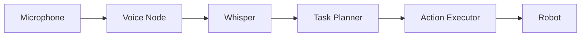

# Implementation Plan: Module 4 - Vision-Language-Action (VLA)

**Branch**: `001-vla-module` | **Date**: 2025-12-30 | **Spec**: [spec.md](./spec.md)
**Input**: Feature specification from `/specs/001-vla-module/spec.md`

## Summary

Create comprehensive educational book content for Module 4: Vision-Language-Action (VLA), covering the convergence of LLMs and robotics. This module includes three chapters (8-10) teaching voice-to-action with OpenAI Whisper, cognitive planning with LLMs, and a capstone project integrating all humanoid robotics concepts.

**Technical Approach**: MDX-based Docusaurus content following existing book patterns, with working ROS 2 code examples tested on Ubuntu 22.04 + ROS 2 Jazzy/Iron.

## Technical Context

**Language/Version**: Python 3.10+ (code examples), MDX (documentation)
**Primary Dependencies**: OpenAI (Whisper, GPT), ROS 2 Jazzy/Iron, Nav2, sounddevice, Docusaurus 3
**Storage**: N/A (documentation only)
**Testing**: Manual testing of code examples on Ubuntu 22.04
**Target Platform**: Ubuntu 22.04 LTS + ROS 2 Jazzy/Iron
**Project Type**: Documentation/Book content (Docusaurus site)
**Performance Goals**: Page load < 2s, Lighthouse 100/100
**Constraints**: 5-7 pages per chapter, ~20 pages total module
**Scale/Scope**: 3 chapters, 16 content files, integration with 3 existing modules

## Constitution Check

*GATE: Must pass before Phase 0 research. Re-check after Phase 1 design.*

| Principle | Status | Evidence |
|-----------|--------|----------|
| I. Execution-First | PASS | All code examples will be tested on Ubuntu 22.04 + ROS 2 |
| II. Sim-to-Real | PASS | Capstone uses Gazebo/Isaac Sim with deployment path to Jetson |
| III. Zero-Tolerance Quality | PASS | Following existing patterns, CI/CD link checking |
| IV. Reusable Intelligence | PASS | VLA skills integrate with existing 8 core skills |
| V. Visual Excellence | PASS | MDX with mermaid diagrams, consistent styling |
| VI. Open Source | PASS | MIT license, free alternatives for API-dependent features |
| VII. Hardware-in-Loop | PASS | Capstone validated in simulation, hardware path documented |
| VIII. TDD | N/A | Documentation feature, not code implementation |

**Post-Design Re-check**: All principles maintained. Local alternatives (whisper.cpp, Ollama) ensure accessibility.

## Project Structure

### Documentation (this feature)

```text
specs/001-vla-module/
├── spec.md              # Feature specification
├── plan.md              # This file
├── research.md          # Phase 0 output (complete)
├── data-model.md        # Phase 1 output (complete)
├── quickstart.md        # Phase 1 output (complete)
├── contracts/           # Phase 1 output (complete)
│   └── ros2-interfaces.md
├── checklists/
│   └── requirements.md  # Spec validation (complete)
└── tasks.md             # Phase 2 output (created by /sp.tasks)
```

### Source Code (repository root)

```text
docs/
├── module-04-vision-language-action/
│   ├── _category_.json
│   ├── chapter-08-voice-to-action/
│   │   ├── _category_.json
│   │   ├── page-01-intro-speech-robotics.md
│   │   ├── page-02-whisper-architecture.md
│   │   ├── page-03-whisper-setup.md
│   │   ├── page-04-voice-command-pipeline.md
│   │   ├── page-05-ros2-integration.md
│   │   └── page-06-exercises.md
│   ├── chapter-09-cognitive-planning/
│   │   ├── _category_.json
│   │   ├── page-01-intro-cognitive-robotics.md
│   │   ├── page-02-llm-task-planning.md
│   │   ├── page-03-natural-language-actions.md
│   │   ├── page-04-ros2-action-generation.md
│   │   └── page-05-exercises.md
│   └── chapter-10-capstone-autonomous-humanoid/
│       ├── _category_.json
│       ├── page-01-project-overview.md
│       ├── page-02-system-architecture.md
│       ├── page-03-implementation-guide.md
│       ├── page-04-testing-validation.md
│       └── page-05-demo-presentation.md

# Files to modify
sidebars.js              # Add Module 04, remove Module 05
docs/intro.md            # Update curriculum structure (if needed)

# Directory to remove
docs/module-05-integrated-rag-chatbot/  # Remove (chatbot is feature, not book content)
```

**Structure Decision**: Following existing book structure with `module-XX-name/chapter-XX-topic/page-XX-title.md` pattern. Using autogenerated sidebar with `_category_.json` files.

## Implementation Phases

### Phase 1: Module Infrastructure (Setup)

**Objective**: Create directory structure and sidebar configuration

**Deliverables**:
1. Create `docs/module-04-vision-language-action/` directory
2. Create `_category_.json` for module and each chapter
3. Update `sidebars.js` to include Module 04 and remove Module 05
4. Remove `docs/module-05-integrated-rag-chatbot/` directory

### Phase 2: Chapter 8 - Voice-to-Action (6 pages)

**Objective**: Teach speech recognition integration with ROS 2

**Pages**:
| Page | Title | Content Focus | Est. Length |
|------|-------|---------------|-------------|
| 01 | Introduction to Speech Recognition | Why voice matters for robotics, human-robot interaction | 1.5 pages |
| 02 | OpenAI Whisper Architecture | How Whisper works, model sizes, accuracy tradeoffs | 1.5 pages |
| 03 | Setting Up Whisper | API setup, local installation, configuration | 1 page |
| 04 | Voice Command Pipeline | Audio capture, VAD, streaming transcription | 1.5 pages |
| 05 | ROS 2 Integration | Voice command node, topic publishing, feedback | 1.5 pages |
| 06 | Exercises | Hands-on practice, extending the pipeline | 1 page |

**Code Examples**:
- Audio capture with sounddevice
- Whisper API client
- Voice command ROS 2 node
- Integration with /robot_commands topic

### Phase 3: Chapter 9 - Cognitive Planning (5 pages)

**Objective**: Teach LLM-based task decomposition

**Pages**:
| Page | Title | Content Focus | Est. Length |
|------|-------|---------------|-------------|
| 01 | Introduction to Cognitive Robotics | Embodied AI, natural language understanding | 1.5 pages |
| 02 | LLM Task Planning | Prompt engineering, comparing providers | 1.5 pages |
| 03 | Natural Language to Actions | Task decomposition, action representation | 1.5 pages |
| 04 | ROS 2 Action Generation | Converting plans to Nav2/MoveIt actions | 1.5 pages |
| 05 | Exercises | Practice with different commands, safety validation | 1 page |

**Code Examples**:
- TaskPlanner class with multiple backends
- Prompt templates for robotics
- Safety validation layer
- ROS 2 action client integration

### Phase 4: Chapter 10 - Capstone Project (5 pages)

**Objective**: Integrate all modules into autonomous humanoid demo

**Pages**:
| Page | Title | Content Focus | Est. Length |
|------|-------|---------------|-------------|
| 01 | Project Overview | Requirements, demo scenario, success criteria | 1 page |
| 02 | System Architecture | Component diagram, data flow, integration points | 1.5 pages |
| 03 | Implementation Guide | Step-by-step build instructions | 2 pages |
| 04 | Testing & Validation | Subsystem testing, integration testing | 1 page |
| 05 | Demo Presentation | How to showcase, common issues, troubleshooting | 1 page |

**Diagrams**:
- Full system architecture (mermaid)
- State machine for command execution
- ROS 2 node graph

### Phase 5: Final Integration

**Objective**: Verify all content, test navigation, validate links

**Deliverables**:
1. Update docs/intro.md curriculum if needed
2. Test all internal links
3. Verify sidebar navigation
4. Run Lighthouse audit
5. Manual code example testing

## Content Guidelines

### Frontmatter Template

```yaml
---
sidebar_position: X
title: "Page Title"
description: "Brief description for SEO"
---
```

### Code Block Format

```python
# Good: Include context and explanation
def process_voice_command(audio_data: np.ndarray) -> str:
    """
    Process audio data through Whisper STT.

    Args:
        audio_data: NumPy array of audio samples (16kHz, mono)

    Returns:
        Transcribed text string
    """
    # Implementation here
```

### Admonition Usage

```markdown
:::tip Pro Tip
Use local Whisper for faster iteration during development.
:::

:::warning Important
Ensure your OPENAI_API_KEY is set before running examples.
:::

:::info Note
This example requires ROS 2 Jazzy or later.
:::
```

### Mermaid Diagram Example

```markdown

```

## Dependencies

### New Python Packages

```bash
pip install openai sounddevice webrtcvad numpy
```

### ROS 2 Packages

```bash
sudo apt install ros-jazzy-nav2-bringup ros-jazzy-nav2-bt-navigator
```

### Optional (for local deployment)

```bash
pip install openai-whisper  # Local Whisper
curl -fsSL https://ollama.ai/install.sh | sh  # Local LLM
```

## Risk Mitigation

| Risk | Probability | Impact | Mitigation |
|------|-------------|--------|------------|
| Students lack API access | Medium | High | Provide local alternatives (whisper.cpp, Ollama) |
| Audio issues cross-platform | Medium | Medium | Extensive troubleshooting section |
| Content exceeds page limit | Low | Low | Prioritize core concepts, move extras to appendix |
| Code examples break | Medium | High | Pin dependency versions, CI testing |

## Success Metrics

| Metric | Target | Measurement |
|--------|--------|-------------|
| Chapter completion time | 2-3 hours each | Student feedback |
| Code example success rate | 95% first-attempt | Beta testing |
| Lighthouse score | 100/100 | Automated CI |
| Page load time | < 2 seconds | Lighthouse |
| Link validity | 100% | CI link checker |

## Next Steps

1. Run `/sp.tasks` to generate detailed implementation tasks
2. Create directory structure and _category_.json files
3. Write Chapter 8 content (Voice-to-Action)
4. Write Chapter 9 content (Cognitive Planning)
5. Write Chapter 10 content (Capstone)
6. Update sidebars.js and remove Module 05
7. Test navigation and links
8. Final review and validation

## Complexity Tracking

> No constitution violations requiring justification.

| Decision | Rationale | Alternative Rejected |
|----------|-----------|---------------------|
| Multi-backend LLM support | Accessibility for students without API keys | Single provider would exclude students |
| Local Whisper fallback | Offline capability, cost reduction | API-only would create barrier |
| Simplified manipulation | Educational focus, not production robotics | Full MoveIt2 integration too complex for module scope |
